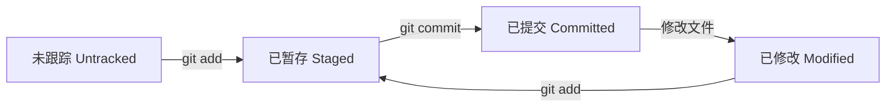
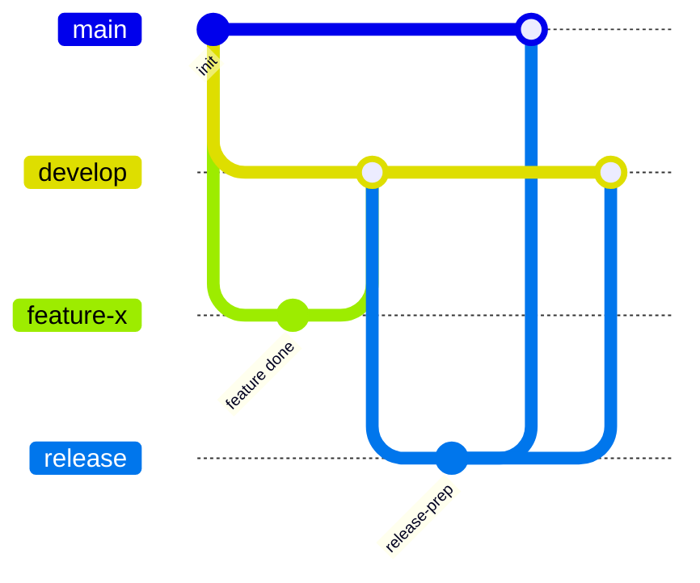

# Git 学习笔记

## 1. Git 工作区域与文件状态

Git 有三个核心区域：

- **工作目录 （Working Directory）**：你正在编辑的文件。
- **暂存区 （Staging Area / Index）**：准备下一次提交的文件列表。
- **本地仓库 （Repository）**：已提交的历史版本。

文件状态在其中流转：



- **未跟踪 （Untracked）**：新文件，未被 Git 管理。
- **已修改 （Modified）**：已跟踪的文件被改动，但未暂存。
- **已暂存 （Staged）**：改动已加入暂存区，等待提交。
- **已提交 （Committed）**：数据已安全存入本地仓库。

---

## 2. 添加和提交文件

```bash
# 添加指定文件到暂存区
git add <file>

# 添加所有变动（新文件、修改、删除）
git add -A    # 或 git add .

# 提交并附上说明
git commit -m "提交信息"
```

> `commit -m` 后面的命名最好采用 **“做了什么 + 为什么”** 的格式，例如 `feat: 添加登录页面`、`fix: 修复首页加载慢的问题`。常见前缀：`feat`（新功能）、`fix`（修复）、`docs`（文档）、`refactor`（重构）等。

---

## 3. git reset 回退版本

`git reset` 可以移动 `HEAD` 指针，有三种模式：

| 模式               | 工作目录 | 暂存区 | 提交历史                   |
| ------------------ | -------- | ------ | -------------------------- |
| `--soft`           | 不变     | 不变   | 回退提交，改动回到暂存区   |
| `--mixed` （默认） | 不变     | 清空   | 回退提交，改动回到工作目录 |
| `--hard`           | 清空     | 清空   | 回退提交，**丢弃所有改动** |

**图形理解**：  
假设原来 `A - B - C`（`HEAD` 指向 C）。执行 `git reset --soft HEAD~1` 后：

```
之前:  A - B - C (HEAD -> main)
之后:  A - B (HEAD -> main)    <-- C 的改动还在暂存区
```

- `--soft`：只撤销 `commit`，**改动留在暂存区**，可以修改后重新提交。
- `--mixed`：撤销 `commit` 和 `add`，**改动回退到工作区**，需要重新 `add`。
- `--hard`：**彻底丢弃工作区和暂存区的所有改动**，恢复成指定版本。

---

## 4. git diff

用于查看差异，作用范围不同：

```bash
# 工作目录 vs 暂存区（即尚未暂存的改动）

# 暂存区 vs 最新提交（即已暂存但尚未提交的改动）

# 两个提交之间

# 两个分支之间
```

---

## 5. git rm

```bash
# 从工作目录和暂存区中删除文件，并记录删除操作（下次提交生效）


# 仅从暂存区移除，保留工作目录文件（停止跟踪）

```

---

## 6. .gitignore

忽略不需要跟踪的文件或目录。常用模式：

```
# 忽略 node_modules 目录

# 忽略所有 .log 文件

# 不忽略重要日志（例外）
```

---

## 7. SSH 配置与克隆仓库

**生成并添加 SSH 密钥**

**克隆仓库**：

```bash
# SSH 方式

# HTTPS 方式
```

**远程仓库关联**：


**VSCode 中的文件状态标识**：
- `??`：Untracked（未跟踪）
- `M`：Modified（已修改）
- `A`：Added（已添加暂存）
- `D`：Deleted（已删除）
- `R`：Renamed（重命名）
- `U`：Updated（已更新未合并）

---

## 8. 分支简介与基本操作

**分支** 是一个可独立推进的代码指针。创建分支不等于切换分支。

```bash
# 查看所有分支

# 创建分支

# 切换到分支

# 创建并切换（一步到位）

# 删除分支
```

> **切换分支时，工作区文件会发生变化**：Git 会把工作目录和暂存区更新为新分支的最新快照。

**分支是并行的**：在 `feature` 分支上做的修改，没有合并回 `main` 之前，不会影响 `main` 分支。

---

## 9. 分支合并

```bash
# 先切换到目标分支（比如 main）
git checkout main

# 将 feature 分支的改动合并进来
git merge feature
```

合并后，`feature` 分支 **依然存在**，可继续开发或删除。

### 合并冲突

当两个分支修改了**同一文件的同一区域**，Git 无法自动合并，产生冲突。

手动解决冲突后：

```bash
git add <解决冲突的文件>
git commit -m "merge: 合并 feature 分支并解决冲突"
```

### 终止合并

```bash
# 如果合并过程中出现冲突，你想放弃本次合并
git merge --abort
```

---

## 10. merge 与 rebase

两者都能整合分支，但方式不同。

|          | **merge**              | **rebase**                           |
| -------- | ---------------------- | ------------------------------------ |
| 操作方式 | 生成一个新的“合并提交” | 将当前分支的提交“搬移”到目标分支顶端 |
| 历史记录 | 保留完整的分叉历史     | 形成一条线性历史，更整洁             |
| 适用场景 | 多人协作、公共分支     | 个人开发、私有分支                   |
| 风险     | 低，不会改写历史       | **会改写历史**，公共分支慎用         |

---

## 11. 工作流模型

### Gitflow

适合有固定发行周期的项目。



**主要分支**：
- `main`：随时可发布的稳定版本。
- `develop`：集成最新开发成果。

**辅助分支**：
- `feature/*`：开发新功能，从 `develop` 分出，完成后合并回 `develop`。
- `release/*`：发布准备，从 `develop` 分出，修复 bug 后合并到 `main` 和 `develop`。
- `hotfix/*`：紧急修复，从 `main` 分出，完成后合并到 `main` 和 `develop`。

### GitHub Flow

更简单，适合持续部署。

- 只有一个长期分支 `main`（可随时部署）。
- 新功能从 `main` 拉出分支开发，完成后发起 Pull Request（PR），审查后合并回 `main`。

---

## 12. 分支命名与协作规范

- **命名格式**：`类型/简短描述`，如 `feat/login-page`、`fix/header-bug`。
- **分支粒度**：一个分支只做一件事，便于回顾和回滚。
- **合并方式**：
  - 建议使用 `Pull Request` + **压缩合并**（squash）或 **普通合并**。
  - 个人分支可选 `rebase` 整理后再合并。
- **提交信息规范**：`类型: 简短描述`（如 `feat: 新增用户注册接口`）。

---

## 13. 版本号规则

采用 **语义化版本**（Semantic Versioning）：`主版本.次版本.修订版本`（`MAJOR.MINOR.PATCH`）

| 版本号                 | 变更类型           | 示例    |
| ---------------------- | ------------------ | ------- |
| **主版本 （MAJOR）**   | 不兼容的 API 修改  | `2.0.0` |
| **次版本 （MINOR）**   | 向下兼容的功能新增 | `1.2.0` |
| **修订版本 （PATCH）** | 向下兼容的问题修正 | `1.1.1` |

