# 自瞄代码完整流程图

> 对应源码：`全功能整合包1.7/game_modifier/scripts/aim.js`
>
> 本文从穿越火线玩家的实际操作出发，再对应到程序内部的类名、方法名和字段名。

---

## 一、玩家实际感受到的流程

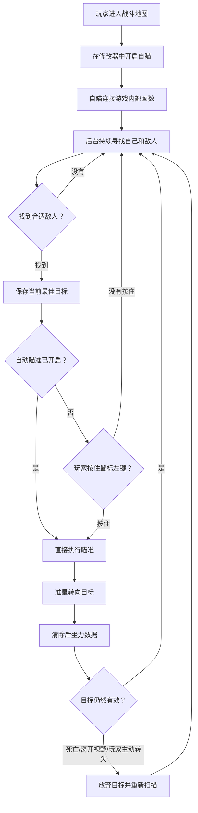

玩家看到的结果可以概括为：

```text
开启自瞄
  ↓
程序寻找准星附近的敌人
  ↓
玩家按住左键，或者开启自动瞄准
  ↓
准星转向选中的敌人
  ↓
敌人死亡、离开范围或玩家主动转头后重新选人
```

---

## 二、自瞄内部总流程

自瞄由两个独立循环共同完成：

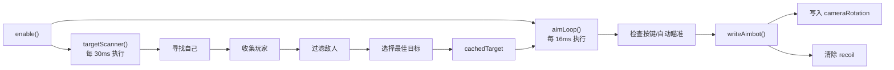

| 循环 | 周期 | 玩家角度的作用 | 核心方法 |
|---|---:|---|---|
| 目标扫描循环 | 30ms | 判断当前应该瞄谁 | `targetScanner()` |
| 准星写入循环 | 16ms | 判断现在是否瞄准，并移动准星 | `aimLoop()`、`writeAimbot()` |

一句话理解：

```text
targetScanner() 负责“选谁”
aimLoop()        负责“什么时候瞄”
writeAimbot()   负责“怎样转过去”
```

---

## 三、玩家开启自瞄

### 玩家视角

玩家在修改器界面打开“自瞄”开关。

### 完整启动流程

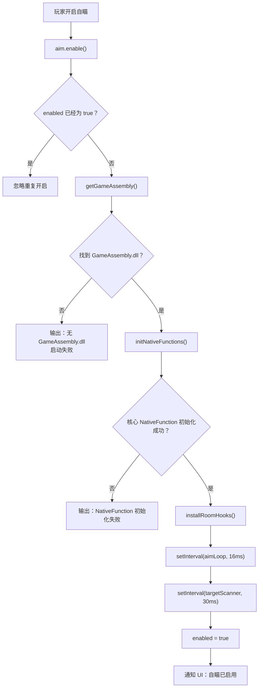

### 连接的游戏内部方法

| JS 变量 | 游戏方法 | 用途 |
|---|---|---|
| `singletonGetter` | `Singleton<GameManager>.get_instance()` | 获取当前 `GameManager` |
| `compGetTransform` | `Component.get_transform()` | 获取 Player 的 Transform |
| `transformGetPos` | `Transform.get_position()` | 获取 Player 世界坐标 |
| `isMyPlayerFn` | `Player.get_isMyPlayer()` | 判断是否为自己 |
| `isDeadFn` | `Entity.get_isDead()` | 判断是否死亡 |
| `getTeamFn` | `Entity.get_team()` | 获取队伍 |
| `getMouseBtnFn` | `Input.GetMouseButton()` | 检测鼠标按键 |
| `linecastFn` | `Physics.Linecast()` | 检查目标是否被墙遮挡 |

### 核心与可选函数

初始化失败会产生不同结果：

```text
核心函数失败
  → initNativeFunctions() 返回 false
  → 自瞄完全无法启动

getTeamFn 失败
  → 改为直接读取 Entity.team

getMouseBtnFn 失败
  → 非自动模式下无法触发瞄准

linecastFn 失败
  → 可见性检测默认放行
```

---

## 四、房间事件监听流程

自瞄启动时会在三个游戏方法上安装 Hook：

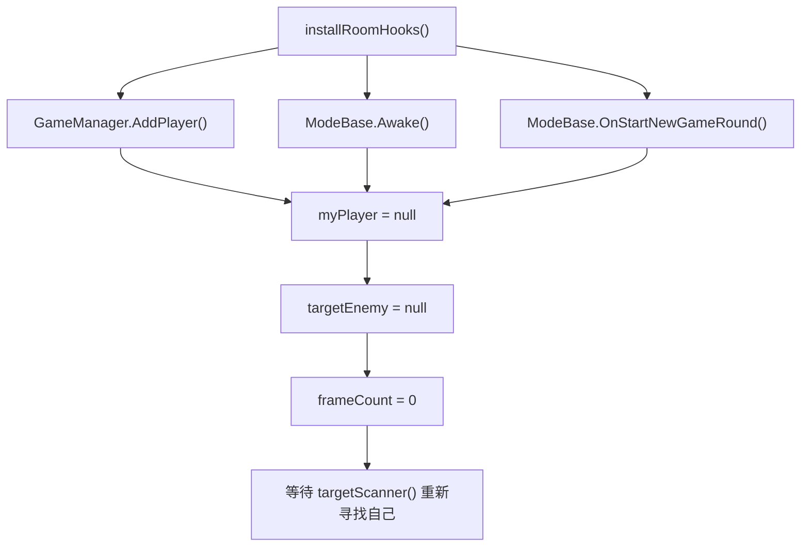

| 游戏事件 | 穿越火线中的场景 | 自瞄的处理 |
|---|---|---|
| `GameManager.AddPlayer()` | 创建玩家或 Bot | 放弃缓存的自己，重新查找 |
| `ModeBase.Awake()` | 新地图或模式对象初始化 | 重置玩家状态 |
| `ModeBase.OnStartNewGameRound()` | 新回合开始 | 重新查找当前 Player |

### 源码中的实际细节

Hook 当前清理了：

```text
myPlayer
targetEnemy
frameCount
```

但是没有直接清理：

```text
cachedTarget
```

不过 `aimLoop()` 在 `myPlayer == null` 时不会执行写入，后续扫描会重新覆盖 `cachedTarget`。

---

## 五、目标扫描总流程

`targetScanner()` 每 30ms 执行一次。

### 玩家视角

程序在后台不断观察当前房间：

1. 先确认“我”是谁。
2. 再获取房间中的所有候选 Player。
3. 排除自己、尸体、队友和不合适的目标。
4. 选择距离准星角度最近的敌人。

### 完整流程图

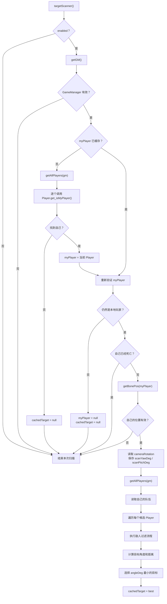

---

## 六、GameManager 获取流程

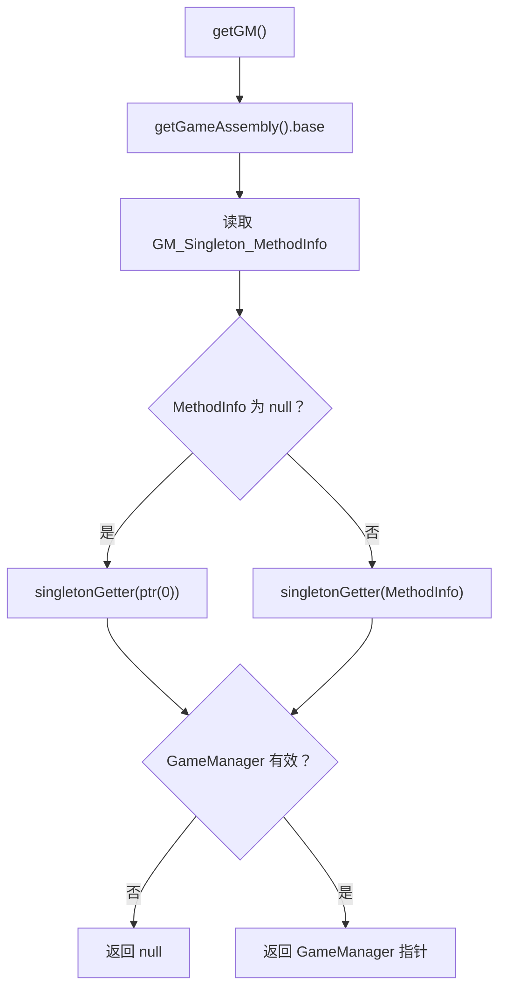

`GameManager` 是自瞄进入游戏数据的入口：

```text
GameManager
  ├─ allPlayers
  ├─ playersBL
  └─ playersGR
```

---

## 七、玩家集合读取流程

当前 `aim.js` 通过三个 GameManager 容器获取玩家：

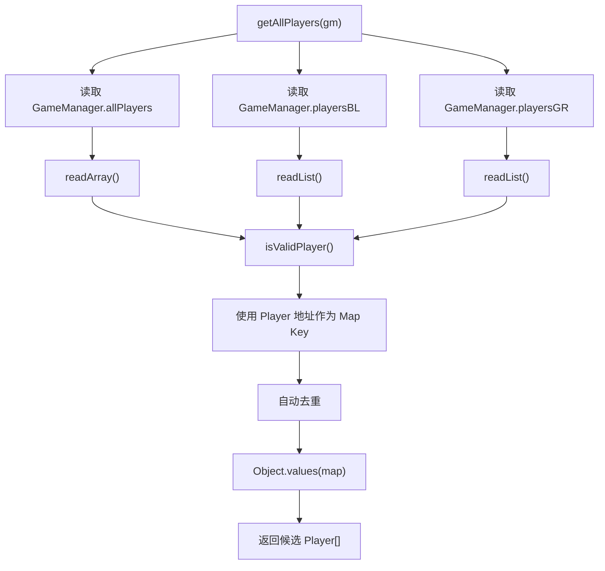

### 三个容器的游戏含义

| 容器 | 类型 | 游戏含义 |
|---|---|---|
| `GameManager.allPlayers` | `Player[]` | GameManager 的固定 Player 槽位表 |
| `GameManager.playersBL` | `List<Player>` | 潜伏者队伍列表 |
| `GameManager.playersGR` | `List<Player>` | 保卫者队伍列表 |

### `readArray()` 流程

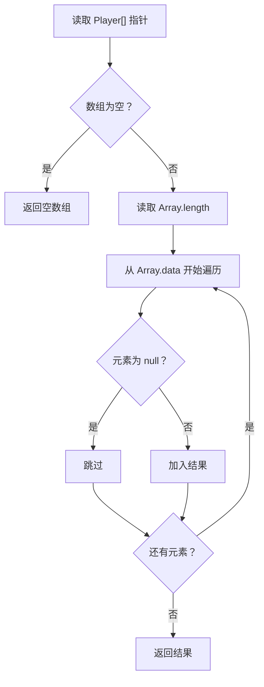

### `readList()` 流程

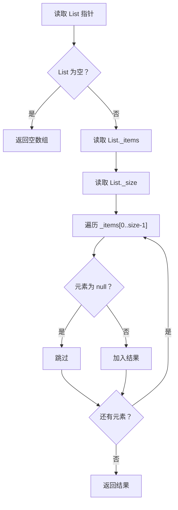

### `isValidPlayer()` 如何判断

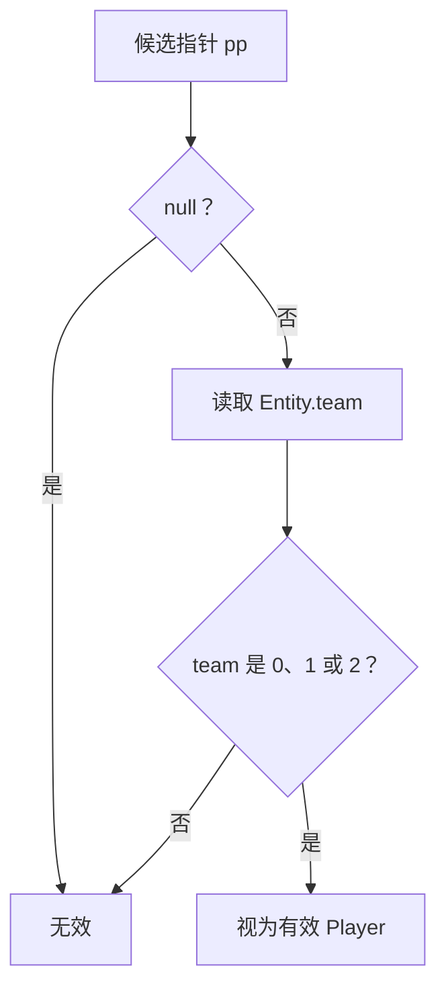

这里的有效性标准只是：

```text
指针非空，并且 team ∈ {0, 1, 2}
```

它不能完整证明对象生命周期安全，只是源码当前采用的快速过滤方式。

### 当前玩家来源的限制

这份 `aim.js` 只读取：

```text
allPlayers + playersBL + playersGR
```

它没有 Hook：

```text
Bot.Update() -> Bot.thisPlayer
```

因此在特殊模式中，如果某些 Bot Player 没有进入这三个 GameManager 容器，自瞄也无法扫描到它们。

---

## 八、寻找本地玩家流程

### 玩家视角

自瞄必须先知道哪个角色是自己，才能读取自己的位置、队伍和准星方向。

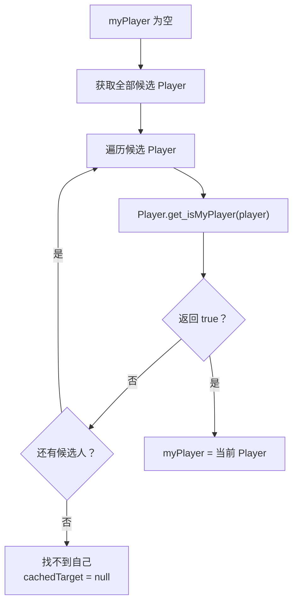

找到后，每次扫描仍会重新验证：

```text
isMyPlayerFn(myPlayer) == false
  ↓
说明地址已经失效或房间发生变化
  ↓
myPlayer = null
cachedTarget = null
  ↓
下次扫描重新查找
```

---

## 九、位置与瞄准部位获取流程

### `getPlayerPos()` 主路径

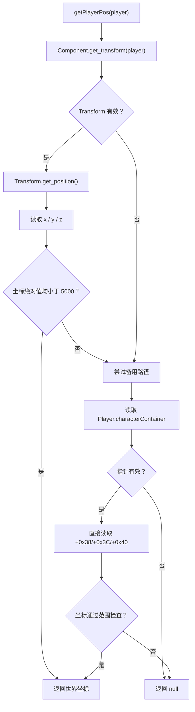

### `getBonePos()` 的实际含义

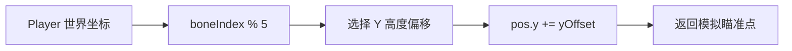

| 索引结果 | Y 偏移 | 大致游戏部位 |
|---:|---:|---|
| 0 | `+1.65` | 头部 |
| 1 | `+1.45` | 颈部 |
| 2 | `+1.05` | 胸部 |
| 3 | `+0.85` | 腰部 |
| 4 | `+0.75` | 腿部附近 |

默认配置：

```text
aimBone = 7
7 % 5 = 2
最终使用 +1.05，约等于胸部位置
```

这不是读取 Unity 骨骼 Transform，而是在 Player 基础坐标上增加估算高度。

---

## 十、敌人过滤完整流程

每个候选 Player 都要通过下面的过滤链：

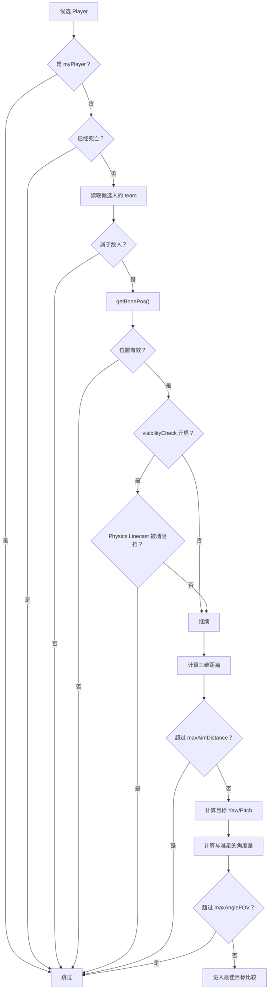

### 敌我判断

代码使用：

```javascript
var isEnemy = (myTeam === 2) || (team === 2) || (myTeam !== team);
```

对应流程：

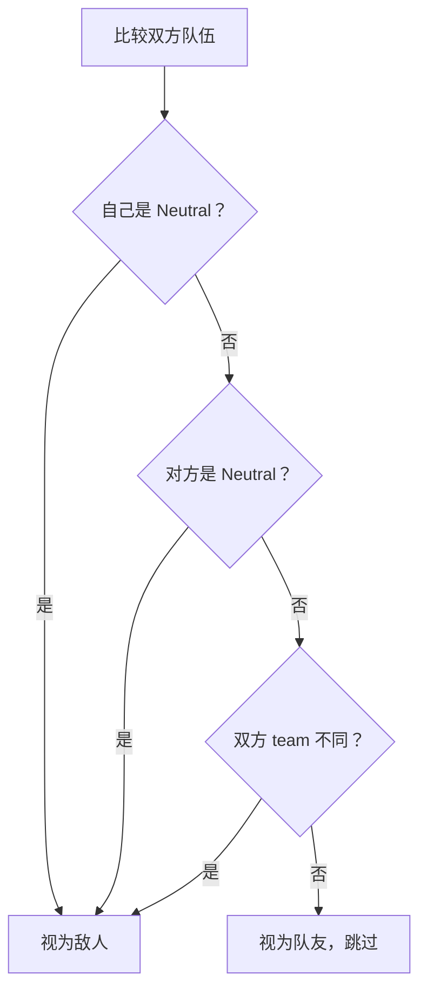

| `team` | 游戏含义 |
|---:|---|
| `0` | BlackList，潜伏者 |
| `1` | GlobalRisk，保卫者 |
| `2` | Neutral，中立 |

---

## 十一、可见性检测流程

只有 `CONFIG.visibilityCheck == true` 时才执行。

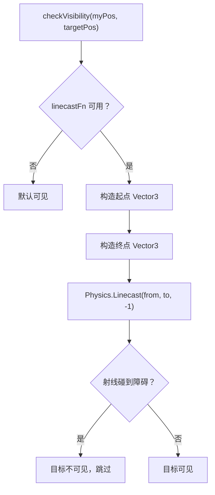

如果调用发生异常，源码也会返回 `true`，即默认目标可见。

---

## 十二、距离、角度和 FOV 计算

### 第一步：计算目标相对位置

```text
dx = target.x - my.x
dy = target.y - my.y
dz = target.z - my.z
```

### 第二步：计算三维距离

```text
dist = √(dx² + dy² + dz²)
```

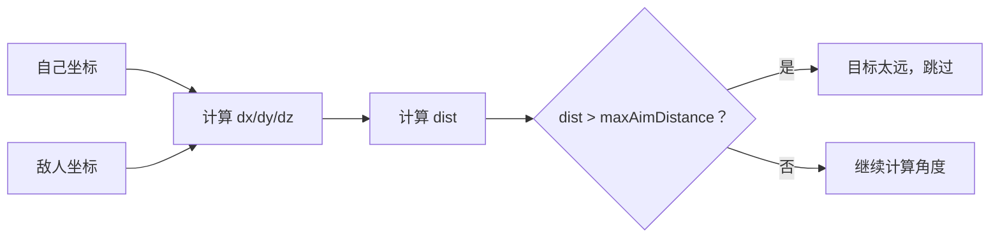

### 第三步：计算目标方向

```text
targetYawDeg   = atan2(dx, dz)
targetPitchDeg = atan2(dy, √(dx² + dz²))
```

游戏含义：

| 角度 | 控制内容 |
|---|---|
| `Yaw` | 左右转头 |
| `Pitch` | 抬头或低头 |

### 第四步：计算目标离准星多远

```text
yawDiff   = targetYawDeg - scanYawDeg
pitchDiff = targetPitchDeg - scanPitchDeg

angleDeg = √(yawDiff² + pitchDiff²)
```

角度会被归一化到合理范围，避免 `179°` 与 `-179°` 被误判成相差 `358°`。

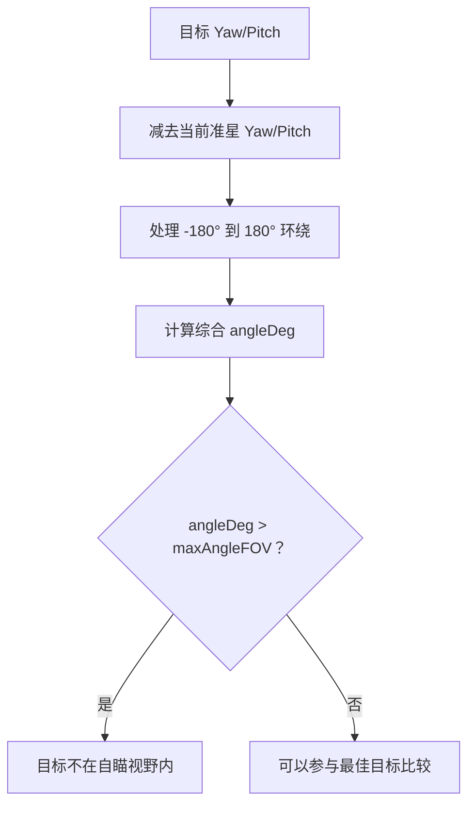

---

## 十三、最佳目标选择流程

源码选择的是：

```text
离准星角度最近的人
```

不是：

```text
世界距离最近的人
```

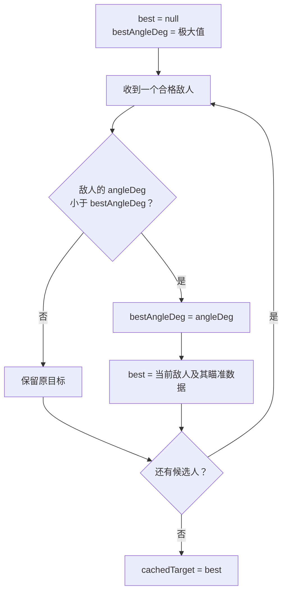

`cachedTarget` 保存：

| 字段 | 含义 |
|---|---|
| `player` | 目标 Player 指针 |
| `pos` | 目标瞄准点 |
| `targetYawDeg` | 目标水平角度 |
| `targetPitchDeg` | 目标垂直角度 |
| `angleDeg` | 与当前准星的角度差 |
| `dist` | 与自己的三维距离 |

如果没有任何敌人通过筛选：

```text
cachedTarget = null
```

---

## 十四、瞄准触发流程

`aimLoop()` 每 16ms 执行一次。

### 玩家视角

- `autoAim=false`：必须按住鼠标左键。
- `autoAim=true`：不需要按键，只要存在目标就执行。

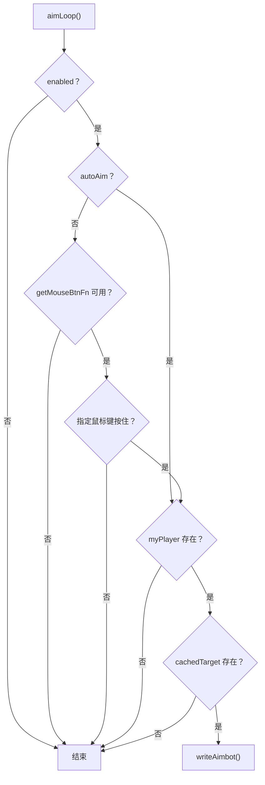

默认配置：

```text
aimKey = 0
autoAim = false
```

所以默认行为是：

```text
按住鼠标左键才瞄准
```

---

## 十五、准星写入完整流程

```mermaid
flowchart TD
    A["writeAimbot()"] --> B{"enabled、myPlayer、cachedTarget 都有效？"}
    B -- "否" --> X["结束"]
    B -- "是" --> C["读取当前 cameraRotation"]
    C --> D["比较当前角度与扫描时角度"]
    D --> E["计算 userAngleDelta"]
    E --> F{"玩家主动转头超过 FOV 一半？"}
    F -- "是" --> G["cachedTarget = null"]
    G --> X
    F -- "否" --> H["读取目标 Yaw/Pitch"]
    H --> I{"0 < smoothness < 1？"}
    I -- "否" --> J["直接使用目标角度"]
    I -- "是" --> K["按 smoothness 插值"]
    J --> L["写入 Player.cameraRotation"]
    K --> L
    L --> M["读取 Player.recoil"]
    M --> N{"recoil 有效？"}
    N -- "否" --> P["frameCount++"]
    N -- "是" --> O["清零 4 个后坐力字段"]
    O --> P
```

---

## 十六、玩家主动转头时为什么放弃目标

扫描循环记录当时的视角：

```text
scanYawDeg
scanPitchDeg
```

写入前再次读取当前视角：

```text
curYawDeg
curPitchDeg
```

两次视角差值代表玩家是否主动移动了鼠标。

```mermaid
flowchart TD
    A["扫描时视角"] --> C["与当前视角比较"]
    B["写入前当前视角"] --> C
    C --> D["userAngleDelta"]
    D --> E{"大于 maxAngleFOV × 0.5？"}
    E -- "是" --> F["认为玩家正在主动转头"]
    F --> G["放弃 cachedTarget"]
    E -- "否" --> H["继续自动瞄准"]
```

默认：

```text
maxAngleFOV = 30°
放弃阈值 = 15°
```

这避免自瞄和玩家的大幅鼠标操作互相争夺视角。

---

## 十七、平滑瞄准流程

### `smoothness = 1.0`

```text
一步写到目标角度
```

### `0 < smoothness < 1`

```text
本次只移动剩余角度的一部分
```

```mermaid
flowchart TD
    A["当前角度"] --> B["计算到目标的 yawDiff/pitchDiff"]
    B --> C["处理角度环绕"]
    C --> D["差值 × smoothness"]
    D --> E["加回当前角度"]
    E --> F["得到 finalYaw/finalPitch"]
```

计算形式：

```text
finalYaw   = currentYaw   + yawDiff   × smoothness
finalPitch = currentPitch + pitchDiff × smoothness
```

| `smoothness` | 效果 |
|---:|---|
| `1.0` | 瞬间转到目标 |
| `0.5` | 每次移动剩余角度的一半 |
| `0.2` | 转动更慢 |
| `0` 或负数 | 源码不进入插值，仍直接使用目标角度 |

---

## 十八、写入视角和清除后坐力

### 写入准星方向

```text
Player.cameraRotation + 0x00 = finalYawDeg
Player.cameraRotation + 0x04 = finalPitchDeg
```

对应玩家看到的效果：

```text
角色左右转头 + 抬头/低头
  ↓
准星对准目标
```

代码没有调用已经声明的：

```text
Player.AddCameraRotation()
```

而是直接写入 `Player.cameraRotation` 字段。

### 清除后坐力

```mermaid
flowchart TD
    A["读取 Player.recoil"] --> B{"指针有效？"}
    B -- "否" --> E["跳过"]
    B -- "是" --> C["写 0 到 +0x10/+0x24/+0x40/+0x54"]
    C --> D["降低或清除枪口跳动数据"]
```

因此这份模块实际同时包含：

```text
自瞄 + 后坐力清零
```

---

## 十九、目标失效和重新扫描

```mermaid
flowchart TD
    A["已有 cachedTarget"] --> B{"下一次 targetScanner()"}
    B --> C{"目标仍通过全部过滤？"}
    C -- "是" --> D["可能继续成为 best"]
    C -- "否" --> E["不再进入 best"]
    D --> F["cachedTarget 更新"]
    E --> F
    F --> G{"本轮还有其他合格敌人？"}
    G -- "是" --> H["切换到新的最佳目标"]
    G -- "否" --> I["cachedTarget = null"]
```

导致目标失效的常见情况：

- 目标死亡。
- 目标变成队友。
- 目标超出 200 米。
- 目标离开 30° FOV。
- 开启可见性检测后，目标被墙挡住。
- Player 指针读取失败。
- 玩家主动大幅转动视角。
- 换回合或重新创建 Player。

---

## 二十、关闭自瞄流程

```mermaid
flowchart TD
    A["玩家关闭自瞄"] --> B["aim.disable()"]
    B --> C{"enabled？"}
    C -- "否" --> X["忽略重复关闭"]
    C -- "是" --> D["停止 aimTimer"]
    D --> E["停止 scanTimer"]
    E --> F["停止 debugTimer"]
    F --> G["detach 所有 roomHooks"]
    G --> H["roomHooks = []"]
    H --> I["myPlayer = null"]
    I --> J["targetEnemy = null"]
    J --> K["enabled = false"]
    K --> L["通知 UI：自瞄已禁用"]
```

### 源码中的清理细节

关闭时没有显式清理：

```text
cachedTarget
```

但是两个定时器已经停止，`enabled=false`，因此不会继续扫描或写入视角。下次启用后，扫描循环会重新计算目标。

---

## 二十一、配置修改流程

```mermaid
flowchart TD
    A["UI 修改自瞄配置"] --> B["setConfig(cfg)"]
    B --> C["更新 smoothness"]
    B --> D["更新 maxAimDistance"]
    B --> E["更新 maxAngleFOV"]
    B --> F["更新 visibilityCheck"]
    B --> G["更新 autoAim"]
    C --> H["下一次循环立即生效"]
    D --> H
    E --> H
    F --> H
    G --> H
```

| 配置 | 默认值 | 玩家体验 |
|---|---:|---|
| `aimKey` | `0` | 鼠标左键 |
| `aimBone` | `7` | 实际使用胸部高度偏移 |
| `smoothness` | `1.0` | 瞬间锁定 |
| `maxAimDistance` | `200.0` | 最远扫描 200 米 |
| `maxAngleFOV` | `30.0` | 只选准星附近 30° 内目标 |
| `visibilityCheck` | `false` | 默认不检查墙体 |
| `autoAim` | `false` | 默认必须按住鼠标键 |

`setConfig()` 当前不能修改：

```text
aimKey
aimBone
debugLog
```

---

## 二十二、单帧完整示例

假设玩家位于保卫者，正面对两个潜伏者：

```text
敌人 A：距离 20 米，离准星 8°
敌人 B：距离 8 米，离准星 18°
```

执行过程：

```mermaid
flowchart TD
    A["扫描到敌人 A 和 B"] --> B["两人都存活且属于敌方"]
    B --> C["两人都在 200 米范围内"]
    C --> D["两人都在 30° FOV 内"]
    D --> E["比较 angleDeg"]
    E --> F["A = 8°，B = 18°"]
    F --> G["选择敌人 A"]
    G --> H["cachedTarget = A"]
    H --> I["玩家按住左键"]
    I --> J["writeAimbot()"]
    J --> K["准星转向敌人 A"]
```

即使敌人 B 更近，自瞄仍选择敌人 A，因为源码按准星角度差排序。

---

## 二十三、完整调用关系

```mermaid
flowchart TD
    UI["玩家操作修改器 UI"] --> EN["aim.enable()"]
    UI --> DIS["aim.disable()"]
    UI --> CFG["aim.setConfig()"]

    EN --> INIT["initNativeFunctions()"]
    EN --> HOOK["installRoomHooks()"]
    EN --> SCAN_TIMER["scanTimer"]
    EN --> AIM_TIMER["aimTimer"]

    SCAN_TIMER --> SCAN["targetScanner()"]
    SCAN --> GM["getGM()"]
    SCAN --> ALL["getAllPlayers()"]
    ALL --> ARRAY["readArray()"]
    ALL --> LIST["readList()"]
    ALL --> VALID["isValidPlayer()"]
    SCAN --> BONE["getBonePos()"]
    BONE --> POS["getPlayerPos()"]
    SCAN --> VIS["checkVisibility()"]
    SCAN --> CACHE["cachedTarget"]

    AIM_TIMER --> LOOP["aimLoop()"]
    LOOP --> INPUT["Input.GetMouseButton()"]
    LOOP --> WRITE["writeAimbot()"]
    CACHE --> WRITE
    WRITE --> ROT["Player.cameraRotation"]
    WRITE --> RECOIL["Player.recoil"]

    HOOK --> RESET["重置 myPlayer/frameCount"]
    RESET --> SCAN

    DIS --> STOP["停止 Timer + 卸载 Hook"]
```

### 用穿越火线的游戏语言再走一遍

```text
1. 玩家进入对局，GameManager 创建本局所有 Player。
2. 自瞄从房间玩家名单中确认哪个 Player 是自己。
3. 自瞄读取自己的站位、阵营和当前准星朝向。
4. 它逐个查看场上的其他 Player：
   不是自己、没有死亡、属于敌对关系、位置有效、没有超出距离和准星 FOV。
5. 如果开启可见性检查，还要排除被墙体遮挡的目标。
6. 在所有合格敌人中，选择最靠近准星中心的一个，而不是距离自己最近的一个。
7. 扫描线程把这个敌人的 Player、位置和目标 Yaw/Pitch 保存为 cachedTarget。
8. 玩家按住开火键，或者开启自动瞄准后，写入线程读取 cachedTarget。
9. 根据 smoothness 计算本帧准星应该转动多少。
10. 把最终 Yaw/Pitch 写入自己的 Player.cameraRotation，游戏镜头随之转向目标。
11. 敌人死亡、跑出范围、离开 FOV 或下次扫描出现更优敌人时，重新选择目标。
12. 新玩家加入、新地图加载或新回合开始时，脚本放弃旧的 myPlayer 缓存并重新确认自己。
```

从玩家视角看，就是：

```text
进入房间
→ 找到自己的角色
→ 看遍场上其他角色
→ 排除不能攻击的人
→ 找到准星附近最适合射击的敌人
→ 按住开火键
→ 准星转向该敌人
→ 持续重新判断是否需要换目标
```

---

## 二十四、从玩家动作反查代码

| 玩家动作或现象 | 对应代码流程 |
|---|---|
| 开启自瞄 | `enable()` |
| 自瞄提示初始化失败 | `initNativeFunctions()` |
| 进入地图后寻找自己 | `targetScanner()` → `isMyPlayerFn()` |
| 扫描房间玩家 | `getAllPlayers()` |
| 排除队友和死人 | `getTeamFn()`、`isDeadFn()` |
| 只锁定准星附近目标 | `maxAngleFOV`、`angleDeg` |
| 限制最远锁定距离 | `maxAimDistance`、`dist` |
| 不锁墙后敌人 | `visibilityCheck`、`checkVisibility()` |
| 按住左键才锁定 | `aimLoop()`、`getMouseBtnFn()` |
| 自动锁定 | `CONFIG.autoAim=true` |
| 准星瞬间移动 | `smoothness=1.0` |
| 准星缓慢移动 | `0<smoothness<1` |
| 玩家主动转头后脱锁 | `userAngleDelta > FOV×0.5` |
| 枪口不再跳动 | `Player.recoil` 清零 |
| 新回合重新找人 | `installRoomHooks()` |
| 关闭自瞄 | `disable()` |

---

## 二十五、关键数据流

```mermaid
flowchart LR
    GM["GameManager"] --> PLAYERS["Player 集合"]
    PLAYERS --> FILTER["敌人过滤"]
    FILTER --> POS["目标位置"]
    MY["myPlayer"] --> VIEW["当前 cameraRotation"]
    POS --> CALC["计算目标 Yaw/Pitch"]
    VIEW --> CALC
    CALC --> TARGET["cachedTarget"]
    TARGET --> WRITE["writeAimbot()"]
    WRITE --> CAMERA["写入 myPlayer.cameraRotation"]
```

核心数据只有三类：

| 数据 | 来源 | 去向 |
|---|---|---|
| 当前玩家 | `isMyPlayerFn()` | `myPlayer` |
| 最佳敌人 | `targetScanner()` | `cachedTarget` |
| 最终瞄准角度 | `writeAimbot()` | `Player.cameraRotation` |

---

## 二十六、源码中未实际参与主流程的变量

| 变量或函数 | 当前状态 |
|---|---|
| `targetEnemy` | 会被清空，但主流程没有读取或赋目标 |
| `timer` | 声明后未使用 |
| `debugTimer` | 关闭时会清理，但没有启动 |
| `addCamRotFn` | 初始化成功是启动条件，但瞄准时没有调用 |
| `CONFIG.debugLog` | 配置存在，但本文件主流程没有使用 |

理解代码时，应把这些内容与真正工作的变量区分开：

```text
真正核心：
enabled
myPlayer
cachedTarget
scanYawDeg
scanPitchDeg
aimTimer
scanTimer
```

---

## 二十七、完整一句话总结

```text
玩家开启自瞄后，程序每 30ms 从 GameManager 的三个玩家容器中收集并去重 Player，
找到本地玩家，排除自己、死人、队友、过远、超出 FOV 和不可见的目标，
选择离准星角度最近的敌人保存到 cachedTarget；
随后每 16ms 检查自动瞄准或鼠标左键状态，
根据平滑度计算最终 Yaw/Pitch，直接写入 myPlayer.cameraRotation，
同时清零 recoil；新玩家、新地图或新回合出现时重新查找本地 Player，
关闭功能时停止两个循环并卸载所有 Hook。
```

---

## 二十八、开发问题与依据

### 问题 1：什么叫“找到合适敌人”？标准是什么？

**回答：** 当前代码中的候选人必须依次满足：

| 顺序 | 条件 | 所属类、字段或变量 | 取得方式与实际判断 |
|---|---|---|---|
| 1 | Player 指针有效 | JS 参数 `p`，指向游戏的 `Player` 对象 | 指针不能为 `null`，并且能安全读取 `Entity.team` |
| 2 | `team` 为合法值 | `Entity._team_k__BackingField`，在 `Player` 对象偏移 `0x20` | `isValidPlayer()` 判断 `team === 0/1/2` |
| 3 | 不是自己 | `GameManager.static_fields.myPlayer` | `Player.get_isMyPlayer()` 用游戏静态 `myPlayer` 与候选 `Player` 比较；扫描中还用 `p.equals(myPlayer)` 排除自己 |
| 4 | 没有死亡 | `Entity.get_isDead()`，内部关联 `HealthData` | `isDeadFn(p) === true` 时排除 |
| 5 | 按当前模式属于敌人 | **不是游戏类字段**；`isEnemy` 是 `targetScanner()` 内临时创建的 JS 布尔变量 | 先用 `Entity.get_team()` 分别取得 `myTeam` 和候选人的 `team`，再计算 `(myTeam === 2) || (team === 2) || (myTeam !== team)` |
| 6 | 能取得目标位置 | `UnityEngine.Component.transform`、`UnityEngine.Transform.position` | `getPlayerPos(p)` 取得角色位置，`getBonePos()` 再增加瞄准高度；失败则排除 |
| 7 | 没有被墙体遮挡 | JS 配置 `CONFIG.visibilityCheck`；Unity 方法 `Physics.Linecast()` | 仅配置开启时检查；Linecast 命中障碍物则排除 |
| 8 | 距离没有过远 | JS 配置 `CONFIG.maxAimDistance` 和局部变量 `dist` | 用自己与目标位置计算三维距离，默认不能超过 200 |
| 9 | 位于准星 FOV 内 | `Player.cameraRotation`、JS 配置 `CONFIG.maxAngleFOV` 和局部变量 `angleDeg` | 根据目标方向与自己的 Yaw/Pitch 计算角度差，默认不能超过 30 度 |

其中第 5 项最容易误解：

```text
Entity.team / Entity.get_team()  = 游戏原有的阵营字段和方法
myTeam、team                     = JS 读取后保存的局部变量
isEnemy                          = JS 根据双方 team 临时计算出的结果
```

具体判断：

| 场景 | `myTeam` | 对方 `team` | `isEnemy` |
|---|---:|---:|---|
| 团队模式，同队 | 0 | 0 | `false`，队友 |
| 团队模式，不同队 | 0 | 1 | `true`，敌人 |
| 团队模式，不同队 | 1 | 0 | `true`，敌人 |
| 个人竞技 | 2 | 2 | `true`，除自己外全部是敌人 |

因此，游戏中并不存在一个可直接读取的 `Player.isEnemy` 字段。当前自瞄是先读取 `Entity.team`，再结合是否为自己，在 JS 中自行推导敌我关系。

通过这些条件后，程序选择 **与准星角度差最小** 的目标：

```javascript
if (angleDeg < bestAngleDeg) {
    bestAngleDeg = angleDeg;
    best = 当前敌人;
}
```

所以“最佳目标”不是最近的敌人，而是合格敌人中最靠近准星中心的人。

注意：

- `visibilityCheck` 默认是 `false`，默认情况下墙后敌人不会因为遮挡而被排除。
- `getBonePos()` 当前没有读取真正的骨骼 Transform，只是在角色位置上增加 Y 偏移。

### 问题 2：为什么需要保存当前最佳目标？

**回答：** 有两层原因。

第一层是在一次扫描中比较所有敌人。`best` 和 `bestAngleDeg` 用来记住“目前为止角度最小的人”，否则遍历结束后无法知道谁最好。

第二层是把扫描和写入分开：

```text
targetScanner()：每 30ms 重新找目标
aimLoop()：每 16ms 读取 cachedTarget 并写准星
```

这样不必每次写准星都重新遍历所有玩家。`cachedTarget` 保存了：

```text
Player 指针
目标位置
目标 Yaw/Pitch
角度差
距离
```

它并不是永久锁定。每次扫描都会重新计算并覆盖，出现更优敌人时会换目标。

开发注意：`GameManager` 暂时无效、自己死亡或位置读取失败时，部分分支只是直接返回，没有统一清空 `cachedTarget`。开发更严格的功能时，应该在这些失效分支中主动清空缓存并增加房间代数校验。

### 问题 3：判断“自己”的依据是什么？

**回答：** 代码不是根据名字、队伍或数组下标判断，而是调用：

```text
Player.get_isMyPlayer()
RVA 0xB55FD0
```

IDA 反编译表明，该方法实际执行：

```text
GameManager.static_fields.myPlayer == 当前 Player this
```

相等就说明这个 `Player` 是本地玩家。找到后保存为 `myPlayer`。

这也是为什么后面写入 `myPlayer + 0x4C` 时，写到的是自己的 `cameraRotation`。


不需要判断自己，可以直接用Player.get_isMyPlayer()，或者GameManager的myplayer静态字段

### 问题 4：判断敌人的依据是什么？个人竞技怎样处理？

**回答：** 队伍来自：

```text
Entity.get_team()
RVA 0x1E0070
```

IDA 表明它直接返回 `Entity._team_k__BackingField`，当前字段偏移是 `0x20`。

当前敌我公式是：

```javascript
var isEnemy = (myTeam === 2) || (team === 2) || (myTeam !== team);
```

| 模式 | 队伍值 | 判断结果 |
|---|---|---|
| 团队模式 | 自己与对方同队 | 队友，排除 |
| 团队模式 | 双方队伍不同 | 敌人 |
| 个人竞技 `DeathMatch` | `team = 2`，中立 | 除自己外全部视为敌人 |

IDA 中 `GameManager.AddPlayer()` 明确规定：

```text
GameMode == 1（DeathMatch） → assignedTeam = 2
GameMode 3~6（Nano）       → assignedTeam = 1
其他模式                    → 使用传入的 team
```

所以个人竞技不是用两个阵营区分敌我，而是先用 `isMyPlayer` 排除自己，再把中立 `team == 2` 的其他 Player 全部当作敌人。

### 问题 5：写入 cameraRotation 时，怎样知道是自己的？

**回答：** 顺序是：

```text
遍历 Player
→ Player.get_isMyPlayer() 返回 true
→ 保存为 myPlayer
→ 读取或写入 myPlayer + 0x4C
```

字段关系：

| 信息 | 类 / 方法 / 字段 |
|---|---|
| 自己是谁 | `Player.get_isMyPlayer()` |
| 自己的准星水平角 | `Player.cameraRotation + 0x00` |
| 自己的准星垂直角 | `Player.cameraRotation + 0x04` |
| 完整字段起点 | `Player + 0x4C` |

因此，`cameraRotation` 本身没有“这是自己的”标记；关键是先确认持有该字段的 `Player` 是 `myPlayer`。

### 问题 6：自己的位置、队伍和准星方向分别从哪里得到？

**回答：**

| 信息 | 首选来源 | 当前代码 |
|---|---|---|
| 自己的 Player | `Player.get_isMyPlayer()` | 遍历候选 Player 查找 |
| 自己的位置 | `Component.get_transform()` → `Transform.get_position()` | `getPlayerPos(myPlayer)` |
| 位置备用来源 | `Player.characterContainer` | `+0x58` 后读取容器 `+0x38/+0x3C/+0x40` |
| 自己的队伍 | `Entity.get_team()` | 失败时直接读取 `Player + 0x20` |
| 准星水平方向 | `Player.cameraRotation.x` | `Player + 0x4C` |
| 准星垂直方向 | `Player.cameraRotation.y` | `Player + 0x50` |

这里的“准星方向”是 Player 保存的 Yaw/Pitch，不是从 `Camera.main.transform.forward` 计算出来的。

### 问题 7：为什么 `getGM()` 能取得 `Singleton<GameManager>.get_instance()`？

**回答：** `0x4A8170` 是 IL2CPP 为泛型 `Singleton<T>.get_instance()` 生成或共享的本机实现。它不能只靠函数地址知道 `T` 是谁，还需要传入专属于 `Singleton<GameManager>` 的 `MethodInfo`：

```text
函数实现 RVA：0x4A8170
GameManager MethodInfo RVA：0xE1CE64
```

IDA 反编译显示该函数会：

```text
读取 method->klass
→ 读取 rgctx_data
→ 得到泛型参数 T 对应的 Singleton<T> 类型
→ 返回该类型 static_fields 中保存的 instance
```

所以同一个泛型函数地址，加上 `Singleton<GameManager>` 的 MethodInfo，最终得到的就是当前 `GameManager` 实例。

开发注意：当前代码在 MethodInfo 指针为空时调用 `singletonGetter(ptr(0))`。但 IDA 中该函数会直接读取 `method->klass`，因此 `null MethodInfo` 不是可靠回退，应直接返回 `null`，不要继续调用。

### 问题 8：获取 GameManager的实例 还有其他方法吗？

**回答：** 有，常见方案如下：

| 方法 | 优点 | 注意事项 |
|---|---|---|
| 调用 `Singleton<GameManager>.get_instance()` | 与游戏原逻辑一致 | 需要正确 MethodInfo |
| Hook `GameManager.Awake(this)` 或 `Start(this)` 保存 `this` | 直接拿到实例 | 离开房间时必须清空旧指针 |
| Hook 其他已知会调用单例的方法，读取其返回值 | 不必手工解析静态字段 | 依赖该调用确实发生 |
| 通过 IL2CPP metadata/API 找类和方法再调用 | 少依赖固定 RVA | 实现更复杂，但版本适配更好 |
| `UnityEngine.Object.FindObjectOfType<GameManager>()` | 直观 | 较慢，而且场景切换期间可能返回空或旧对象 |

当前项目更适合“单例调用为主，`GameManager.Awake/OnDestroy` 管理生命周期”为辅。

### 问题 9：`GameManager.AddPlayer()` 是只在房间创建时执行，还是死亡复活也执行？

**回答：** 正常流程中，它是 **创建 Player 对象时执行**，不是每次死亡复活都执行。

IDA 调用关系：

```text
GameManager.Start()
→ GameManager.ResetRound()
→ GameManager.AddPlayers()
→ 遍历 ClientData
→ GameManager.AddPlayer(isBot, team)
→ Instantiate Player prefab
→ 放入 allPlayers
```

死亡复活走的是另一条路径：

```text
Mode_DeathMatch.DeathEvent()
或 Mode_TeamDeath.DeathEvent()
→ Player.Respawn()
→ 延时后 Player.Spawn()
```

这条复活路径复用原来的 `Player` 对象，没有调用 `GameManager.AddPlayer()`。

因此：

- 初次建立本局玩家时会调用。
- 中途真正新增一个玩家对象时可能再次调用。
- 普通死亡、复活不会调用。
- 当前自瞄把它作为“玩家集合可能变化”的重置通知是合理的，但不能把它当作复活事件。

### 问题 10：`Bot.Update() -> Bot.thisPlayer` 能否替换 `allPlayers + playersBL + playersGR`？

**回答：** 不能完整替换，只能作为 Bot 补充来源。

原因有明确的对象关系：

```text
Bot.Update() 只会在带有 Bot 组件的对象上运行
Bot.thisPlayer 只指向这个 Bot 控制的 Player
```

它可以找到活动中的 Bot Player，但通常找不到：

- 本地玩家；
- 其他真人玩家；
- 没有 Bot 组件的 Player；
- 当前未执行 `Bot.Update()` 的对象。

推荐的数据源组合：

```text
基础全集：GameManager.allPlayers + playersBL + playersGR
Bot 补充：Bot.Update() -> Bot.thisPlayer
最后按 Player 指针去重
```

如果只做“聚怪所有 Bot”，`Bot.Update()` 很有价值；如果要做“包含真人和 Bot 的全体玩家功能”，不能只依赖它。

### 问题 11：开发其他玩家功能时，推荐怎样取得完整信息？

**回答：**

```text
1. 取得当前 GameManager，并绑定房间生命周期。
2. 从 allPlayers、playersBL、playersGR 收集基础 Player。
3. 特殊模式需要完整 Bot 时，再合并 Bot.thisPlayer。
4. 按 Player 指针去重。
5. 用 Player.get_isMyPlayer() 标记自己。
6. 用 Entity.get_isDead() 判断存活。
7. 用 Entity.get_team() 读取队伍。
8. 用 Player.clientData 取得 ClientData；读取前检查 null。
9. 用 Transform.position 取得实时位置。
10. 每次使用前重新验证对象，不跨房间长期保存裸指针。
```

核心原则：

```text
Player 是场景中的实时角色对象；
ClientData 是身份、阵营、Bot 标记等配置数据；
Bot.thisPlayer 是 Bot 控制器与 Player 之间的关联；
GameManager 是本局 Player 集合和本地玩家状态的总入口。
```
