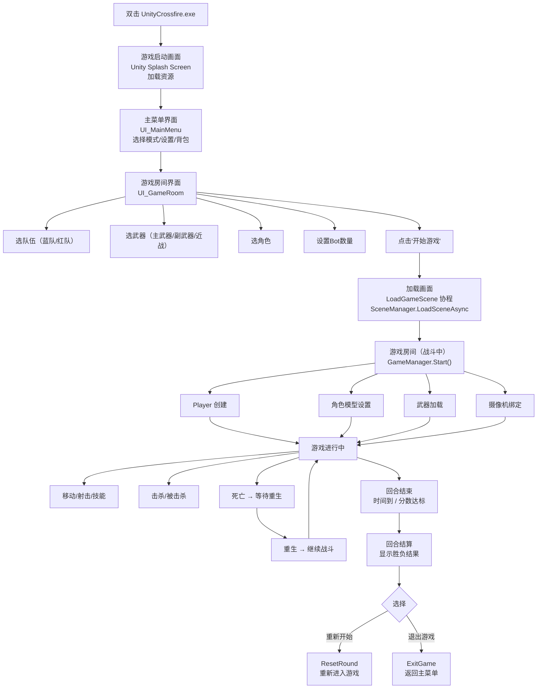
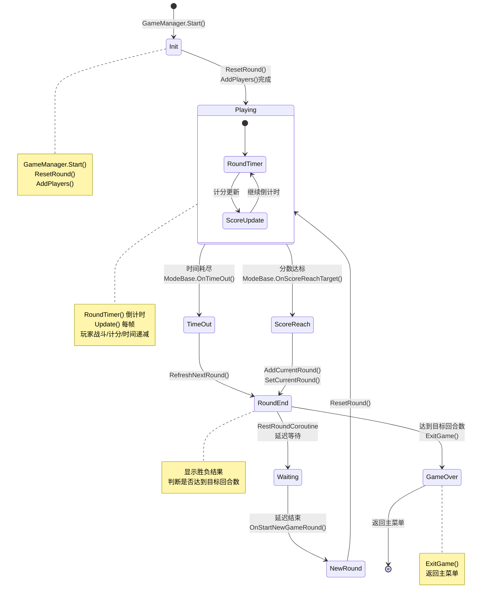
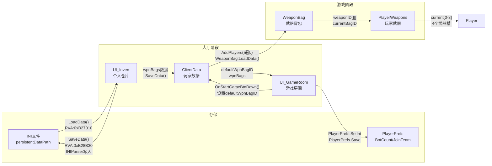

# 游戏加载流程（基于IDA汇编代码验证）

> 所有RVA地址均来自IDA汇编代码，基址0x10000000，实际地址 = 0x10000000 + RVA
> 游戏为32位单机游戏

---

## 阶段一：游戏启动

**打开 UnityCrossfire.exe**

### GameManager.Awake() — RVA: 0xAFA250

**关键结论**：

- GameManager.Awake() 只做基础初始化
- 加载武器资源
- 此时 `GameManager.myPlayer` = null，`GameManager.gameMode` 未设置

---

## 阶段二：游戏大厅

**进入游戏房间界面**

### UI_GameRoom.Awake() — RVA: 0xB25900

**ClientData 创建时机**：

| 数据 | 创建时机 | 说明 |
|------|---------|------|
| ClientData.mine | ClientData$$.cctor() [RVA:0xB3ACF0] | 静态构造函数中 `new ClientData()` 赋值给 `mine`，在首次访问 ClientData 类时触发 |
| Bot ClientData | GenerateBotClient() [RVA:0xB25B80] | 点击"开始游戏"后，在 OnStartGameBtnDown() 中调用，此时才创建 |

**UI_GameRoom.Awake() 执行流程**：

```
UI_GameRoom$$Awake:
  1. 调用父类 Singleton<UI_TopMenu>.Awake()
  2. 清空 UI_GameRoom.players 列表
  3. 将 ClientData.mine 添加到 players 列表  ← 此时只有本地玩家数据
  4. 遍历 mapDatas，用 GameModeExpand.ToChinese(gameMode) 填充 matchTypeDropdown
  5. ExpandUtil.RefreshValue(matchTypeDropdown)
  6. 读取 PlayerPrefs("BotCount", 默认9) → 设置 botCountDropDown.value
  7. 读取 PlayerPrefs("JoinTeam", 默认0) → 设置 joinTeamDropDown.value
```

> **关键结论**：在游戏大厅阶段，**只有 ClientData.mine（本地玩家数据）存在**，Bot 的 ClientData 尚未创建。Player 实例也还不存在。

### UI_GameRoom.OnStartGameBtnDown() — RVA: 0xB25F40

**点击"开始游戏"按钮**

**执行流程**：

```
UI_GameRoom$$OnStartGameBtnDown:
  1. ClientData.mine.defaultWpnBagID = wpnBagTab.currentSelection + 1
  2. UI_Inven.SaveData()  → 保存背包数据到INI文件
  3. currentMapAsset.ApplyGameSetting(mapID, gameSettingDropdowns)  → 应用游戏设置
  4. PlayerPrefs.SetInt("BotCount", botCountDropDown.value)
  5. PlayerPrefs.SetInt("JoinTeam", joinTeamDropDown.value)
  6. ClientData.mine.joinTeam = (joinTeamDropDown.value != 0)
  7. PlayerPrefs.Save()
  8. GenerateBotClient()  ← ★ 此时才创建 Bot 的 ClientData
  9. 启动 LoadGameScene 协程
```

### UI_GameRoom.GenerateBotClient() — RVA: 0xB25B80

**Bot ClientData 创建流程**：

```
UI_GameRoom$$GenerateBotClient:
  1. 获取 ClientData.mine.joinTeam，判断玩家是否选队
  2. 获取 botCountDropDown.value（Bot数量）
  3. Bot数量限制：非多人模式 ≤ 15；多人模式(Nano4_Terminator, GameMode==6)无硬编码上限
     （IDA依据：GameModeExpand__IsMultiPlayerMode [RVA:0x10AFE480] 只有 `return gameMode == 6`）
     （限制逻辑：`if (!IsMultiPlayerMode) m_Value = Mathf.Min(15, m_Value)`）
  4. 循环创建 Bot ClientData:
     a. new ClientData()  → 创建实例
     b. isBot = true
     c. vipLevel = 随机(0或1~6)
     d. level = Random(0, 106)
     e. nickName = 从 botNames 列表随机取一个（取出后移除，避免重名）
     f. joinTeam = 交替分配队伍（与上一个Bot不同队）
     g. ClientData.BotRandom()  → 随机分配武器和角色
     h. 添加到 UI_GameRoom.players 列表
  5. Bot.InitHangOutCount()  → 初始化Bot挂机计数
```

**关键结论**：

- 大厅阶段只有 ClientData.mine，Bot 的 ClientData 在点击"开始游戏"后才创建
- Player 实例在整个大厅阶段都不存在，要到阶段四 AddPlayers() 才创建

### Bot数量限制分析

**IDA反编译证据**（GenerateBotClient [RVA:0xB25B80]）：

```c
m_Value = botCountDropDown->fields.m_Value;           // 从下拉框获取值
if ( !GameModeExpand__IsMultiPlayerMode(gameMode, 0) )
    m_Value = UnityEngine_Mathf__Min(15, m_Value, 0); // 非多人模式：截断到15
// 多人模式：m_Value 不截断，直接用下拉框值
```

**数量控制链**：

```
botCountDropDown.value（UI下拉框，编辑器预设选项0~29）
        ↓
    Mathf.Min(15, value)  ← 仅非多人模式生效
        ↓
    循环 m_Value 次创建 Bot ClientData
        ↓
    每个Bot从 botNames 列表取名字（取出后移除，避免重名）
```

**能否增加？影响分析**：

| 修改方式 | 可行性 | 影响范围 |
|---------|--------|---------|
| 修改 `Mathf.Min(15, value)` 中的15为更大值 | 可行，改1条指令 | 仅影响非多人模式的Bot上限 |
| 修改 botCountDropDown 的选项数量 | 需改UI预制体，非代码层面 | 下拉框显示更多选项 |
| 直接内存写入 `botCountDropDown.value` | 可行，运行时修改 | 跳过UI限制 |

**潜在风险（牵一发而动全身）**：

| 风险点 | 说明 | 严重程度 |
|--------|------|---------|
| **botNames 列表耗尽** | 每个Bot取名字后从列表移除，名字数量有限（编辑器预设），超过后 `botNames[index]` 越界崩溃 | **高** |
| **allPlayers 数组越界** | `Player[] allPlayers` 在 GameManager._ctor 中硬编码分配为 `new Player[30]`（IDA: `push 1Eh; push Player___TypeInfo; call il2cpp_array_new_specific`），AddPlayer() 中通过 `allPlayers[index] = player` 直接索引赋值，超出30会越界崩溃。`GetSparePlayerIndex()` 中也有 `if (v1 >= 30) return 0` 的硬编码上限 | **高** |
| **队伍列表** | `playersBL`/`playersGR` 是 `List<Player>`，动态扩容，无硬限 | 低 |
| **Bot AI 性能** | Bot 每帧执行寻路、决策，数量过多会导致严重卡顿 | 中 |
| **出生点不足** | 地图出生点数量有限，Bot过多会重叠出生 | 中 |
| **网络同步** | 单机游戏无此问题 | 无 |

> **结论**：`allPlayers` 数组硬编码为30大小，这是**真正的硬性上限**。即使多人模式没有 Mathf.Min(15) 截断，超过30个 Player 也会导致数组越界崩溃。`GetSparePlayerIndex()` 同样硬编码 `v1 >= 30` 返回0。要增加超过30个Player，必须同时修改：① `_ctor` 中 `push 1Eh` 改为更大值 ② `GetSparePlayerIndex` 中 `v1 >= 30` 的30改为对应值 ③ `botNames` 列表扩充或改为名字可复用。

---

## 阶段三：场景切换

**LoadGameScene 协程执行**

- 场景切换，GameManager在新场景中重新激活

---

## 阶段四：进入游戏房间（核心阶段）

**GameManager.Start() 触发**

### GameManager.Start() — RVA: 0xAFC160

**IDA汇编证据**：`GameAssembly_part3.lst` 第1109968行

```
GameManager$$Start:
  1. 初始化 GameManager_TypeInfo
  2. 调用 GameManager$$ResetRound(delay=0)  → 重置回合
  3. jmp GameManager$$AddPlayers  → 直接跳转到AddPlayers
```

### GameManager.ResetRound() — RVA: 0xAFBCA0

**IDA汇编证据**：`GameAssembly_part3.lst` 第1109583行

```
GameManager$$ResetRound:
  ├─ 获取 GameManager.instance
  ├─ 启动 RestRoundCoroutine 协程
  └─ 重置回合状态（清理回收对象、重置计分等）
```

### GameManager.AddPlayers() — RVA: 0xAF9DE0

```
GameManager$$AddPlayers:
  1. 获取 UI_GameRoom 的 ClientData 列表
  2. 遍历 ClientData 列表（foreach）:
     a. 调用 GameManager$$AddPlayer(isBot, team)  → 创建Player实例
     b. 调用 ClientData$$Update(clientData)  → 更新客户端数据
     c. 设置 Player.clientData = clientData
     d. 调用 WeaponBag$$LoadData(playerWeapons, clientData)  → 加载武器
     e. 如果是本地玩家（esi == ClientData本地实例）:
        - 设置 GameManager.myPlayer = player
        - 调用 CameraManager$$SetFocusPlayer(player)  → 摄像机跟随
        - 设置 HUD_Weapon 的武器引用
     f. 调用 UI_Inven$$GetCharacterItem()  → 获取角色装备
     g. 调用 SO_Item_Character$$GetCharacterName()  → 获取角色名
     h. 调用 GameManager$$SetCharacter(player, characterName)  → 设置角色模型
     i. 调用 System.Action<Player>.Invoke()  → 触发玩家创建回调
  3. 循环结束，Dispose枚举器
```

### GameManager.AddPlayer(bool isBot, Team team) — RVA: 0xAF9A90

**AddPlayers() 与 AddPlayer() 的区别**：

| | AddPlayers() [RVA:0xAF9DE0] | AddPlayer(isBot, team) [RVA:0xAF9A90] |
|---|---|---|
| **角色** | 批量调度器，遍历所有 ClientData | 单个工厂方法，创建一个 Player 实例 |
| **输入** | 无参数，从 UI_GameRoom.players 获取列表 | isBot(是否机器人) + team(队伍) |
| **职责** | 遍历 ClientData 列表，对每个调用 AddPlayer | 实例化 Player 预制体，初始化 Player 对象 |
| **调用关系** | AddPlayers() 内部循环调用 AddPlayer() | 被 AddPlayers() 调用 |
| **后续操作** | 无（后续操作在 AddPlayers 的循环中完成） | 只负责创建和初始化 Player，返回实例 |

**简单理解**：AddPlayers() 是"总指挥"，负责遍历和后续设置；AddPlayer() 是"工人"，只负责创建一个 Player。

```
GameManager$$AddPlayer:
  1. 初始化类元数据
  2. 根据 GameMode 判断队伍分配:
     - GameMode 3~6 (Nano模式): assignedTeam = 1 (固定队伍)
     - GameMode 1 (DeathMatch): assignedTeam = 2 (Neutral中立)
     - 其他(GameMode 0=TeamDeath, 2=Special): assignedTeam = team参数
  3. 获取 GameManager.instance.playerPrefab
  4. 调用 UnityEngine.Object.Instantiate<GameObject>(playerPrefab)  → 实例化Player预制体
     ★ 此时Unity自动调用 Player$$.cctor()（静态构造函数，首次访问Player类时触发）
     ★ 此时Unity自动调用 Player$$Awake()（实例初始化）
  5. 调用 GetComponent<Player>()  → 获取Player组件
  6. 设置 GameObject.name = "Player" + index.ToString()
  7. 调用虚函数 Player.Init(isBot, assignedTeam)  → 通过vtable调用
  8. 将Player添加到对应队伍列表（playersBL 或 playersGR）
  9. 设置 Player.playerId
  10. 返回 Player 实例
```

**GameMode 队伍分配逻辑详解**：

| GameMode | 值 | 队伍分配 | 原因 |
|----------|---|---------|------|
| TeamDeath（团队竞技） | 0 | 使用 team 参数 | 团队死斗，需要分两队（BlackList/GlobalRisk） |
| DeathMatch（个人竞技） | 1 | 强制 Team=2 (Neutral) | 个人死斗，所有人都是中立，不分队 |
| Special（特殊战） | 2 | 使用 team 参数 | 特殊模式，需要分两队 |
| Nano3/Nano4/Nano6/Nano4_Terminator | 3~6 | 强制 Team=1 (GlobalRisk) | Nano模式，所有玩家同队对抗AI/终结者 |

> **为什么 Nano 模式固定 Team=1？** Nano 模式是 PVE 玩法，玩家合作对抗AI敌人，所以所有玩家被分配到同一队（GlobalRisk），敌人由游戏模式逻辑单独管理。

**GameManager.instance.playerPrefab 是什么？**

`playerPrefab` 是 GameManager 上挂载的一个 **Unity GameObject 预制体引用**（字段偏移 0xC），它是一个预先配置好的 Player 游戏对象模板，包含：

- `Player` 组件（脚本）
- `Entity` 组件（实体基类）
- `HealthData` 组件（血量管理）
- `PlayerWeapons` 组件（武器管理）
- `WeaponBag` 组件（背包管理）
- 各种 Collider、Rigidbody、Animator 等 Unity 物理和动画组件

`Instantiate(playerPrefab)` 的作用是根据这个模板**克隆出一个全新的 GameObject**，Unity 会自动：
1. 调用 `Player$$.cctor()`（如果 Player 类尚未初始化）
2. 调用 `Player$$Awake()`（实例初始化）
3. 复制预制体上所有组件和子对象

> **注意**：GameManager 还有一个 `botPrefab`（偏移 0x10），但 IDA 反编译显示 AddPlayer() 中**只使用 playerPrefab**，不区分 Bot 和本地玩家——Bot 和本地玩家使用同一个预制体，通过 `Player.Init(isBot=true)` 来区分行为。

### GameManager.SetCharacter() — RVA: 0xAFBFD0

**IDA汇编证据**：`GameAssembly_part3.lst` 第1109808行

```
GameManager$$SetCharacter:
  1. 调用 Player$$SetExistentCharacter(player, characterName)  → 尝试设置已有角色
  2. 如果失败，通过 GameManager.instance 获取角色预制体
  3. 实例化新角色模型并关联到Player
```

**关键结论**：
- **Player$$.cctor() 在此时才触发**（首次Instantiate(playerPrefab)时由IL2CPP运行时触发）
- **Player$$Awake() 在此时才调用**（Instantiate后由Unity调用）
- **GameManager.myPlayer 在此时才赋值**（AddPlayers遍历中识别本地ClientData时）

---

## 阶段五：游戏运行

### Player.Spawn() — RVA: 0xB53760

```
Player$$Spawn:
  ├─ Entity$$Spawn()  → 父类生成逻辑
  ├─ ModeBase_Nano.SpawnEvent()  → 模式事件通知
  └─ 角色模型设置、技能初始化等
```

### Player.Update() — 每帧更新
### Player.Respawn() — 重生逻辑

---

## 关键修正点

| 项目 | 正确流程（IDA验证） |
|------|-------------------|
| Player$$.cctor() | **进入游戏房间后**，首次Instantiate(playerPrefab)时触发 |
| Player$$Awake() | **进入游戏房间后**，Instantiate后由Unity调用 |
| GameManager.myPlayer | **AddPlayers()遍历中**，识别本地ClientData时赋值 |
| GameMode | 是**枚举值**，在UI_GameRoom中设置，AddPlayer中用于判断队伍 |
| ClientData | **大厅阶段创建**，AddPlayers遍历ClientData列表来创建Player |

---

## GameMode 枚举值

```csharp
public enum GameMode  // TypeDefIndex: 5187
{
    TeamDeath = 0,         // 团队死斗
    DeathMatch = 1,        // 自由死斗
    Special = 2,           // 特殊模式
    Nano3 = 3,             // Nano 3人
    Nano4 = 4,             // Nano 4人
    Nano6 = 5,             // Nano 6人
    Nano4_Terminator = 6   // Nano 4人终结者
}
```

在 `GameManager.AddPlayer()` 中，GameMode用于判断队伍分配：
- GameMode 3~6（Nano模式）：队伍固定为1
- GameMode 1（DeathMatch）：队伍设为2
- 其他模式：使用传入的team参数

---

## 一、流程图（玩家视角）

> 从玩家操作角度描述完整步骤



---

## 三、状态机图

> 以下枚举为状态机图的参考数据

### 3.0 枚举定义

**队伍枚举**

```csharp
public enum Team  // TypeDefIndex: 5182
{
    BlackList = 0,   // 蓝队（黑名单）
    GlobalRisk = 1,  // 红队（全球风险）
    Neutral = 2      // 中立/观察者（未分配队伍）
}
```

- 同队不可互相伤害
- 游戏内部通过 `Entity.team` 字段判断队伍
- `TeamExpand.GetEnemyTeam(team)` 获取敌方队伍

**重生类型枚举**

```csharp
public enum Player.RespawnType  // TypeDefIndex: 5163
{
    Team = 0,       // 在队友身边重生
    Stay = 1,       // 原地重生
    EnemyTeam = 2   // 在敌方身边重生
}
```


### 3.2 房间/回合状态机

> 基于 ModeBase 的回合逻辑推导



---

## 四、游戏设置与背包系统

### 4.1 比赛类型、地图、杀敌数、时间的设置流程

> 基于 IDA 反编译 UI_GameRoom、MapAsset、MapAsset_TeamDeath 验证

**设置时机**：在游戏房间界面（UI_GameRoom）中，通过 Dropdown 下拉菜单选择

**UI_GameRoom 关键字段**（TypeDefIndex: 5512）：

| 字段 | 类型 | 偏移 | 作用 |
|------|------|------|------|
| matchTypeDropdown | Dropdown | 0xC | 比赛类型下拉框 |
| mapDropdown | Dropdown | 0x10 | 地图下拉框 |
| winTypeDropdown | Dropdown | 0x14 | 胜利条件下拉框 |
| conditionDropdown | Dropdown | 0x18 | 游戏条线下拉框 |
| weaponSelectDropdown | Dropdown | 0x1C | 武器选择下拉框 |
| wpnBagTab | UI_SelectionGroup | 0x20 | 背包标签页 |
| wpnSlots | UI_ItemBox[] | 0x24 | 武器槽位 |
| wpnSlot_Throw | UI_ItemBox_Throw | 0x28 | 投掷武器槽位 |
| mapDatas | MapAsset[] | 0x2C | 地图资源数组 |
| currentMapAsset | MapAsset | 0x30 | 当前选中的地图资源 |
| botCountDropDown | Dropdown | 0x3C | 机器人数量下拉框 |
| joinTeamDropDown | Dropdown | 0x40 | 加入队伍下拉框 |

**MapAsset 数据结构**（TypeDefIndex: 5440）：

```csharp
public class MapAsset : ScriptableObject
{
    public GameMode gameMode;           // 比赛类型
    public GameObject gameModePrefab;   // 游戏模式预制体
    public MapAsset.Map[] datas;        // 地图数据数组
}

public struct MapAsset.Map
{
    public string sceneName;                // 场景名称
    public string mapName;                  // 地图名
    public Sprite mapIcon;                  // 地图图标
    public Texture loadingTex_BL;           // 蓝队加载图
    public Texture loadingTex_GR;           // 红队加载图
    public GameObject gameModePrefabOverride; // 模式预制体覆盖
    public WeaponLimited weaponLimited;     // 武器限制
}

public enum WeaponLimited  // TypeDefIndex: 5370
{
    None = 0,      // 无限制
    Knife = 1,     // 仅近战
    HandGun = 2,   // 仅手枪
    Sniper = 3     // 仅狙击
}
```

**MapAsset_TeamDeath 静态配置**（TypeDefIndex: 5444）：

| 字段 | 类型 | 说明 |
|------|------|------|
| KillDatas | int[] | 杀敌数选项（如30/50/100） |
| KillTexts | string[] | 杀敌数显示文本 |
| KillConditionTime | Vector2Int | 杀敌模式下的默认时间 |
| TimeDatas | Vector2Int[] | 时间选项（如5分/8分/10分） |
| TimeTexts | string[] | 时间显示文本 |
| WinType | string[] | 胜利条件类型（杀敌数/时间） |

**ModeBase 静态字段**（游戏规则，在 ApplyGameSetting 中设置）：

| 字段 | 类型 | 说明 |
|------|------|------|
| targetScore | int | 目标杀敌数（0=时间模式） |
| targetRound | int | 目标回合数（0=无限回合） |
| gameTime | Vector2Int | 游戏时间（分,秒） |
| respawnTime | float | 重生时间 |

---

### 4.2 背包系统

> 基于 IDA 反编译 UI_Inven、WeaponBag、ClientData 验证

**背包数量**：7个背包（wpnBagTab 选择 0-6，内部存储为 bagID 1-7）

**每个背包包含4个武器槽位**：

| 槽位 | 索引 | 说明 |
|------|------|------|
| 主武器 | 0 | 步枪/冲锋枪/机枪/狙击枪 |
| 副武器 | 1 | 手枪/霰弹枪 |
| 近战 | 2 | 刀（默认不可卸下） |
| 投掷 | 3 | 手雷/闪光弹等 |

**数据存储位置**：

| 数据 | 存储位置 | 格式 |
|------|---------|------|
| 背包武器配置 | ClientData.wpnBags (int[][]) | 7个背包×4个槽位的武器ID |
| 默认背包ID | ClientData.defaultWpnBagID | 1-7 |
| 持有武器列表 | UI_Inven.myWeapons (List\<ItemObject\>) | 静态字段，运行时缓存 |
| 持有角色列表 | UI_Inven.myCharacters (List\<ItemObject\>) | 静态字段，运行时缓存 |
| 持有道具列表 | UI_Inven.myItems (List\<ItemObject\>) | 静态字段，运行时缓存 |
| 物品字典 | UI_Inven.itemDic (Dictionary\<int,SO_Item\>) | 静态字段，ID→物品映射 |
| 持久化文件 | UI_Inven.dataPath (static string) | INI格式，路径=persistentDataPath |

**背包数据流向**：



---

