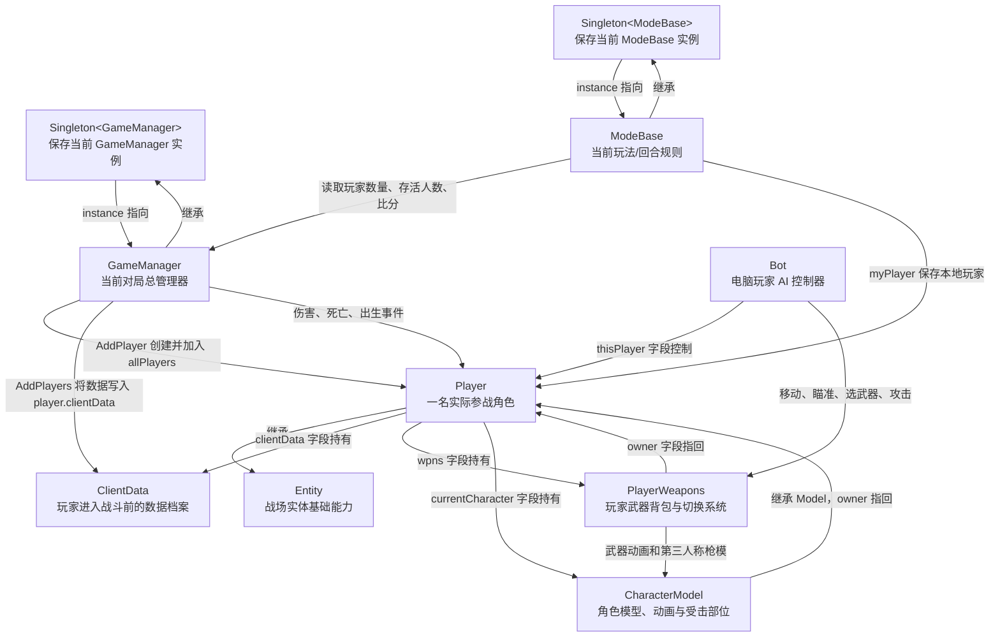
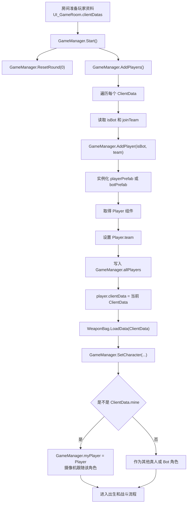
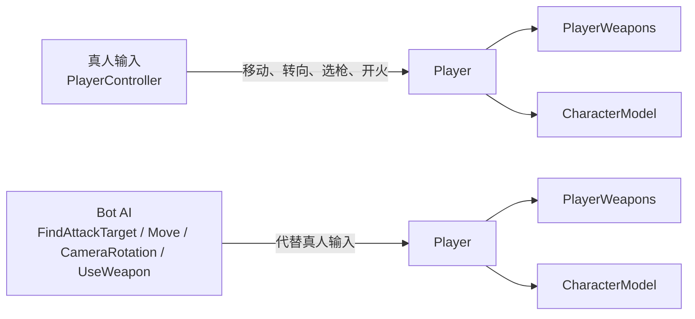

# 穿越火线关键类关系图

> 分析对象：Unity IL2CPP 版本  
> 第一版范围：`Singleton<T>`、`GameManager`、`ModeBase`、`ClientData`、`Entity`、`Player`、`Bot`、`PlayerWeapons`、`CharacterModel`

## 一、怎么看这份图

图中的箭头含义：

| 箭头文字 | 含义 | 判断依据 |
| --- | --- | --- |
| 继承 | 子类拥有父类提供的基础能力 | `dump.cs` 类声明 |
| 字段持有 | A 的字段中直接保存 B 的实例地址 | `dump.cs` 字段定义 |
| 创建 | A 的方法创建 B | IDA 方法调用和对象实例化 |
| 绑定 | 两个组件指向同一名战场角色 | 字段赋值或 `GetComponent<T>()` |
| 读取/控制 | A 调用 B 的方法或读取其状态 | 方法调用、属性和交叉引用 |

证据等级：

- **IDA 确认**：汇编中能看到实际调用、比较或赋值。
- **dump.cs 确认**：能确认类、字段、偏移、属性和方法签名。
- **功能解释**：结合字段和调用关系，用穿越火线游戏流程解释其职责。

## 二、关键类总关系图



### 用游戏语言理解

可以把它们理解为：

1. `ClientData` 是进入战场前的参战登记表。
2. `GameManager` 根据登记表创建战场里的 `Player`。
3. `Player` 是真正会移动、受伤、死亡和复活的角色。
4. `PlayerWeapons` 是挂在该角色上的武器管理系统。
5. `CharacterModel` 是其他玩家实际看到的角色外观、动画和受击点。
6. 真人角色由玩家输入控制；电脑角色额外挂一个 `Bot`，由 AI 代替真人做决定。
7. `ModeBase` 不负责角色怎么移动，而是决定本局怎么玩、如何计分、何时结束。
8. `Singleton<T>` 让其他代码可以快速找到当前唯一的 `GameManager` 或 `ModeBase`。

## 三、从进入房间到开始战斗



### 这条流程说明了什么

- `ClientData` 不是场景中的人物对象，它只是人物资料。
- `Player` 才是场景中的参战实体。
- `GameManager.myPlayer` 不是另造一个角色，而是 `allPlayers` 中与 `ClientData.mine` 对应的那个 `Player`。
- `isBot` 决定创建时使用普通玩家预制体还是带 AI 组件的 Bot 预制体。
- Bot 最终仍然操作一个 `Player`，所以 Bot 也有生命、队伍、武器和角色模型。

## 四、真人与 Bot 的差别



| 对比项 | 真人 | Bot |
| --- | --- | --- |
| 战场实体 | `Player` | `Player` |
| 玩家资料 | `ClientData.isBot == false` | `ClientData.isBot == true` |
| 控制来源 | `PlayerController` 和输入状态 | `Bot` AI |
| 武器系统 | `PlayerWeapons` | `PlayerWeapons` |
| 角色模型 | `CharacterModel` | `CharacterModel` |
| 队伍、生命、死亡 | `Entity` / `Player` | `Entity` / `Player` |

关键结论：

> `Bot` 不是 `Player` 的替代品，而是控制 `Player` 的 AI 驾驶层。

IDA 依据：

- `Bot.Awake()` 调用 `GetComponent<Player>()`。
- 返回的 `Player` 被写入 `Bot.thisPlayer`，字段偏移为 `Bot + 0x24`。
- `Bot` 随后监听这个 `Player` 的生命状态，并使用它的玩家数据、武器和技能。

## 五、每个类在穿越火线中做什么

### 5.1 `Singleton<T>`：当前系统实例的入口

`Singleton<T>` 是泛型单例基类。

```text
Singleton<GameManager>.instance -> 当前对局的 GameManager
Singleton<ModeBase>.instance    -> 当前玩法的 ModeBase
```

它解决的问题是：脚本不需要在场景里反复搜索管理器，可以直接取得当前实例。

关键字段：

| 字段 | 功能 |
| --- | --- |
| `<instance>k__BackingField` | 自动属性 `instance` 的真实存储位置 |
| `inspector` | 与 Unity Inspector 对象关联的辅助字段 |

注意：

- `Singleton<GameManager>.instance` 指向对局管理器。
- `GameManager.myPlayer` 指向本机控制的玩家。
- 两者不是同一个对象，也不是同一个字段。

依据：

- `GameManager : Singleton<GameManager>`
- `ModeBase : Singleton<ModeBase>`
- `dump.cs` 列出了 `Singleton<GameManager>.get_instance()` 和 `Singleton<ModeBase>.get_instance()` 的泛型实例。

### 5.2 `GameManager`：一场对局的总管理器

在穿越火线中，它相当于当前战斗房间的战场总调度中心。

主要职责：

| 功能 | 相关字段或方法 |
| --- | --- |
| 创建参战角色 | `AddPlayers()`、`AddPlayer()` |
| 保存全部角色 | `allPlayers` |
| 按阵营保存角色 | `playersBL`、`playersGR` |
| 保存存活角色 | `playersBL_Alive`、`playersGR_Alive` |
| 保存本机角色 | `myPlayer` |
| 设置角色模型 | `SetCharacter()`、`GetCharacter()` |
| 发放和读取武器 | `GiveWeapon()`、`GetWeapon()` |
| 处理伤害 | `TakeDamage()` |
| 广播死亡 | `DeathEventBroadcast()` |
| 回合开始和结束 | `ResetRound()`、`GameRoundEnd()` |
| 清理战场对象 | `ClearRecyclableObject()`、`OnDestroy()` |

重要持有关系：

| GameManager 字段 | 指向什么 |
| --- | --- |
| `Player[] allPlayers` | 当前对局的玩家槽位 |
| `Player myPlayer` | 本机玩家 |
| `List<Player> playersBL` | 潜伏者/BL 阵营玩家 |
| `List<Player> playersGR` | 保卫者/GR 阵营玩家 |
| `WeaponAsset weaponAsset` | 武器资源配置 |
| `CharacterAsset characterAsset` | 角色资源配置 |

### 5.3 `ModeBase`：当前游戏模式和胜负规则

它负责“这局怎么玩”，而不是“玩家身体怎么移动”。

主要职责：

| 游戏功能 | 字段或方法 |
| --- | --- |
| 当前比分 | `score` |
| 当前回合 | `currentRound` |
| 目标回合和目标分数 | `targetRound`、`targetScore` |
| 比赛时间 | `gameTime`、`restGameTime`、`RoundTimer()` |
| 两边人数和存活人数 | `playerCountBL/GR`、`aliveCountBL/GR` |
| 计分板显示 | `UpdatePlayerRect()`、`UpdateTimeUI()` |
| 新回合开始 | `OnStartNewGameRound()` |
| 分数达到目标 | `OnScoreReachTarget()` |
| 时间结束 | `OnTimeOut()` |
| 退出战斗 | `ExitGame()` |

具体玩法类会继承或扩展它，例如团队竞技、个人竞技、生化模式可以覆盖计分和回合处理方法。

### 5.4 `ClientData`：玩家的参战资料

它表示一名玩家进入战斗时携带的数据，不负责场景移动或受伤。

| 字段 | 穿越火线中的含义 |
| --- | --- |
| `mine` | 本机玩家的数据记录 |
| `nickName` | 玩家昵称 |
| `level` | 玩家等级 |
| `joinTeam` | 进入的阵营 |
| `isBot` | 是否电脑玩家 |
| `character` | 选择的角色 |
| `defaultWpnBagID` | 默认武器背包 |
| `wpnBags` | 各背包的武器配置 |
| `vipLevel` | VIP 等级 |
| `itemList` | 携带道具 |

关键关系：

```text
Player.clientData -> ClientData
```

IDA 在 `GameManager.AddPlayers()` 中确认：

```text
Player + 0x94 = 当前 ClientData
```

### 5.5 `Entity`：战场实体的公共基础

`Player` 继承自 `Entity`。很多看似属于 `Player` 的基础状态，实际定义在 `Entity`。

| 字段或属性 | 功能 |
| --- | --- |
| `healthData` | 生命值等生命状态 |
| `team` | 当前阵营 |
| `isDead` | 是否死亡 |
| `isInvincible` | 是否无敌 |
| `baseMoveSpeed` | 基础移动速度 |
| `speedPenalty` | 减速效果 |
| `damageRate` | 伤害倍率 |
| `characterController` | Unity 角色碰撞和移动控制器 |
| `LifeState_Listenner` | 出生、死亡等生命状态通知 |

常用方法：

- `SetTeam()`
- `Spawn()`
- `OnEntityHurt()`
- `OnEntityDeath()`
- `AddSpeedPenalty()`
- `CleanAllBuff()`

因此判断玩家阵营应读取 `Player` 继承得到的 `Entity.team`，而不是寻找一个独立的 `Player.isEnemy` 字段。

### 5.6 `Player`：真正存在于战场中的角色

它是一名玩家在地图中的完整战斗对象。

主要职责：

| 功能 | 字段或方法 |
| --- | --- |
| 移动和跳跃 | `MoveByLocalDirection()`、`OnJumpBtnDown()` |
| 视角方向 | `cameraRotation`、`GetCameraRotation()`、`LookAt()` |
| 玩家资料 | `clientData` |
| 武器系统 | `wpns` |
| 角色模型 | `currentCharacter` |
| 生命和伤害 | 继承 `Entity`，并覆盖 `OnEntityHurt/Death()` |
| 出生和复活 | `Spawn()`、`Respawn()` |
| 武器背包 | `weaponBag`、`SelectWeaponBag()` |
| 战绩 | `kill`、`death`、`score`、`survival` |
| 生化角色能力 | `nanoRole`、`nanoClothCount`、`skills` |

关键字段关系：

```text
Player.clientData       -> ClientData
Player.wpns             -> PlayerWeapons
Player.currentCharacter -> CharacterModel
Player.weaponBag        -> WeaponBag
Player.cameraManager    -> PlayerCameraManager
```

### 5.7 `Bot`：电脑玩家的决策控制器

它负责替 Bot 对应的 `Player` 做决定。

| AI 功能 | 字段或方法 |
| --- | --- |
| 找敌人 | `FindAttackTarget()`、`CheckAttackTarget()` |
| 保存当前敌人 | `enemyInfo`、`tryFindEnemy` |
| 检查能否命中 | `CheckHitBox()` |
| 寻路 | `seeker`、`path`、`OnPathComplete()` |
| 移动 | `Move()`、`GetMoveStateByDir()` |
| 控制视角 | `CameraRotation()` |
| 切换武器 | `SelectWeapon()` |
| 使用武器 | `UseWeapon()` |
| 使用技能 | `UseSkill()` |
| 响应生命变化 | `OnLifeStateChange()` |

最重要字段：

```text
Bot.thisPlayer -> Bot 实际控制的 Player
```

所以通过 `Bot.Update()` 找到的不是另一套特殊 Player，而是“当前正在由 AI 更新的 Player”。

### 5.8 `PlayerWeapons`：玩家身上的武器管理系统

它不代表某一把枪，而是管理玩家全部武器槽位。

| 字段 | 功能 |
| --- | --- |
| `owner` | 武器系统属于哪个 `Player` |
| `all` | 持有的全部武器 |
| `inUse` | 当前正在使用的武器 |
| `current` | 当前武器组 |
| `normal` | 普通武器组 |
| `special` | 特殊武器组 |
| `temporaryWpn` | 临时武器 |
| `F_KeyWpn` | F 键武器 |
| `mapWpn` | 地图拾取武器 |
| `curSlot` | 当前槽位 |
| `lastSlot` | 上一个槽位 |

主要功能：

- `Select()`：切换武器。
- `SetWeapon()`：把武器装入对应槽位。
- `Remove()` / `RemoveAll()`：移除武器。
- `FillMainWeaponAmmo()` / `FillAllGunAmmo()`：补充弹药。
- `GiveUpWeapon()`：丢弃武器。

`Player.Awake()` 中创建 `PlayerWeapons(owner)`，因此它和该 `Player` 是一对一的拥有关系。

### 5.9 `CharacterModel`：第三人称角色外观和受击模型

它负责角色“看起来是什么样”和“子弹能打到哪里”。

| 字段 | 功能 |
| --- | --- |
| `characterAnimator` | 身体动画控制器 |
| `handAnimator` | 手部动画控制器 |
| `spine/spine1/neck` | 身体关键节点 |
| `hitboxes` | 可检测的受击节点 |
| `helmet` | 头盔对象 |
| `bindQvMdl` | 绑定的第三人称武器模型 |
| `voiceAsset` | 角色语音 |
| `roleAsset` | 角色 HUD 资源 |

主要功能：

- 播放移动、跳跃、换弹、死亡和受击动画。
- 将武器模型绑定到角色手部插槽。
- 使用 `GetVisibleHitBox()` 检查从某条视线能够看见的受击部位。
- 在角色死亡和复活时切换模型状态。

关系是双向的：

```text
Player.currentCharacter -> CharacterModel
CharacterModel.owner     -> Player
```

## 六、哪些类成为了其他类的字段

| 持有者 | 字段 | 字段类型 | 关系说明 | 依据 |
| --- | --- | --- | --- | --- |
| `GameManager` | `allPlayers` | `Player[]` | 当前对局的玩家槽位 | dump.cs |
| `GameManager` | `myPlayer` | `Player` | 本机玩家 | dump.cs + IDA |
| `GameManager` | `playersBL/GR` | `List<Player>` | 两个阵营的玩家 | dump.cs |
| `ModeBase` | `myPlayer` | `Player` | 当前模式关注的本机玩家 | dump.cs |
| `Player` | `clientData` | `ClientData` | 这名战场角色对应的玩家资料 | dump.cs + IDA |
| `Player` | `wpns` | `PlayerWeapons` | 这名玩家的武器管理器 | dump.cs + IDA 交叉引用 |
| `PlayerWeapons` | `owner` | `Player` | 武器管理器反向指向所属玩家 | dump.cs |
| `Player` | `currentCharacter` | `CharacterModel` | 当前显示的角色模型 | dump.cs |
| `CharacterModel` | `owner` | `Player` | 通过父类 `Model.owner` 反向指向玩家 | dump.cs |
| `Bot` | `thisPlayer` | `Player` | AI 当前控制的战场玩家 | dump.cs + IDA |
| `Bot` | `enemyInfo` | `BotEnemyInfo` | AI 当前敌人和锁定状态 | dump.cs |
| `CharacterModel` | `hitboxes` | `Transform[]` | 可见性和命中检测节点 | dump.cs |

## 七、队友和敌人的关系

第一版关键类中没有看到一个通用的 `Player.isEnemy` 字段。

基础依据是：

```text
Player 继承 Entity
Entity.team 保存阵营
GameManager.playersBL / playersGR 保存两边玩家
```

在团队玩法中，一般关系是：

```text
目标.team != 自己.team -> 敌方
目标.team == 自己.team -> 队友
```

但最终还必须结合当前 `GameMode`：

- 团队竞技：主要按 BL/GR 阵营区分。
- 个人竞技：所有其他参战者都可能是敌人，不能只使用“阵营不同”。
- 生化模式：还要结合人类、生化角色和 `NanoRole` 等模式状态。

因此，修改代码时应优先寻找当前模式已有的敌我判断方法，不能把一个固定的阵营比较应用于所有玩法。

## 八、关键对象从哪里获取

| 想获取的对象 | 推荐入口 | 原因 |
| --- | --- | --- |
| 当前对局管理器 | `Singleton<GameManager>.get_instance()` | 返回当前 GameManager 单例 |
| 本机玩家 | `GameManager.myPlayer` | `AddPlayers()` 与 `ClientData.mine` 比较后写入 |
| 全部玩家槽位 | `GameManager.allPlayers` | GameManager 创建玩家时写入 |
| 某玩家资料 | `player.clientData` | `AddPlayers()` 明确赋值 |
| 某玩家武器系统 | `player.wpns` | Player 自己持有 |
| 当前武器 | `player.wpns.inUse` | PlayerWeapons 管理当前武器 |
| 某玩家角色模型 | `player.currentCharacter` | Player 保存当前模型 |
| Bot 控制的玩家 | `bot.thisPlayer` | `Bot.Awake()` 通过 GetComponent 获取 |
| 当前玩法控制器 | `Singleton<ModeBase>.get_instance()` | 返回当前模式单例 |

## 九、对修改代码最有用的关系

### 获取全部玩家信息

```text
Singleton<GameManager>.instance
    -> allPlayers[i]
        -> clientData
        -> team
        -> healthData
        -> wpns
        -> currentCharacter
```

注意过滤：

- `player == null`
- `player.clientData == null`
- 已销毁或尚未初始化的 Unity 对象
- `allPlayers` 中未使用的空槽位

### 获取自己的信息

```text
GameManager.myPlayer
    -> clientData
    -> team
    -> cameraRotation
    -> wpns.inUse
    -> currentCharacter
```

### 获取 Bot 的目标和武器

```text
Bot
    -> thisPlayer
        -> wpns
    -> enemyInfo.enemy
    -> tryFindEnemy
```

### 获取角色受击部位

```text
Player.currentCharacter
    -> hitboxes
    -> neck / spine / spine1
    -> helmet
```

## 十、证据索引

### dump.cs

| 类型 | TypeDefIndex | 关键证据 |
| --- | ---: | --- |
| `Singleton<T>` | 5376 | `instance` 自动属性及泛型实例列表 |
| `Bot` | 5095 | `thisPlayer`、寻敌、移动、武器和技能方法 |
| `ClientData` | 5120 | `mine`、`joinTeam`、`isBot`、武器背包资料 |
| `PlayerWeapons` | 5156 | `owner`、武器数组和选择/移除方法 |
| `Entity` | 5161 | `healthData`、`team`、`isDead` 和生命事件 |
| `Player` | 5171 | `clientData +0x94`、`wpns +0xA0`、`currentCharacter +0x5C` |
| `ModeBase` | 5194 | 比分、回合、时间和模式事件 |
| `GameManager` | 5365 | `allPlayers`、`myPlayer`、创建和伤害方法 |
| `CharacterModel` | 5394 | 动画、身体节点和 `hitboxes +0x74` |

### IDA 导出汇编

| 地址 | 方法 | 已确认关系 |
| --- | --- | --- |
| `0x10AFC160` | `GameManager.Start()` | 调用 `ResetRound()` 后进入 `AddPlayers()` |
| `0x10AF9DE0` | `GameManager.AddPlayers()` | 遍历 `List<ClientData>` |
| `0x10AF9F21` | `GameManager.AddPlayers()` | 读取 `ClientData.isBot +0x1C` |
| `0x10AF9F26` | `GameManager.AddPlayers()` | 读取 `ClientData.joinTeam +0x18` |
| `0x10AF9F32` | `GameManager.AddPlayers()` | 调用 `AddPlayer(isBot, team)` |
| `0x10AF9F4F` | `GameManager.AddPlayers()` | 写入 `Player.clientData +0x94` |
| `0x10AF9F7B` | `GameManager.AddPlayers()` | 当前 ClientData 与 `ClientData.mine` 比较 |
| `0x10AF9FAB` | `GameManager.AddPlayers()` | 写入 `GameManager.myPlayer` |
| `0x10AF9A90` | `GameManager.AddPlayer()` | 创建 Player 并写入 `allPlayers` |
| `0x10B2D02B` | `Bot.Awake()` | `GetComponent<Player>()` |
| `0x10B2D03D` | `Bot.Awake()` | 写入 `Bot.thisPlayer +0x24` |
| `0x10B2D0EF` | `Bot.Awake()` | 监听 Player/Entity 的生命状态 |
| `0x10B4FEF0` | `Player.Awake()` | Player 初始化入口 |
| `0x10B16F10` | `PlayerWeapons..ctor(Player)` | PlayerWeapons 构造入口 |

## 十一、第一版结论

核心数据链可以压缩成一句话：

> `GameManager` 根据 `ClientData` 创建 `Player`；`Player` 持有武器系统和角色模型；如果该角色是电脑玩家，`Bot` 再控制这个 `Player`；`ModeBase` 使用这些玩家状态执行当前穿越火线玩法的计分、回合和胜负规则。

后续适合补充的第二层关键类：

- `PlayerController`：真人输入如何变成移动、视角和开火。
- `Weapon` / `WPN_Gun`：一把枪如何开火、计算弹药和后坐力。
- `DamageEventData` / `DeathEventData`：伤害与死亡数据如何流转。
- `CameraManager` / `PlayerCameraManager`：第一人称视角如何绑定本机玩家。
- 各 `Mode_*`：团队竞技、个人竞技和生化模式的敌我及胜负规则。
- `WeaponBag`：`ClientData.wpnBags` 如何变成玩家实际持有的武器。
