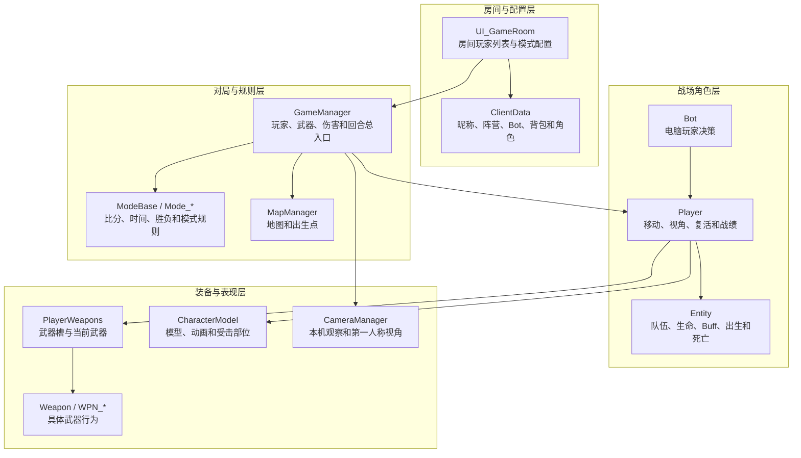

# 穿越火线核心类总览

> 目的：建立 Unity IL2CPP 穿越火线的核心类地图，再进入单个类的详细分析。  
> 依据：`dump.cs`、IDA 导出汇编；关系分为字段持有、创建、调用、事件通知和继承。

## 一、文档导航

| 文档 | 主要回答的问题 | 状态 |
| --- | --- | --- |
| [GameManager 类关系与流程](01-GameManager类关系与流程.md) | 一局战斗如何创建玩家、管理武器、处理伤害和控制回合 | 已生成 |
| [Player 类关系与流程](02-Player类关系与流程.md) | 一名玩家如何组合生命、移动、武器、模型和资料 | 已生成 |
| [ClientData 类关系与流程](03-ClientData类关系与流程.md) | 房间玩家资料如何变成战场 Player | 已生成 |
| [Bot 类关系与流程](04-Bot类关系与流程.md) | AI 如何控制 Player 寻敌、移动和攻击 | 已生成 |
| [PlayerWeapons 类关系与流程](05-PlayerWeapons类关系与流程.md) | 武器槽、当前武器和 Weapon 实例如何组织 | 已生成 |
| [ModeBase 类关系与流程](06-ModeBase类关系与流程.md) | 不同玩法如何处理比分、时间、回合和胜负 | 已生成 |
| [Entity 类关系与流程](07-Entity类关系与流程.md) | 战斗实体如何共享生命、队伍、Buff、出生和死亡基础 | 已生成 |
| [CameraManager 类关系与流程](08-CameraManager类关系与流程.md) | 本机观察目标、第一人称相机和死亡观战如何协调 | 已生成 |
| [CharacterModel 类关系与流程](09-CharacterModel类关系与流程.md) | 角色模型、动画、命中盒、死亡和武器表现如何工作 | 已生成 |
| [MapManager 类关系与流程](10-MapManager类关系与流程.md) | 出生点、补给点、地图枪和雷达参数如何管理 | 已生成 |

配套资料：

- [GameManager 类完整分析与修改指南](../GameManager类完整分析与修改指南.md)：完整字段、属性和方法字典。
- [穿越火线关键类关系图](../穿越火线关键类关系图.md)：第一版多类关系总览。

## 二、核心类分层

