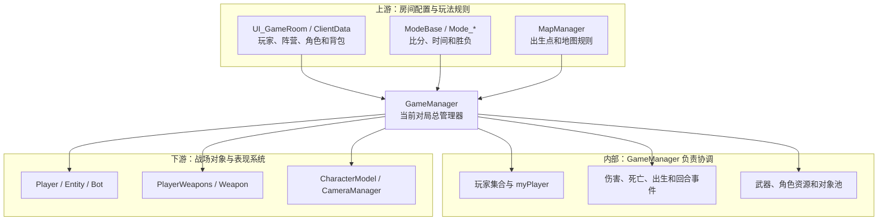
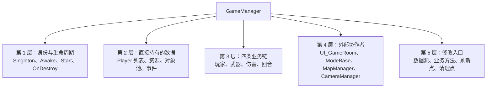
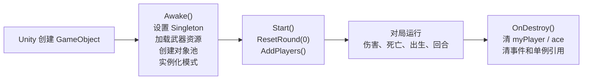
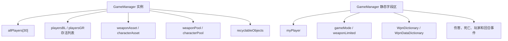
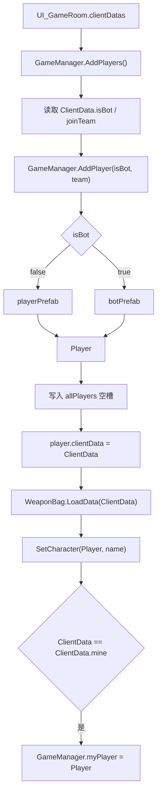
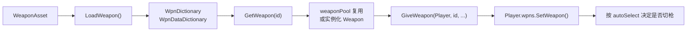
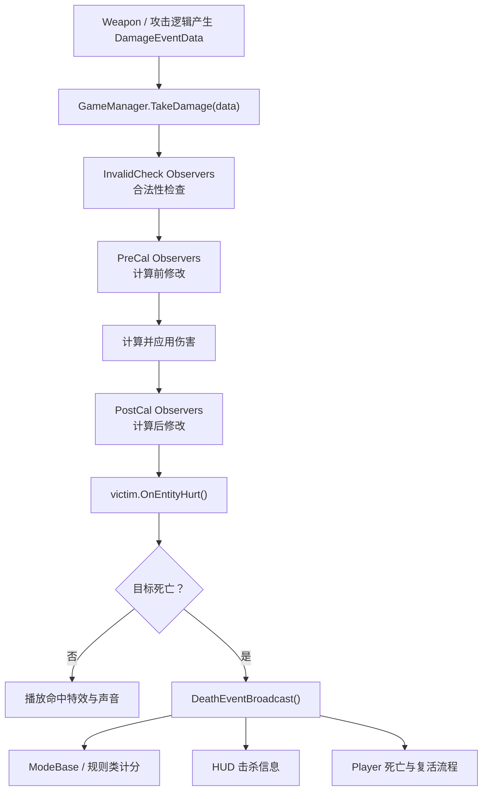
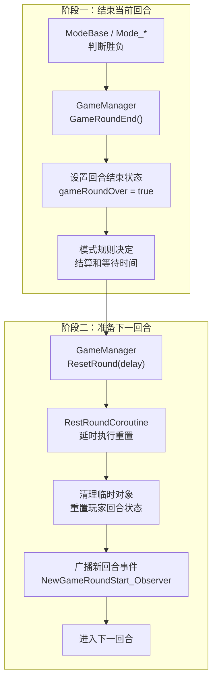
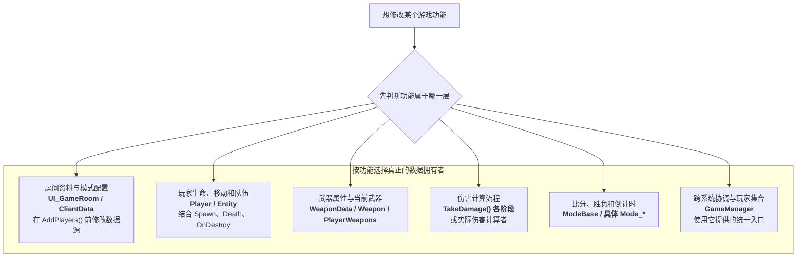
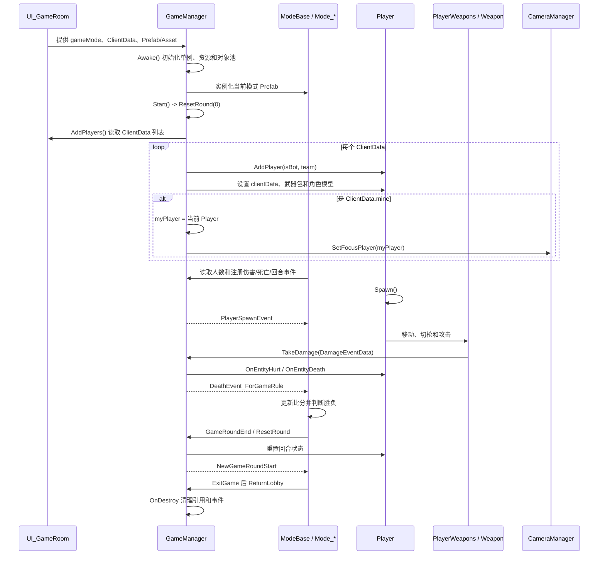

# GameManager 类关系与流程

> 目标：从穿越火线对局流程出发，理解 `GameManager` 与其他类之间的真实关系。  
> 配套字典：[GameManager 类完整分析与修改指南](../GameManager类完整分析与修改指南.md)

## 一、先用一句话理解

`GameManager` 是一局战斗的**资源入口、玩家创建者、战场对象登记中心、伤害事件中转站和回合重置入口**。

它不是所有规则的最终拥有者：

- 房间玩家资料主要来自 `UI_GameRoom / ClientData`。
- 具体胜负、比分和倒计时主要由 `ModeBase` 及子类负责。
- 玩家生命、队伍和移动状态主要在 `Entity / Player`。
- 具体武器状态主要在 `PlayerWeapons / Weapon`。
- 地图出生点主要由 `MapManager` 提供。

## 二、A：以 GameManager 为中心的分层预览



### 箭头不能混为一谈

| 关系 | 示例 | 意义 |
| --- | --- | --- |
| 字段持有 | `GameManager.allPlayers -> Player[]` | GameManager 长期保存对象引用 |
| 创建 | `AddPlayer() -> Player` | GameManager 负责产生战场玩家对象 |
| 调用 | `SetCharacter(Player, name)` | GameManager 对已有对象执行操作 |
| 事件通知 | `DeathEvent_Observers` | GameManager 广播结果，规则类和 HUD 再响应 |
| 数据来源 | `UI_GameRoom -> ClientData` | 数据不属于 GameManager，只是被它消费 |

## 三、C：分层学习地图



### 3.1 第一层：身份与生命周期



| 阶段 | RVA | GameManager 做什么 | 依赖 |
| --- | ---: | --- | --- |
| `.ctor()` | `0xAFCFB0` | 创建玩家列表、30 槽数组和回收列表 | IL2CPP 对象构造 |
| `Awake()` | `0xAFA250` | 初始化单例、资源和对象池，创建模式对象 | Unity 序列化字段和有效场景 |
| `Start()` | `0xAFC160` | 调用 `ResetRound(0)` 后进入 `AddPlayers()` | 房间 `ClientData` 已准备 |
| `OnDestroy()` | `0xAFB6F0` | 清理静态玩家引用、Ace 和事件 | 离开战斗场景 |

关键认识：

- `.ctor()` 只初始化 C# 对象内部容器，不代表房间资料已加载。
- `Awake()` 负责系统级准备。
- `Start()` 才批量创建本局玩家。
- 跨房间长期缓存 `GameManager*`、`Player*` 或列表地址有失效风险。

### 3.2 第二层：GameManager 直接持有什么



| 字段组 | 属于谁 | 实际含义 |
| --- | --- | --- |
| `allPlayers` | GameManager 实例 | 固定 30 槽的 Player 引用数组 |
| `playersBL/GR` | GameManager 实例 | 两个阵营的 Player 列表 |
| `playersBL/GR_Alive` | GameManager 实例 | 两个阵营当前存活 Player |
| `entityBL/GR_Alive` | GameManager 实例 | 包含 Player 在内的存活 Entity |
| `myPlayer` | GameManager 静态字段 | 与 `ClientData.mine` 对应的本机 Player |
| 武器字典 | GameManager 静态字段 | 武器编号到模板/配置的索引 |
| 资源和对象池 | GameManager 实例 | 创建或复用武器、角色模型 |
| Observer 字段 | GameManager 静态字段 | 向模式、HUD、Bot 等广播事件 |

### 3.3 第三层：四条核心业务链

#### 玩家创建链



直接依据：

| 地址 | 行为 |
| --- | --- |
| `0x10AFC1B7` | `Start()` 跳转 `AddPlayers()` |
| `0x10AF9F21` | 读取 `ClientData.isBot +0x1C` |
| `0x10AF9F26` | 读取 `ClientData.joinTeam +0x18` |
| `0x10AF9F32` | 调用 `AddPlayer(isBot, team)` |
| `0x10AF9F4F` | 写入 `Player.clientData +0x94` |
| `0x10AF9F7B` | 与 `ClientData.mine` 比较 |
| `0x10AF9FAB` | 写入 `GameManager.myPlayer` |

#### 武器链



理解重点：

- `WeaponAsset` 是资源输入。
- 字典是模板和配置索引。
- `GetWeapon()` 返回可投入战斗的武器实例。
- `GiveWeapon()` 还需要把实例交给指定玩家。
- 玩家当前用哪把枪由 `PlayerWeapons.inUse/curSlot` 管理，不由 GameManager 字段直接保存。

#### 伤害与死亡链



这里的 GameManager 更像“伤害流水线协调者”，不是所有伤害数值的唯一来源。

#### 回合链



`GameManager` 提供通用回合操作；具体何时结束、哪一方获胜，主要由当前模式类决定。

### 3.4 第四层：外部类如何与 GameManager 协作

| 外部类 | 它提供什么 | GameManager 如何使用 | 关系依据 |
| --- | --- | --- | --- |
| `Singleton<GameManager>` | 当前唯一实例入口 | `get_instance()` 返回当前 GameManager | 继承 + 泛型 MethodInfo |
| `UI_GameRoom` | 房间 `ClientData` 列表 | `AddPlayers()` 遍历 | IDA 调用与字段读取 |
| `ClientData` | 阵营、Bot、角色、背包等资料 | 创建并初始化 Player | IDA 赋值 |
| `Player/Entity` | 战场生命、队伍和行为 | 保存列表、接收伤害和死亡事件 | 字段 + 调用 |
| `Bot` | AI 控制 | 由 `botPrefab` 随 Player 创建，监听伤害事件 | Prefab + Observer |
| `ModeBase/Mode_*` | 玩法规则 | 读取人数，订阅事件，调用回合入口 | 事件 + 调用 |
| `MapManager` | 地图和出生点 | Player 出生流程间接使用 | 调用关系 |
| `CameraManager` | 本机观察目标 | 创建本机 Player 后设置焦点 | IDA 调用 |
| `PlayerWeapons` | 玩家武器槽 | `GiveWeapon()` 将 Weapon 交给它 | 方法调用 |
| `CharacterModel` | 玩家可见模型 | `SetCharacter()` 获取并绑定 | 对象池 + 方法调用 |
| `RecyclableObject` | 掉落物和临时对象 | 加入列表并在回合重置时回收 | 字段 + 方法调用 |

### 3.5 第五层：开发时应该修改哪一层



判断原则：

- GameManager 有入口，不代表最终状态就在 GameManager。
- 修改计算结果容易被下一次刷新覆盖，应寻找数据生产者。
- 直接改列表不等于完成对象的加入/移除流程。
- 调用方法前必须满足实例、参数、线程和生命周期条件。

## 四、B：完整穿越火线对局流程



## 五、反向关系：谁会主动找到或调用 GameManager

只看“GameManager 持有什么”还不够，还要看谁把它当作入口：

| 使用者 | 典型用途 |
| --- | --- |
| `ModeBase / Mode_*` | 读取玩家人数、结束/重置回合、返回大厅 |
| `Player / Entity` | 加入阵营列表、广播出生、伤害和死亡 |
| `Bot` | 注册伤害观察者，读取战场实体集合 |
| `Weapon / WPN_*` | 获取武器配置、提交伤害、登记临时对象 |
| `HUD_*` | 订阅玩家加入、出生、击杀和回合事件 |
| `CameraManager` | 使用 `myPlayer` 或焦点玩家 |
| 地图交互对象 | 发放武器、登记回收对象或造成伤害 |

这说明 `GameManager` 是一个高扇入类：很多系统会调用它，因此修改其公共入口的影响范围通常比修改单个 Player 更大。

## 六、最重要的对象访问路径

```text
Singleton<GameManager>.get_instance()
├─ instance + 0x1C -> allPlayers
├─ instance + 0x20 -> playersBL
├─ instance + 0x28 -> playersGR
├─ instance + 0x30 -> weaponAsset
├─ instance + 0x34 -> characterAsset
└─ static_fields
   ├─ +0x00 -> myPlayer
   ├─ +0x04 -> gameMode
   ├─ +0x18 -> WpnDictionary
   └─ +0x1C -> WpnDataDictionary
```

继续访问玩家：

```text
GameManager.myPlayer
├─ Player + 0x94 -> clientData
├─ Player + 0xA0 -> wpns
├─ Player + 0x5C -> currentCharacter
└─ 继承 Entity + 0x20 -> team
```

## 七、常见误解

### `allPlayers` 是不是所有槽位都必须非空

不是。它是固定长度 30 的槽位数组，空槽为 `null`。不要把数组长度当作实际玩家人数。

### `allPlayers` 能不能完全替代阵营列表

不能完全替代：

- `allPlayers` 适合枚举全部 Player 槽位。
- `playersBL/GR` 已按阵营维护。
- `playersBL/GR_Alive` 适合读取存活玩家。
- 不同列表的刷新时机可能存在短暂差异。

### Bot 是不是另一种 Player

Bot 最终仍然对应 `Player`。差别是 Bot Prefab 额外带有 `Bot` AI 组件，由 AI 控制 `Player` 的移动、视角和武器。

### 修改 `gameMode` 为什么没有立刻切换玩法

因为 `gameMode` 只是模式标识之一。当前模式 Prefab、Mode 实例、队伍、UI 和玩家状态已经在加载阶段创建，改单个枚举不会重建整个模式。

### 调用无参方法为什么没有反应

IL2CPP 实例方法仍需要有效的 `this` 和隐藏的 `MethodInfo*`；方法还可能依赖主线程、资源、Observer 或正确的生命周期。

## 八、GameManager 修改价值地图

| 目标 | 优先入口 | 不推荐做法 |
| --- | --- | --- |
| 枚举全部玩家 | `instance->allPlayers` 并做 null 检查 | 只依赖长期缓存的 Player 指针 |
| 获取自己 | `GameManager.myPlayer` | 猜测数组固定下标 |
| 监听新玩家 | Hook `AddPlayers/AddPlayer` 或加入事件 | 每帧重复创建 |
| 给武器 | `GiveWeapon()` 并处理选择/刷新 | 只改武器字典指针 |
| 改武器属性 | 找 `WeaponData` 数据源或当前 `Weapon` 实例 | 不区分模板和实例 |
| 改伤害 | Hook `TakeDamage()` 对应阶段 | 直接伪造不完整事件结构 |
| 改胜负规则 | 具体 `Mode_*` | 只写 `gameRoundOver` |
| 强制新回合 | `ResetRound(delay)` | 手工改协程状态机 |
| 离房清理 | `GameManager.OnDestroy()` | 跨房继续使用旧实例 |

## 九、证据索引

| 证据 | 位置 |
| --- | --- |
| `GameManager : Singleton<GameManager>` | `dump.cs` TypeDefIndex 5365 |
| 42 个字段、8 个属性、58 个方法 | `dump.cs` GameManager 定义 |
| `Start -> ResetRound -> AddPlayers` | IDA `0x10AFC160` |
| `AddPlayers` 遍历 `List<ClientData>` | IDA `0x10AF9DE0` |
| `AddPlayer` 创建并写入 Player 槽位 | IDA `0x10AF9A90` |
| `Player.clientData = ClientData` | IDA `0x10AF9F4F` |
| `ClientData.mine -> myPlayer` | IDA `0x10AF9F7B`、`0x10AF9FAB` |
| `OnDestroy` 清理静态字段和事件 | IDA `0x10AFB6F0` |
| `allPlayers = new Player[30]` | IDA `GameManager..ctor()` |
| 具体成员说明 | [完整分析指南](../GameManager类完整分析与修改指南.md) |

## 十、读完后应该能够回答

1. GameManager 的数据从哪些类来？
2. 它直接创建和持有哪些对象？
3. `myPlayer` 与 `allPlayers` 是什么关系？
4. Player、Bot、ClientData 为什么不是同一种对象？
5. 武器模板、武器实例和玩家武器系统分别在哪里？
6. 伤害为什么要经过 Observer 和多个阶段？
7. GameManager 与 ModeBase 谁负责回合，谁负责胜负规则？
8. 为什么直接修改字段或主动调用方法可能没有效果？
9. 进入房间和离开房间时，哪些地址不能长期缓存？

能够沿着图和证据回答这些问题，就已经掌握了 GameManager 的主体结构。
