# Player 类关系与流程

> 目标：从穿越火线实战角度理解一名 `Player` 如何组合资料、生命、移动、视角、武器、模型、技能和复活流程。  
> 上游文档：[GameManager 类关系与流程](01-GameManager类关系与流程.md)

## 一、先用一句话理解

`Player` 是地图中真正存在的一名战斗角色。

它不是单独完成所有功能，而是一个组合中心：

- 从父类 `Entity` 继承生命、队伍、Buff、受伤和死亡基础能力。
- 使用 `ClientData` 保存进入战斗前的昵称、阵营、角色和背包资料。
- 持有 `PlayerVelocity`、`PlayerWeapons`、`PlayerSkills` 等运行时子系统。
- 持有 `CharacterModel` 表现第三人称角色和受击部位。
- 真人由 `PlayerController` 控制；Bot 则由 `Bot.thisPlayer` 指向并控制。

## 二、A：以 Player 为中心的分层预览

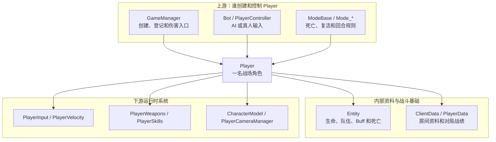

### Player 持有的资料

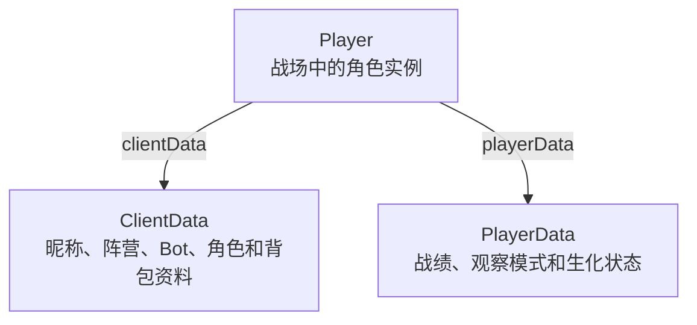

### Player 持有的运行时系统

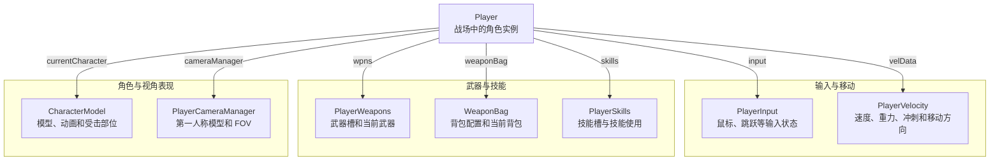

### 最重要的认识

`Player` 是组合对象，不是单一数据结构：

```text
Player = Entity 基础战斗状态
       + ClientData 房间资料
       + PlayerData 对局统计
       + PlayerVelocity 移动速度
       + PlayerWeapons 武器系统
       + CharacterModel 角色表现
       + PlayerSkills 模式技能
```

## 三、C：分层学习地图

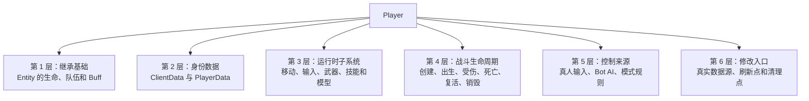

### 3.1 第一层：Player 从 Entity 继承什么

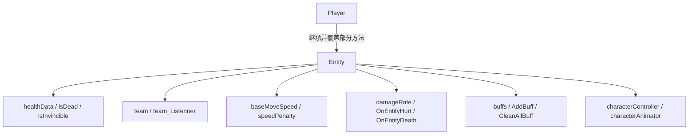

| 功能 | 实际定义位置 | Player 如何使用 |
| --- | --- | --- |
| 队伍 | `Entity.team +0x20` | 加入 `playersBL/GR` 和敌我判断 |
| 生命 | `Entity.healthData +0x1C` | 受伤、死亡、复活 |
| 死亡状态 | `Entity.isDead` | AI、模式和 HUD 判断 |
| 移动基础值 | `Entity.baseMoveSpeed +0x0C` | `Player.GetMoveSpeed()` 继续计算 |
| 无敌 | `Entity.isInvincible +0x18` | 出生保护和 Buff |
| Buff | `Entity.buffs +0x34` | 减速、伤害倍率和无敌等 |

因此，不能只扫描 `Player` 自己声明的字段。`Player* + 0x20` 的 `team` 来自父类 `Entity`。

### 3.2 第二层：身份资料与对局统计

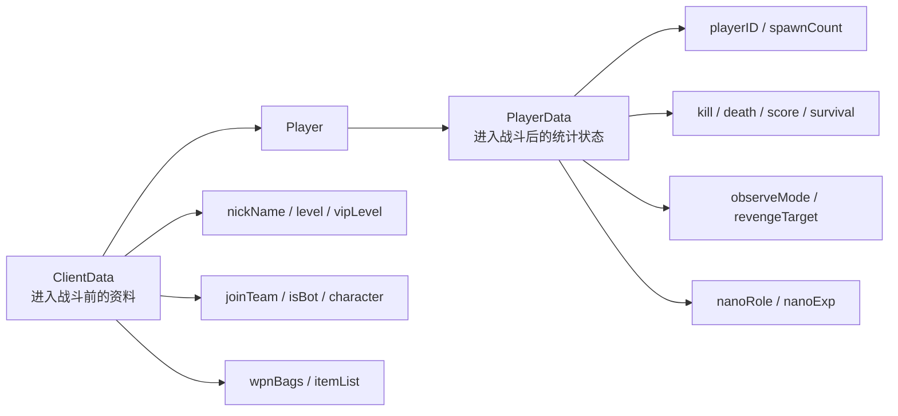

区别：

| 类型 | 主要阶段 | 示例 |
| --- | --- | --- |
| `ClientData` | 房间准备和进场初始化 | 昵称、选择阵营、角色、武器背包、是否 Bot |
| `PlayerData` | 对局运行 | 击杀、死亡、分数、出生次数、观察模式 |

`Player.nickName`、`level` 和 `vipLevel` 是属性，实际会回到 `player.clientData` 读取。

### 3.3 第三层：Player 直接持有的运行时子系统

| Player 字段 | 偏移 | 指向 | 穿越火线功能 |
| --- | ---: | --- | --- |
| `cameraManager` | `0x48` | `PlayerCameraManager` | 第一人称模型、FOV、狙击镜和震屏 |
| `cameraRotation` | `0x4C` | `Vector2` | 该 Player 的横向和纵向视角角度 |
| `currentCharacter` | `0x5C` | `CharacterModel` | 当前角色模型、动画和受击部位 |
| `velData` | `0x90` | `PlayerVelocity` | 速度、冲刺、重力和移动方向 |
| `clientData` | `0x94` | `ClientData` | 玩家进场资料 |
| `playerData` | `0x98` | `PlayerData` | 对局统计和模式状态 |
| `input` | `0x9C` | `PlayerInput` | 鼠标和跳跃等输入状态 |
| `wpns` | `0xA0` | `PlayerWeapons` | 武器槽、当前武器和切枪 |
| `weaponBag` | `0xA4` | `WeaponBag` | 武器背包配置 |
| `skills` | `0xB0` | `PlayerSkills` | 生化等模式的技能 |
| `modelInfo` | `0xB4` | `PlayerMdlInfo` | 第一/第三人称模型颜色和材质 |

#### Awake 中实际创建的对象

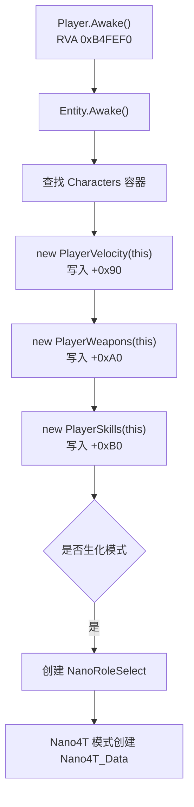

IDA 直接依据：

- `0x10B4FF54` 调用 `Entity.Awake()`。
- `0x10B4FFB7` 构造 `PlayerVelocity(this)`，写入 `Player + 0x90`。
- `0x10B4FFDC` 构造 `PlayerWeapons(this)`，写入 `Player + 0xA0`。
- `0x10B50004` 构造 `PlayerSkills(this)`，写入 `Player + 0xB0`。

### 3.4 第四层：战斗生命周期

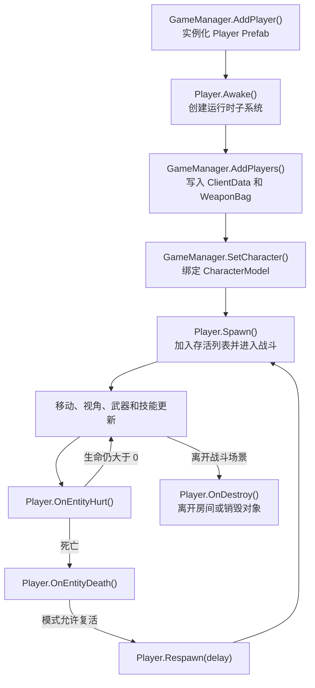

### 3.5 第五层：谁在控制 Player

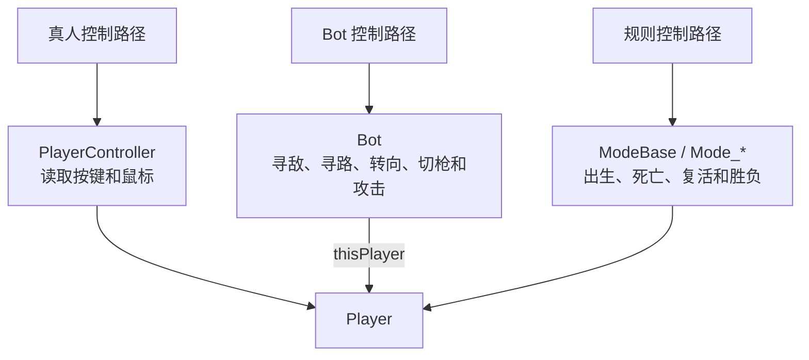

本机玩家与其他玩家使用同一个 `Player` 类。区别主要来自：

- `GameManager.myPlayer` 指向哪个 Player。
- `Player.get_isMyPlayer()` 的判断。
- `CameraManager` 当前聚焦哪个 Player。
- 真人是否有 `PlayerController` 输入控制。
- Bot Prefab 是否带有 `Bot` 组件。

### 3.6 第六层：开发时修改哪一层

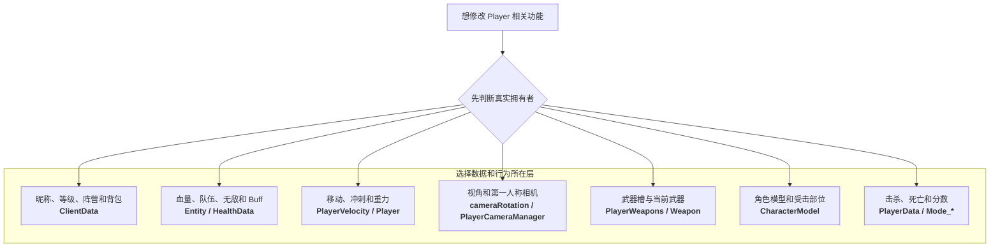

## 四、专题业务链

### 4.1 移动和视角链

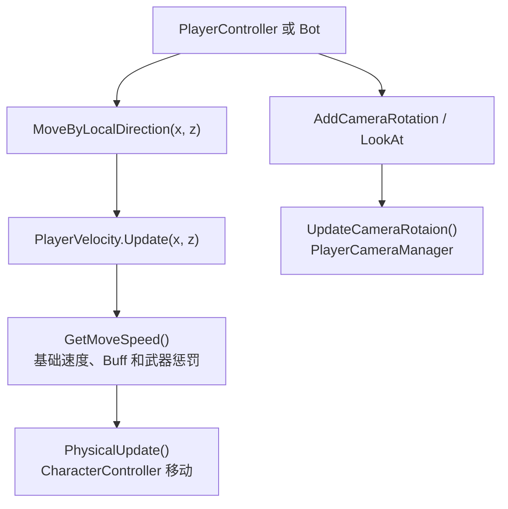

### 4.2 武器链

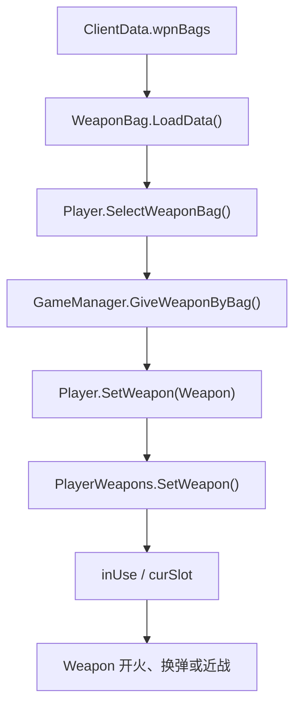

### 4.3 角色模型链

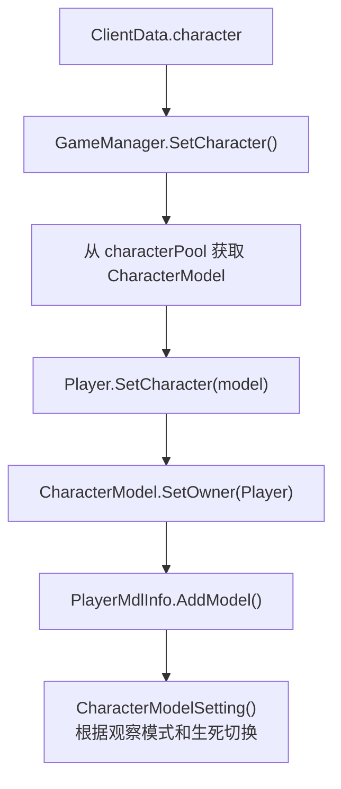

### 4.4 死亡和复活链

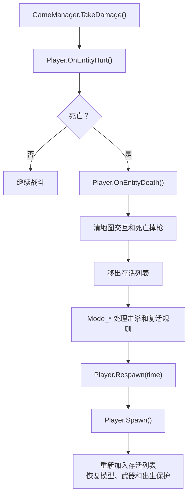

## 五、B：一名玩家的完整游戏流程

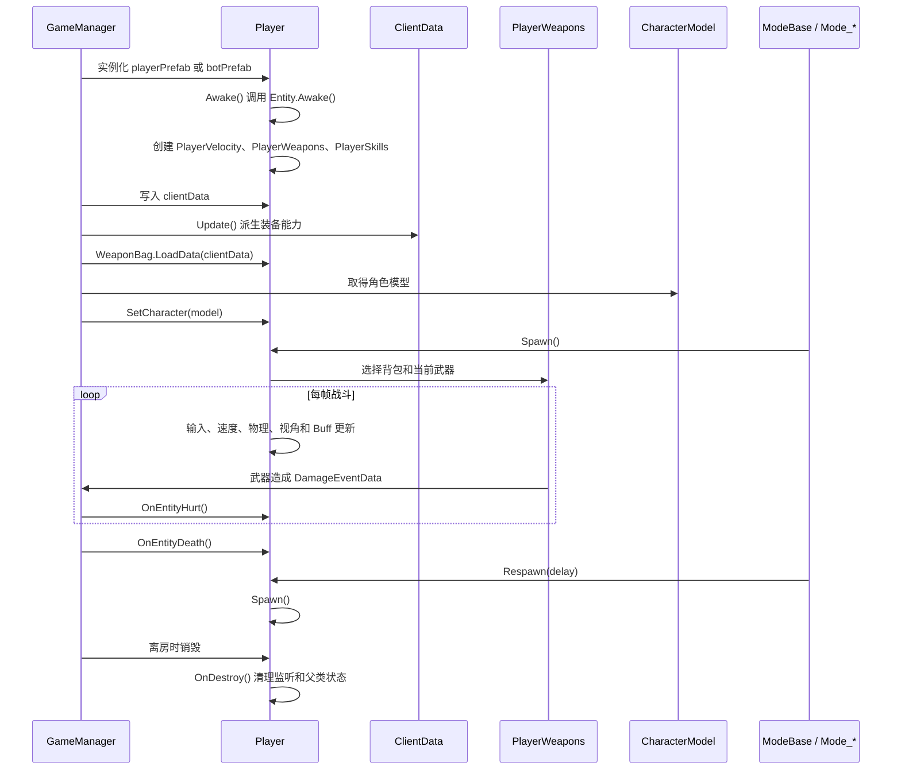

## 六、最重要的对象访问路径

```text
GameManager.myPlayer 或 GameManager.allPlayers[i]
└─ Player
   ├─ 继承 Entity
   │  ├─ +0x1C -> healthData
   │  └─ +0x20 -> team
   ├─ +0x48 -> cameraManager
   ├─ +0x4C -> cameraRotation
   ├─ +0x5C -> currentCharacter
   ├─ +0x90 -> velData
   ├─ +0x94 -> clientData
   ├─ +0x98 -> playerData
   ├─ +0x9C -> input
   ├─ +0xA0 -> wpns
   ├─ +0xA4 -> weaponBag
   ├─ +0xB0 -> skills
   └─ +0xB4 -> modelInfo
```

## 七、常见误解

### Player 自己有没有 `isEnemy` 字段

没有看到通用 `Player.isEnemy` 字段。团队模式通常根据继承自 `Entity` 的 `team` 比较；个人竞技和生化模式还必须结合具体 `Mode_*` 规则。

### Bot.thisPlayer 能不能替代 allPlayers

不能。`Bot.thisPlayer` 只表示某个 Bot 组件控制的 Player；真人 Player 没有 Bot 控制器。枚举全部玩家仍应从 `GameManager.allPlayers` 或阵营列表开始。

### `cameraRotation` 为什么是这个 Player 的

它是 `Player` 实例字段 `+0x4C`。从 `GameManager.myPlayer` 取得的 Player 再读取该字段，才是本机玩家视角；从敌方 Player 读取则是敌方角色自己的视角状态。

### Player 死亡后会重新 AddPlayer 吗

正常复活使用 `Respawn()` 和 `Spawn()`，不会重新创建 Player。`AddPlayer()` 主要用于初次创建参战对象。

### 为什么长期缓存 Player 地址会出问题

离开房间后 `Player.OnDestroy()` 和 `GameManager.OnDestroy()` 会执行。旧地址即使仍可读，也不再代表新房间的有效 Player。

## 八、证据索引

| 证据 | dump/IDA 位置 |
| --- | --- |
| `Player : Entity` | `dump.cs` TypeDefIndex 5171 |
| Entity 的生命和队伍字段 | `dump.cs` TypeDefIndex 5161 |
| `Player.Awake()` | RVA `0xB4FEF0` |
| 创建 `PlayerVelocity(this)` | IDA `0x10B4FFB7`，写入 `+0x90` |
| 创建 `PlayerWeapons(this)` | IDA `0x10B4FFDC`，写入 `+0xA0` |
| 创建 `PlayerSkills(this)` | IDA `0x10B50004`，写入 `+0xB0` |
| `Player.OnDestroy()` | RVA `0xB511C0` |
| `Player.OnEntityDeath()` | RVA `0xB51210` |
| `Player.OnEntityHurt()` | RVA `0xB516B0` |
| `Player.Respawn()` | RVA `0xB527A0` |
| `Player.SelectWeaponBag()` | RVA `0xB52830` |
| `Player.SetCharacter()` | RVA `0xB52AD0` |
| `Player.SetWeapon()` | RVA `0xB53650` |

## 九、读完后应该能够回答

1. Player 和 Entity 为什么要分成两个类？
2. ClientData 与 PlayerData 分别保存什么？
3. Player 的移动、武器、技能和模型分别由哪个对象负责？
4. 真人和 Bot 为什么可以使用同一个 Player 类？
5. 本机视角应该从哪个 Player 开始读取？
6. 死亡复活为什么不会重新执行 AddPlayer？
7. 修改血量、移动、武器和模型时应该分别进入哪一层？
