# ClientData 类关系与流程

> 目标：理解一名房间玩家的数据如何准备、更新，并在进入穿越火线战斗场景后绑定到 `Player`。  
> 下游文档：[Player 类关系与流程](02-Player类关系与流程.md)

## 一、先用一句话理解

`ClientData` 是一名参战者进入战场前的**玩家档案和装备快照**。

它保存：

- 昵称、等级和 VIP 等展示资料。
- 加入阵营、是否 Bot 和选择角色。
- 武器背包和默认背包。
- 已装备或拥有的道具列表。
- 从道具列表计算出的弹匣、生化装备和角色能力标记。

它不是：

- 场景中的人物对象。
- 玩家当前血量和位置。
- 当前正在使用的武器实例。
- 对局中的击杀、死亡和分数。

这些运行时状态分别属于 `Player / Entity`、`PlayerWeapons / Weapon` 和 `PlayerData`。

## 二、A：以 ClientData 为中心的分层预览

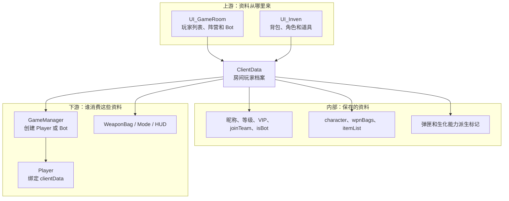

## 三、C：分层学习地图

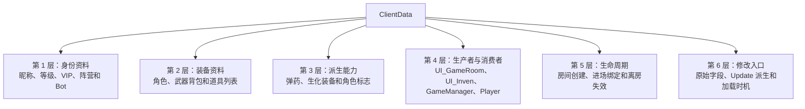

### 3.1 第一层：身份资料

| 字段 | 偏移 | 穿越火线含义 | 谁会读取 |
| --- | ---: | --- | --- |
| `mine` | 静态 `+0x00` | 本机玩家对应的 ClientData | `GameManager.AddPlayers()` |
| `nickName` | `+0x10` | 玩家昵称 | Player 属性、HUD 和计分板 |
| `level` | `+0x14` | 玩家等级 | Player 属性和 HUD |
| `joinTeam` | `+0x18` | 房间中选择的阵营 | `GameManager.AddPlayer()` |
| `isBot` | `+0x1C` | 是否电脑玩家 | 决定使用 playerPrefab 或 botPrefab |
| `vipLevel` | `+0x20` | VIP 等级 | Player 属性和相关显示 |

`mine` 是静态字段，保存“哪一份 ClientData 属于本机”。它不是 Player 地址。

实际绑定关系：

```text
ClientData.mine
→ GameManager.AddPlayers() 比较当前 ClientData
→ 找到对应 Player
→ GameManager.myPlayer = 该 Player
```

### 3.2 第二层：装备资料

| 字段 | 偏移 | 功能 |
| --- | ---: | --- |
| `defaultWpnBagID` | `+0x08` | 默认选择的武器背包 |
| `wpnBags` | `+0x0C` | 多个背包中的武器编号 |
| `character` | `+0x24` | 角色物品或角色选择编号 |
| `itemList` | `+0x28` | 当前装备/拥有的道具编号 |

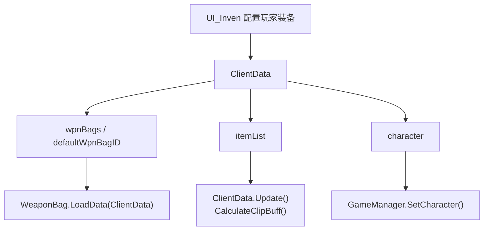

### 3.3 第三层：派生能力字段

`ClientData.Update()` 不是 Unity 的每帧生命周期方法。它由 `GameManager.AddPlayers()` 在进场初始化时主动调用。

它读取 `itemList`，更新：

- `haveNanoCloth`
- `haveNanoAmmo`
- `haveRifleAmmo`
- `haveShotGunAmmo`
- `haveMgAmmo`
- `haveSmgAmmo`
- `haveSniperAmmo`
- `havePistolAmmo`
- `haveHulk`
- `haveNurse`
- `havePsycho`
- `haveNanoRole`
- `haveNanoHook`

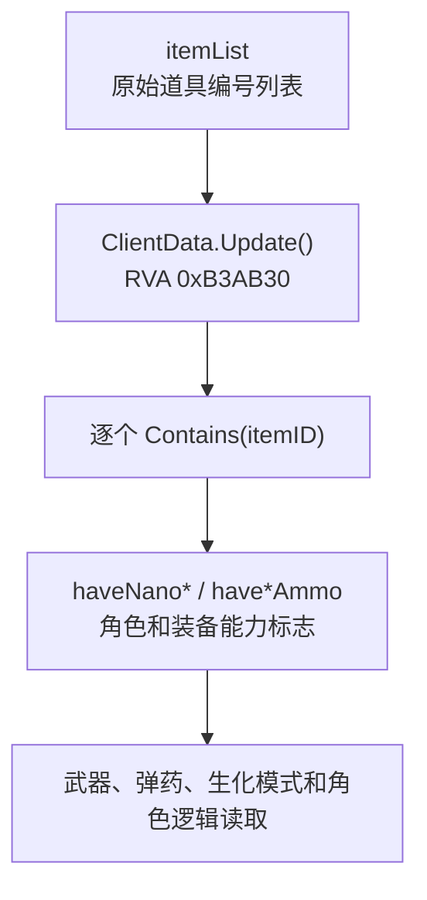

IDA 确认 `Update()` 连续调用 `List<int>.Contains()`，把结果写入对象 `+0x2C` 之后的布尔字段。

注意：`dump.cs` 对部分连续布尔 backing field 显示为 `0x0`，但汇编实际写入 `+0x2C` 到 `+0x38` 一带。遇到这种情况应以 IDA 的真实访问地址复核，不能把所有字段都当作对象偏移 0。

### 3.4 ClipBuff 如何计算

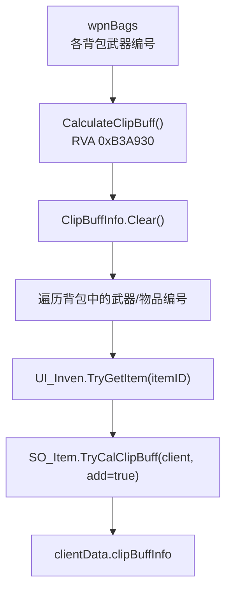

`clipBuffInfo` 是装备计算结果。只修改结果而不修改背包数据，下一次 `CalculateClipBuff()` 可能会重新计算并覆盖。

### 3.5 第四层：谁创建和使用 ClientData

| 类 | 与 ClientData 的关系 | 直接依据 |
| --- | --- | --- |
| `UI_GameRoom` | 保存房间玩家列表，生成 Bot ClientData | `GenerateBotClient()` 调用 `BotRandom()` |
| `UI_Inven` | 配置背包、角色和道具；随机 Bot 装备 | `RandomizeInven()`、`TryGetItem()` |
| `GameManager` | 遍历 ClientData，创建 Player | `AddPlayers()` |
| `Player` | `clientData +0x94` 长期指向对应档案 | IDA 赋值 |
| `WeaponBag` | `LoadData(ClientData)` 读取背包 | IDA 调用 |
| `SO_Item` | 根据道具定义计算弹匣加成 | `TryCalClipBuff()` |
| `Bot` | 不直接替代 ClientData；其 Player 仍持有一份 Bot ClientData | Player 绑定关系 |

### 3.6 第五层：生命周期

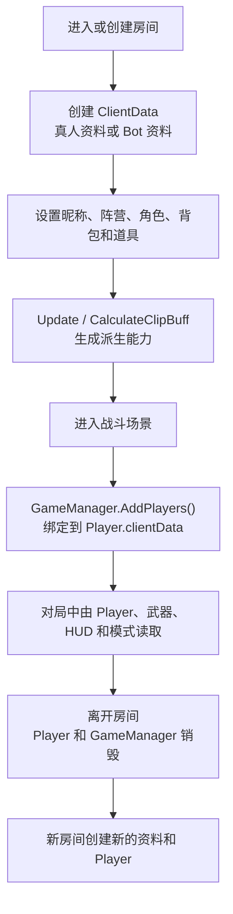

`ClientData` 通常比场景 Player 更接近“房间数据”，但不要假定旧房间地址在新房间仍有效。

### 3.7 第六层：开发时修改哪一层

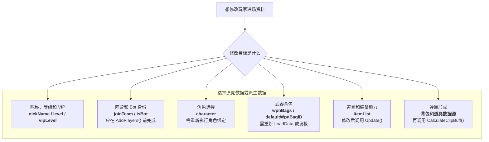

## 四、专题业务链

### 4.1 真人进场资料链

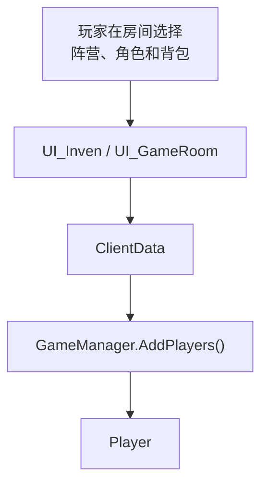

### 4.2 Bot 资料生成链

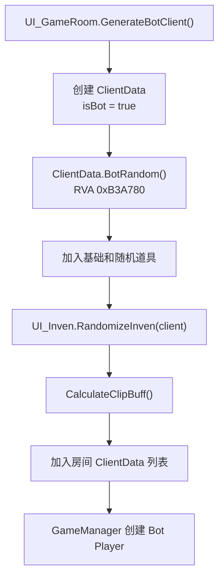

Bot 的 `isBot` 只是身份和创建路径标志。Bot 进入场景后仍然是：

```text
ClientData(isBot=true)
→ GameManager 创建带 Bot 组件的 Prefab
→ Player.clientData 指向这份 ClientData
→ Bot.thisPlayer 指向这个 Player
```

### 4.3 道具切换链

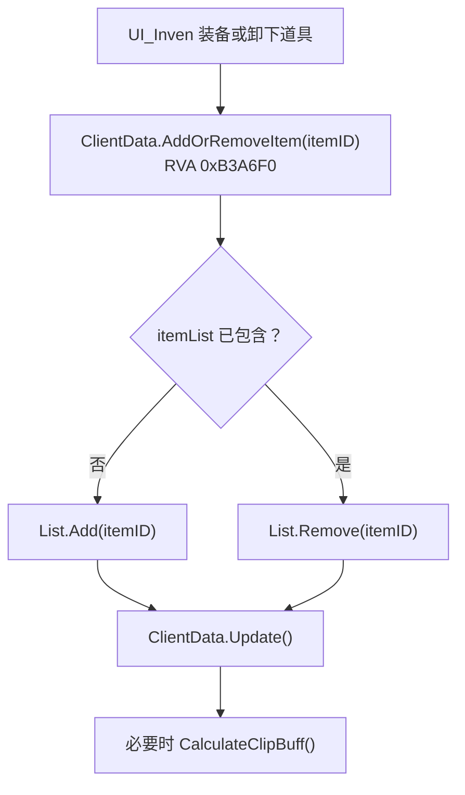

`AddOrRemoveItem()` 本身只执行列表切换。IDA 中没有看到它自动调用 `Update()` 或 `CalculateClipBuff()`，因此修改道具后需要关注调用者是否继续刷新派生字段。

## 五、B：ClientData 到 Player 的完整流程

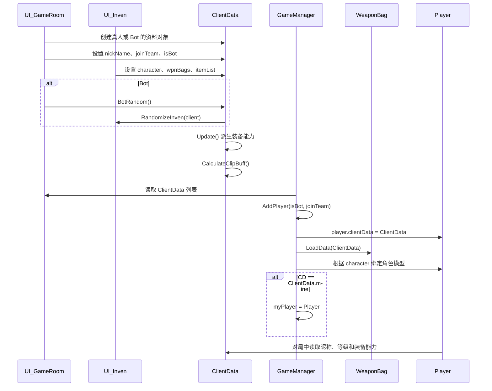

## 六、最重要的对象访问路径

```text
ClientData
├─ static_fields +0x00 -> mine
├─ instance +0x08 -> defaultWpnBagID
├─ instance +0x0C -> wpnBags
├─ instance +0x10 -> nickName
├─ instance +0x14 -> level
├─ instance +0x18 -> joinTeam
├─ instance +0x1C -> isBot
├─ instance +0x20 -> vipLevel
├─ instance +0x24 -> character
└─ instance +0x28 -> itemList

Player +0x94 -> clientData
```

获取本机资料：

```text
ClientData.mine
```

或者从本机 Player 反向获取：

```text
GameManager.myPlayer
→ Player +0x94
→ ClientData
```

## 七、常见误解

### ClientData 是不是 Player

不是。一个是房间资料对象，一个是 Unity 场景中的 `MonoBehaviour` 战斗实体。

### `isBot=true` 会让 ClientData 自己执行 AI 吗

不会。它只让 `GameManager.AddPlayer()` 选择 Bot Prefab。真正 AI 在 `Bot` 类中。

### 修改 `joinTeam` 后为什么当前 Player 阵营没变

`joinTeam` 是创建 Player 时的输入。Player 已创建后，实际队伍保存在继承自 `Entity` 的 `team`，还涉及阵营列表和模式规则。

### 修改 `wpnBags` 后为什么当前武器没变化

当前武器已经是 `Weapon` 实例，并由 `PlayerWeapons` 管理。修改 ClientData 只改变资料源，需要重新 `WeaponBag.LoadData()`、选择背包或重新发枪。

### 修改 `character` 后为什么模型没变化

角色模型已经通过 `GameManager.SetCharacter()` 绑定。修改编号后还需要执行合法的角色查询与绑定流程。

### 为什么派生 bool 看起来都在偏移 0

这是 `dump.cs` 对连续布尔 backing field 的显示异常或布局信息缺失。IDA 明确显示 `ClientData.Update()` 写入对象 `+0x2C` 之后的连续字节，应以实际汇编访问为准。

## 八、证据索引

| 证据 | dump/IDA 位置 |
| --- | --- |
| `ClientData` 定义 | `dump.cs` TypeDefIndex 5120 |
| `mine` 静态字段 | `dump.cs` static `+0x00` |
| `GameManager.AddPlayers()` 读取 `isBot/joinTeam` | IDA `0x10AF9F21`、`0x10AF9F26` |
| 绑定到 `Player.clientData` | IDA `0x10AF9F4F` |
| 判断 `ClientData.mine` | IDA `0x10AF9F7B` |
| `AddOrRemoveItem()` | RVA `0xB3A6F0` |
| `BotRandom()` | RVA `0xB3A780` |
| `CalculateClipBuff()` | RVA `0xB3A930` |
| `Update()` | RVA `0xB3AB30` |
| `WeaponBag.LoadData(ClientData)` | RVA `0xB78BA0` |
| BotRandom 调用 `UI_Inven.RandomizeInven()` | IDA `0x10B3A910` |
| BotRandom 调用 `CalculateClipBuff()` | IDA `0x10B3A918` |
| Update 根据 itemList 写派生标志 | IDA `0x10B3AB54` 至 `0x10B3ACDF` |

## 九、读完后应该能够回答

1. ClientData 与 Player 的本质区别是什么？
2. `mine` 与 `GameManager.myPlayer` 如何对应？
3. `isBot` 为什么不是 AI 本身？
4. 武器背包资料如何变成 Player 实际持有的武器？
5. `itemList` 与 `haveNano* / have*Ammo` 有什么关系？
6. 为什么修改原始字段后还需要 Update、LoadData 或重新绑定？
7. 哪些字段适合在进场前改，哪些不适合在战斗中直接改？
