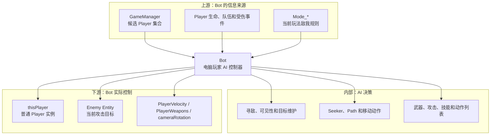
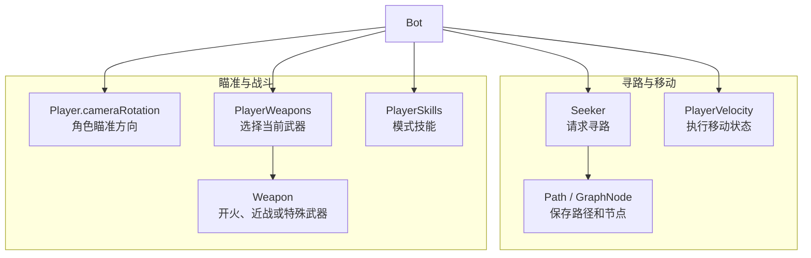
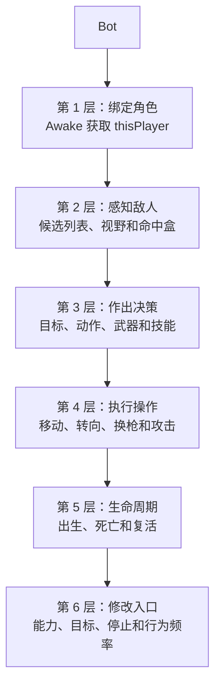
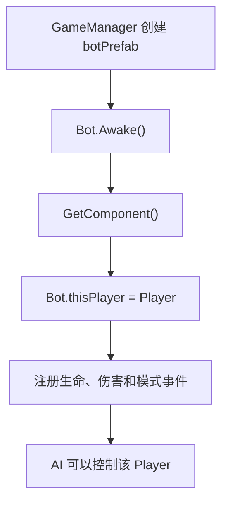
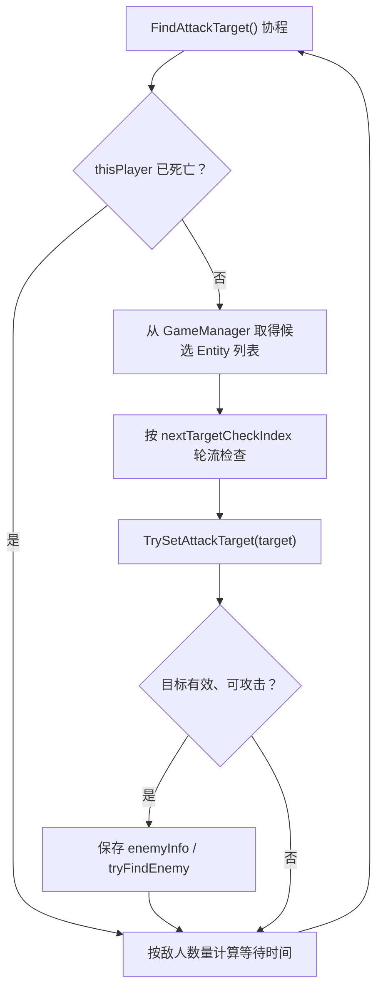
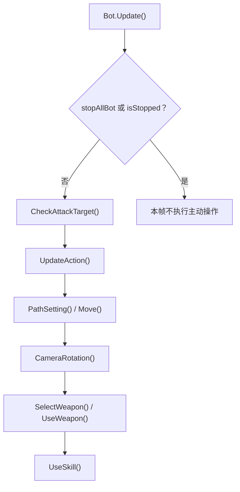
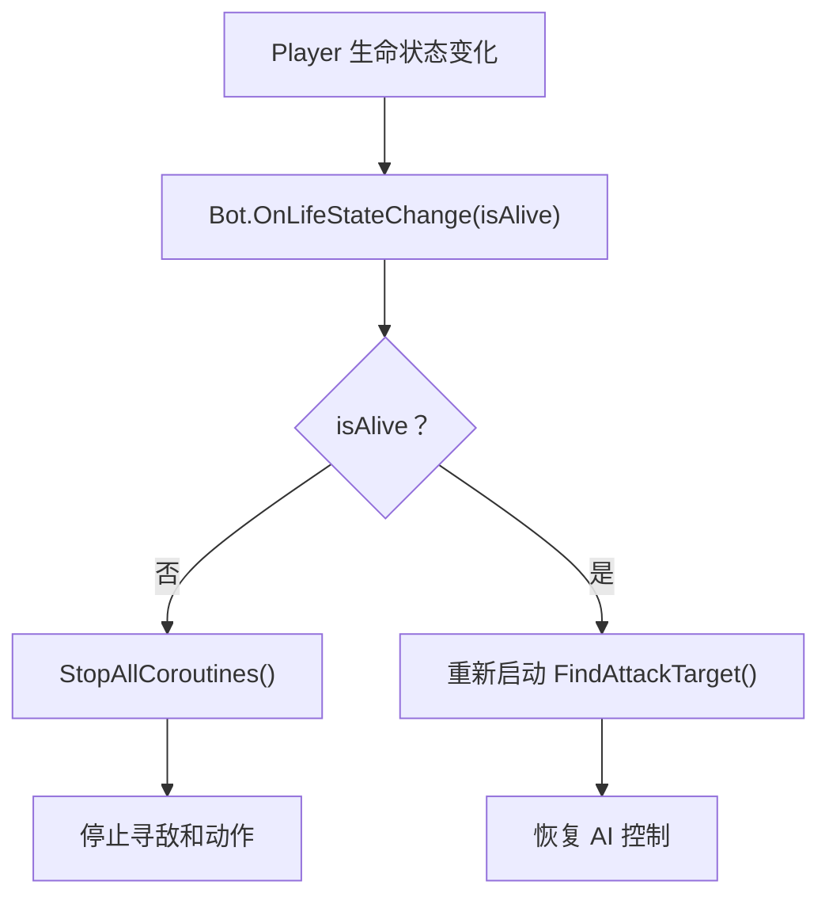
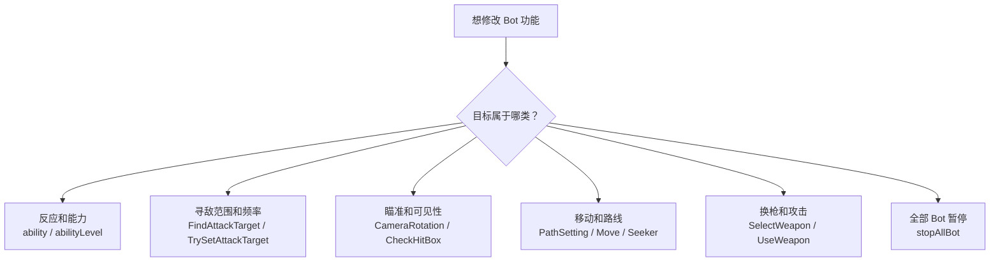

# Bot 类关系与流程

> 目标：理解穿越火线中的电脑玩家如何借用普通 `Player` 完成寻敌、移动、瞄准、换枪和攻击。  
> 上游文档：[Player 类关系与流程](02-Player类关系与流程.md)

## 一、先用一句话理解

`Bot` 不是另一种 Player 数据结构，而是挂在电脑玩家对象上的 **AI 控制器**。

```text
Bot 负责思考和发出操作
Player 负责真正移动、转向、持枪、受伤和死亡
```

因此：

- `Bot.thisPlayer` 是该 AI 当前控制的战场角色。
- `Bot` 与真人使用的 `Player` 共享生命、队伍、武器和模型系统。
- 区别主要在控制来源：真人由输入控制，Bot 由 AI 方法控制。

## 二、A：以 Bot 为中心的分层预览



### Bot 使用的执行系统



## 三、C：分层学习地图



## 四、Bot 与 Player 是怎样绑定的

`Bot.Awake()` 会在当前 GameObject 上取得 `Player`，写入 `thisPlayer`。



直接依据：

- `Bot.thisPlayer` backing field 位于 `Bot +0x24`。
- `Bot.Awake()`：RVA `0xB2CEF0`。
- 导出汇编中 `Bot.Awake()` 调用 `GetComponent<Player>()`，随后保存到 `+0x24`。
- `Bot.get_isDead()` 从 `this +0x24` 继续读取 Player 的生命状态。

这也解释了为什么 Hook `Bot.Update()` 能逐个发现大量 Bot Player：每个 Bot 实例都保存自己的 `thisPlayer`，不是 Bot 另外维护了一份全局玩家数组。

## 五、核心字段

### 5.1 角色和目标

| 字段 | 偏移 | 穿越火线中的作用 |
| --- | ---: | --- |
| `ability` | `+0x0C` | Bot 能力参数，影响反应或行为表现 |
| `thisPlayer` | `+0x24` | 此 Bot 实际控制的 Player |
| `enemyInfo` | `+0x28` | 当前锁定敌人的附加信息 |
| `tryFindEnemy` | `+0x2C` | 正在尝试判断的候选目标 |
| `faceToEnemy` | `+0x30` | 是否已经面向敌人 |
| `nextTargetCheckIndex` | `+0x34` | 分批检查候选玩家时的索引 |
| `nextCheckEnemyInViewTime` | `+0x38` | 下次检查目标是否可见的时间 |

### 5.2 攻击与动作

| 字段 | 偏移 | 作用 |
| --- | ---: | --- |
| `nextAttackTime` | `+0x3C` | 下一次允许攻击的时间 |
| `knifeAttackType` | `+0x40` | 刀战攻击类型 |
| `knifeAttackEndTime` | `+0x44` | 当前近战动作结束时间 |
| `watchOutEndTime` | `+0x48` | 警戒状态截止时间 |
| `watchOutPos` | `+0x4C` | 受击或警戒来源位置 |
| `actionList` | `+0x58` | 当前等待执行的 Bot 动作 |
| `nextSelectWpnTime` | `+0x68` | 下一次换枪判断时间 |
| `selectWpnActionList` | `+0x6C` | 候选武器槽动作 |
| `nextUseSkillCheckTime` | `+0x74` | 下一次技能判断时间 |

### 5.3 寻路

| 字段 | 偏移 | 作用 |
| --- | ---: | --- |
| `seeker` | `+0x78` | A* Pathfinding 的路径请求组件 |
| `path` | `+0x80` | 当前计算得到的路径 |
| `pathLength` | `+0x84` | 当前路径长度 |
| `gNode_Nearset` | `+0x88` | 最近导航节点 |
| `gNode_Next` | `+0x8C` | 下一导航节点 |
| `nextPathPos` | `+0xA0` | 下一移动目标位置 |
| `dirToNextNode` | `+0xAC` | 前往下一节点的方向 |
| `nextFindPathTime` | `+0xB8` | 下一次重新寻路时间 |
| `blockedTime` | `+0xEC` | 被障碍阻挡的累计状态 |

`repathMinTime = 0.25`、`repathMaxTime = 0.5` 表明 Bot 不会每帧完整重算路径，而是按间隔刷新。

## 六、寻找敌人的完整流程



导出汇编确认：

- `FindAttackTarget()` 是协程，RVA `0xB2E840`。
- 协程先调用 `get_isDead()`。
- `<FindAttackTarget>g__GetAttackTargetList()` 会取得 `Singleton<GameManager>.get_instance()`。
- 候选列表按索引逐个送入 `TrySetAttackTarget()`。
- 检查间隔会根据候选敌人数量变化，不是每帧扫描全部玩家。

### “合适敌人”的判断层次

`TrySetAttackTarget()`、`CheckHitBox()` 和 `CheckAttackTarget()` 共同完成筛选，不能只看某一个字段。

```text
候选 Entity 存在
-> 不是 thisPlayer 自己
-> 按当前模式属于可攻击对象
-> 没有处于死亡等无效状态
-> 命中盒或视线检查通过
-> 距离、朝向和当前锁定状态允许
-> 才成为攻击目标
```

具体模式的“敌我”规则仍由 `Player/Entity` 队伍状态和 `Mode_*` 共同决定。团队竞技通常按 BL/GR 阵营；个人竞技不能简单用“阵营不同”代替最终敌我判断。

## 七、每帧 AI 主流程



这里的 `CameraRotation()` 修改的是 `thisPlayer` 的朝向链，因此它天然知道应该控制哪个 Player；依据就是 `Bot.thisPlayer` 的实例绑定，而不是通过 `GameManager.myPlayer` 猜测。

## 八、死亡和复活时发生什么



导出汇编确认 `OnLifeStateChange(false)` 调用 `StopAllCoroutines()`；恢复存活后重新创建并启动 `FindAttackTarget` 协程。

## 九、从玩家视角理解一名 Bot

```text
房间为某个 ClientData 标记 isBot
-> GameManager 使用 botPrefab 创建角色
-> Player 初始化生命、模型、武器和移动系统
-> Bot.Awake 找到同对象上的 Player
-> Bot.thisPlayer 指向该角色
-> Bot 从 GameManager 的玩家集合寻找候选敌人
-> 寻路系统计算前往目标附近的路径
-> Bot 写入移动状态和 cameraRotation
-> PlayerWeapons 切换武器
-> Weapon 执行射击或近战
-> Player 死亡时 Bot 停止协程
-> Player 复活后 Bot 重新寻敌
```

## 十、修改功能时应该改哪一层



修改注意：

- 直接固定 `tryFindEnemy` 可能马上被寻敌协程覆盖。
- 只改 `faceToEnemy` 不会自动改变真实瞄准方向。
- 只调用 `UseWeapon()` 不代表目标、朝向、武器状态和攻击冷却已经满足。
- `stopAllBot` 是静态字段，会影响全部 Bot，不是单个实例。
- 修改路径字段但不处理 `PathSetting()` 的刷新，值可能在下一次寻路时被覆盖。

## 十一、关键方法速查

| 方法 | RVA | 功能 |
| --- | ---: | --- |
| `Awake()` | `0xB2CEF0` | 绑定 Player、组件和事件 |
| `Update()` | `0xB33370` | 每帧 AI 主入口 |
| `FindAttackTarget()` | `0xB2E840` | 循环寻找候选敌人 |
| `TrySetAttackTarget()` | `0xB32800` | 验证并尝试设置目标 |
| `CheckHitBox()` | `0xB2E150` | 检查目标命中盒/可攻击性 |
| `CheckAttackTarget()` | `0xB2DD80` | 维护当前攻击目标 |
| `PathSetting()` | `0xB31E90` | 更新寻路状态 |
| `Move()` | `0xB2FBE0` | 执行移动 |
| `CameraRotation()` | `0xB2D670` | 调整 Player 瞄准方向 |
| `SelectWeapon()` | `0xB32250` | 判断并选择武器 |
| `UseWeapon()` | `0xB33BD0` | 执行当前武器行为 |
| `UseSkill()` | `0xB33A80` | 尝试使用模式技能 |
| `UpdateAction()` | `0xB33070` | 更新动作列表 |
| `OnLifeStateChange()` | `0xB31680` | 处理死亡和复活 |

## 十二、证据索引

| 结论 | 依据 | 等级 |
| --- | --- | --- |
| Bot 是 MonoBehaviour 控制器 | `public class Bot : MonoBehaviour` | dump.cs 确认 |
| Bot 控制普通 Player | `thisPlayer +0x24`；`Awake()` 获取 Player | dump.cs + 汇编确认 |
| Bot 候选目标来自 GameManager | `GetAttackTargetList()` 调用 Singleton GameManager | 汇编确认 |
| 寻敌是分批协程 | `FindAttackTarget` 状态机、索引和等待时间 | 汇编确认 |
| 死亡时停止 AI 协程 | `OnLifeStateChange(false)` 调用 `StopAllCoroutines` | 汇编确认 |
| 复活后重新寻敌 | `OnLifeStateChange(true)` 创建 FindAttackTarget 协程 | 汇编确认 |
| 具体敌我规则随模式变化 | 类关系和 `Mode_*` 规则结构 | 组合证据 |
