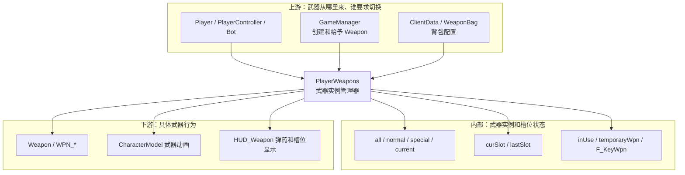
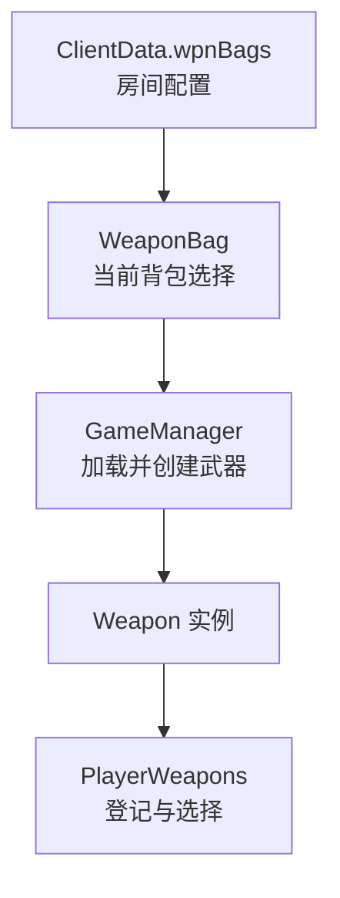
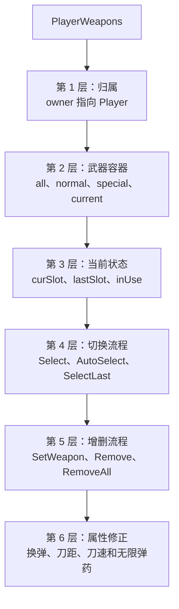
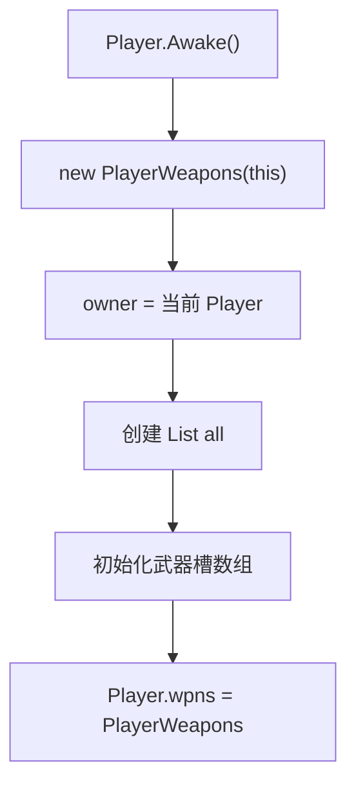
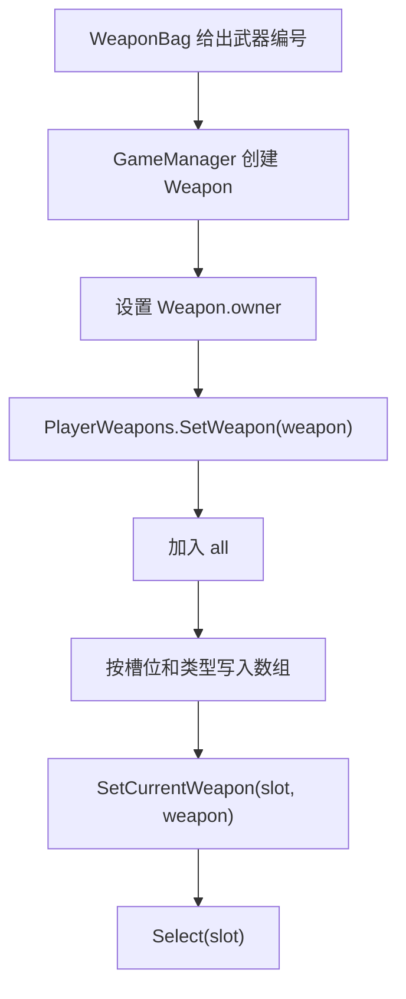
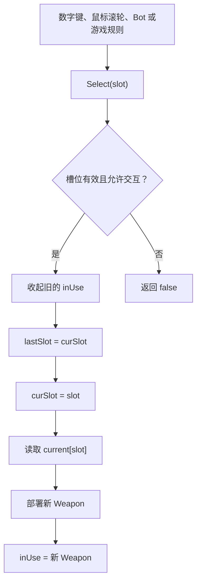
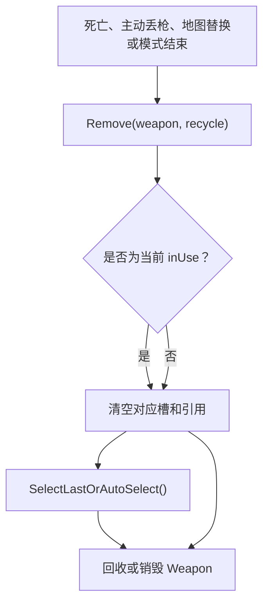
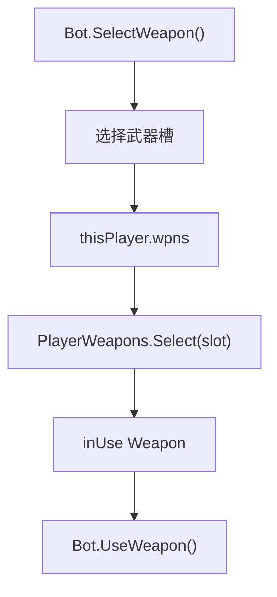
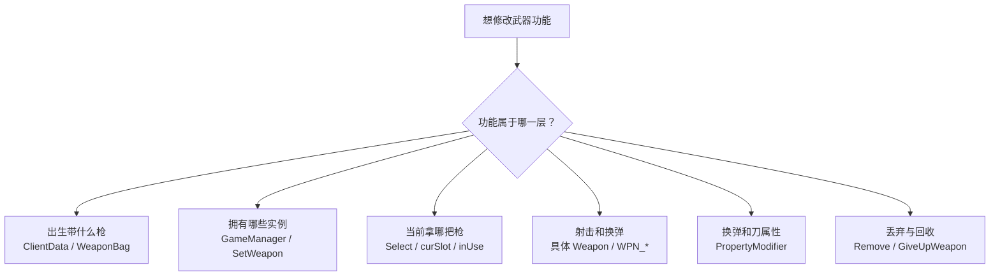

# PlayerWeapons 类关系与流程

> 目标：理解一名 Player 的武器实例如何登记、分槽、切换、丢弃和清理。  
> 上游文档：[Player 类关系与流程](02-Player类关系与流程.md)

## 一、先用一句话理解

`PlayerWeapons` 是 **单个 Player 的武器管理器**。它不保存武器配置编号，而是管理已经创建出来的 `Weapon` 实例。

```text
ClientData / WeaponBag 决定带什么枪
GameManager 创建 Weapon 实例
PlayerWeapons 决定实例放在哪个槽、当前拿哪一把
Weapon 自己执行射击、换弹和特殊行为
```

## 二、A：以 PlayerWeapons 为中心的分层预览



### 配置与实例的区别



`wpnBags` 中的编号不是 `Weapon*` 地址；必须经过资源加载和实例化，才会进入 `PlayerWeapons`。

## 三、C：分层学习地图



## 四、PlayerWeapons 从哪里来



直接依据：

- `PlayerWeapons` TypeDefIndex `5156`。
- 构造函数 `PlayerWeapons(Player owner)`：RVA `0xB16F10`。
- 导出汇编标记其调用者为 `Player.Awake+0xEC`。
- `Player.Awake()` 随后把对象写入 `Player +0xA0`。

因此，每个 Player 都有自己独立的 `PlayerWeapons`，不能把某个 Bot 的 `wpns` 当作全局武器管理器。

## 五、字段和容器

### 5.1 核心归属与槽位

| 字段 | 偏移 | 穿越火线中的作用 |
| --- | ---: | --- |
| `owner` | `+0x08` | 拥有这些武器的 Player |
| `all` | `+0x0C` | 该 Player 当前拥有的全部 Weapon 实例 |
| `curSlot` | `+0x10` | 当前选择的武器槽 |
| `lastSlot` | `+0x14` | 上一次使用的武器槽 |
| `inUse` | `+0x18` | 当前正在手上使用的 Weapon |

### 5.2 武器分类

| 字段 | 偏移 | 作用 |
| --- | ---: | --- |
| `current` | `+0x1C` | 当前各槽实际选中的武器 |
| `normal` | `+0x20` | 普通武器槽集合 |
| `special` | `+0x24` | 特殊或模式武器槽集合 |
| `temporaryWpn` | `+0x28` | 临时获得的武器 |
| `F_KeyWpn` | `+0x2C` | F 键触发的特殊武器 |
| `mapWpn` | `+0x30` | 地图拾取或地图机制武器 |

`all`、`current`、`normal` 不是同义数组：

```text
all      = 所有已登记武器实例
normal   = 普通规则下各槽候选
special  = 特殊模式下各槽候选
current  = 当前规则下每个槽实际使用哪一把
inUse    = 当前已经部署到手上的那一把
```

### 5.3 状态和属性修正

| 字段/属性 | 偏移 | 作用 |
| --- | ---: | --- |
| `rapidChange` | `+0x34` | 快速切枪状态 |
| `runState` | `+0x35` | 当前是否处于跑动相关状态 |
| `interactDisabled` | `+0x36` | 是否禁止武器交互 |
| `movePenalty` | `+0x38` | 武器带来的移动惩罚 |
| `Modifier_ReloadSpeed` | `+0x3C` | 换弹速度修正 |
| `Modifier_KnifeRange` | `+0x40` | 近战距离修正 |
| `Modifier_KnifeSpeed` | `+0x44` | 近战速度修正 |
| `isInfinityAmmo` | 属性 | 当前模式/状态是否无限弹药 |

## 六、武器进入 PlayerWeapons 的流程



`SetWeapon()` 是“登记一把 Weapon 实例”，`Select()` 是“部署某个槽位”。主动调用前者不等于角色立刻把枪拿到手上。

## 七、切枪流程



常用入口：

| 方法 | 用途 |
| --- | --- |
| `Select(int slot)` | 直接选择指定槽 |
| `SelectByMouseRoll(bool forward)` | 按滚轮方向循环选择 |
| `SelectLast()` | 返回 `lastSlot` |
| `SelectLastOrAutoSelect()` | 上一槽无效时自动找可用槽 |
| `AutoSelect()` | 自动选择可用武器 |
| `GetValidSlot()` | 查找可使用槽位 |
| `SelectFKeyWeapon()` | 部署 F 键特殊武器 |

导出汇编确认 `SelectLast()` 读取 `this +0x14`，再调用 `Select(lastSlot)`。

## 八、武器被丢弃或删除



`RemoveAll()` 会遍历 `all` 清理全部武器，适合 Player 销毁或整套武器重新加载。它不是普通换枪方法。

## 九、完整穿越火线对局流程

```text
玩家在房间选择背包
-> ClientData.wpnBags 保存武器编号
-> 进入地图后 WeaponBag.LoadData 读取配置
-> GameManager 创建对应 Weapon 实例
-> PlayerWeapons.SetWeapon 登记实例
-> SetCurrentWeapon 建立各槽当前武器
-> 出生后 Select 默认槽位
-> inUse 指向手上的武器
-> 玩家按键或 Bot 调用 Select 切枪
-> Weapon 自己处理开火、换弹和攻击动作
-> 丢枪或死亡时 Remove / GiveUpWeapon
-> Player 销毁时 RemoveAll
```

## 十、Bot 与 PlayerWeapons 的关系



Bot 不需要一套独立武器系统。它通过 `thisPlayer.wpns` 使用与真人 Player 相同的切枪和武器实例。

## 十一、修改功能时应该改哪一层



修改注意：

- 只改 `curSlot` 不会完整执行收枪和部署流程，应优先调用 `Select()`。
- 只改 `inUse` 会让动画、槽位和实际 Weapon 状态不同步。
- `current[slot]` 可能因特殊模式切换而变化，不能永久假设它等于 `normal[slot]`。
- 只修改 `ClientData.wpnBags`，如果 Weapon 已经创建，不会自动替换当前实例。
- `SetWeapon()`、`Select()`、`Weapon.Fire()` 是三个不同阶段。

## 十二、关键方法速查

| 方法 | RVA | 功能 |
| --- | ---: | --- |
| `.ctor(Player owner)` | `0xB16F10` | 创建单个 Player 的武器管理器 |
| `SetWeapon(Weapon)` | `0xB16BF0` | 登记并分类 Weapon 实例 |
| `SetCurrentWeapon()` | `0xB16A70` | 设置指定槽当前武器 |
| `Select(int)` | `0xB166A0` | 正式切换武器槽 |
| `SelectByMouseRoll()` | `0xB164E0` | 鼠标滚轮切枪 |
| `SelectLast()` | `0xB16680` | 切回上一槽 |
| `AutoSelect()` | `0xB15A90` | 自动寻找可用槽 |
| `Remove(Weapon, bool)` | `0xB15FD0` | 删除一把武器 |
| `RemoveAll()` | `0xB15EB0` | 清理全部武器 |
| `GiveUpWeapon()` | `0xB15DC0` | 丢弃当前或指定槽武器 |
| `FillMainWeaponAmmo()` | `0xB15C10` | 填充主武器弹药 |
| `FillAllGunAmmo()` | `0xB15AB0` | 填充全部枪械弹药 |

## 十三、证据索引

| 结论 | 依据 | 等级 |
| --- | --- | --- |
| PlayerWeapons 属于单个 Player | 构造参数 `Player owner`，`owner +0x08` | dump.cs 确认 |
| Player.Awake 创建 PlayerWeapons | 构造函数调用者 `Player.Awake+0xEC` | 汇编确认 |
| `all` 保存全部 Weapon 实例 | `List<Weapon> all +0x0C` | dump.cs 确认 |
| `inUse` 是手上正在用的 Weapon | 字段类型与 Select 流程 | dump.cs + 汇编确认 |
| SelectLast 使用 lastSlot | `+0x14` 后调用 `Select()` | 汇编确认 |
| GameManager 会调用 Select | `Select` 调用引用包含 `GameManager.GiveWeapon` | 汇编确认 |
| Bot 复用 PlayerWeapons | Bot 持有 `thisPlayer` 并有 SelectWeapon/UseWeapon | 组合证据 |
