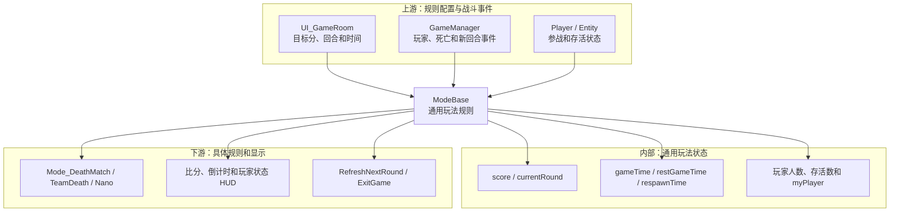
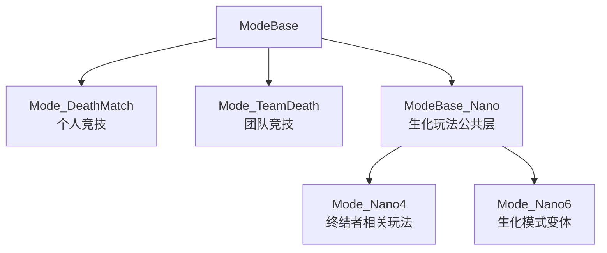
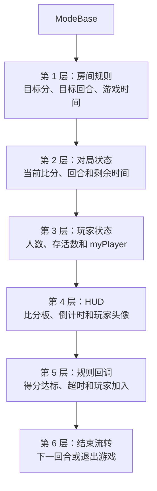
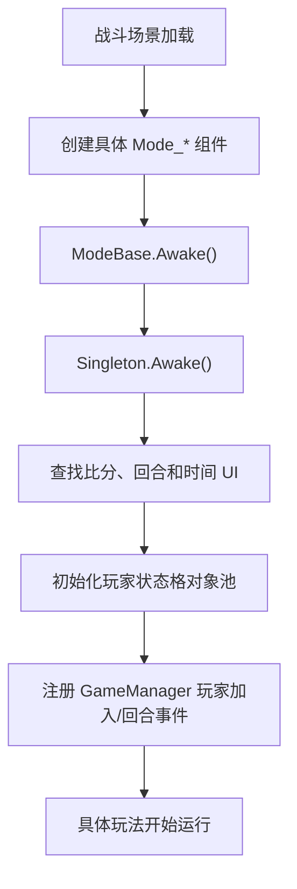
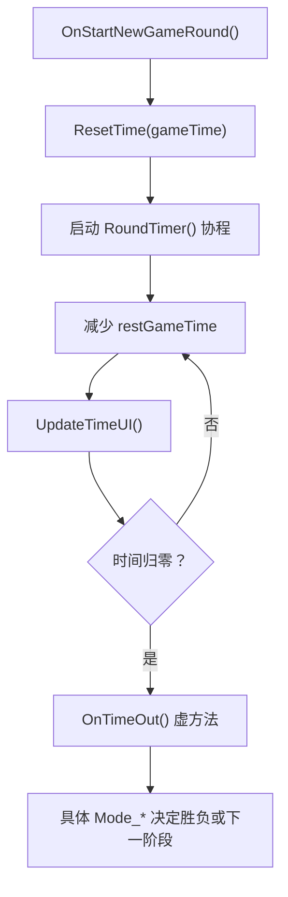
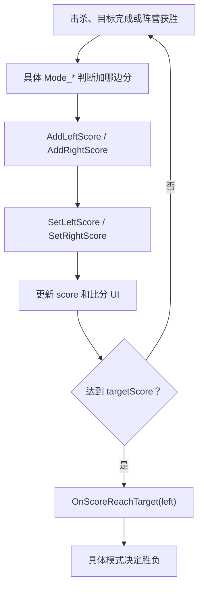
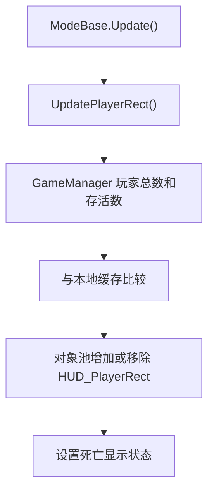
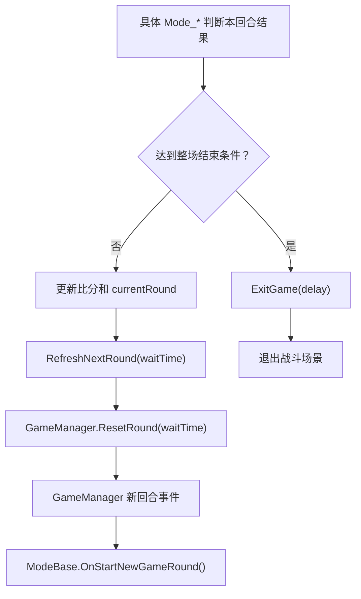
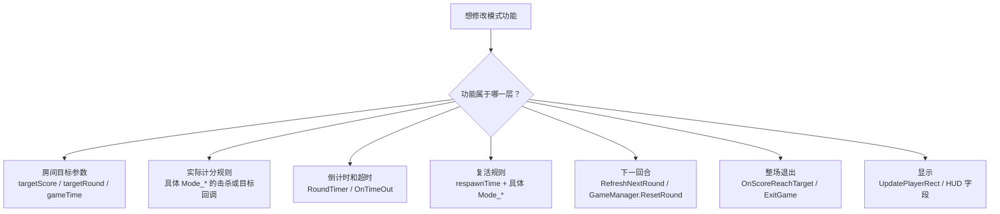

# ModeBase 类关系与流程

> 目标：理解穿越火线不同玩法如何共用比分、时间、玩家存活显示和胜负流程。  
> 上游文档：[GameManager 类关系与流程](01-GameManager类关系与流程.md)

## 一、先用一句话理解

`ModeBase` 是 **玩法规则的公共底座**，具体玩法类在它上面补充“怎样得分、何时结束、死亡后是否复活”等规则。

```text
GameManager 管整局对象和公共战斗入口
ModeBase 管通用比分、时间和界面
Mode_DeathMatch / Mode_TeamDeath / Mode_Nano* 管具体玩法规则
```

## 二、A：以 ModeBase 为中心的分层预览



### 具体玩法继承关系



dump.cs 直接确认的 `ModeBase` 派生类包括 `Mode_DeathMatch`、`Mode_TeamDeath`；生化玩法通过 `ModeBase_Nano` 再继续派生。

## 三、C：分层学习地图



## 四、配置字段与运行时字段

### 4.1 静态房间规则

| 字段 | 偏移 | 穿越火线中的作用 |
| --- | ---: | --- |
| `targetRound` | 静态 `+0x00` | 达到多少回合后整场结束 |
| `targetScore` | 静态 `+0x04` | 达到多少分触发胜负判断 |
| `gameTime` | 静态 `+0x08` | 房间设置的对局时间 |
| `respawnTime` | 静态 `+0x10` | 玩法允许复活时的等待时间 |

这些字段是规则参数，不等于当前实时状态。修改后是否立即生效，取决于具体 `Mode_*` 是否已经复制或消费该值。

### 4.2 当前对局状态

| 字段 | 偏移 | 作用 |
| --- | ---: | --- |
| `score` | `+0x0C` | 左右两方当前比分 |
| `currentRound` | `+0x14` | 当前回合编号 |
| `BLOnLeft` | `+0x18` | BL 阵营是否显示在左侧 |
| `restGameTime` | `+0x34` | 当前剩余分钟和秒 |
| `myPlayer` | `+0x6C` | 本机玩家在当前模式中的引用 |

### 4.3 玩家人数和存活显示

| 字段 | 偏移 | 作用 |
| --- | ---: | --- |
| `playerCountBL` | `+0x48` | BL 总人数缓存 |
| `playerCountGR` | `+0x4C` | GR 总人数缓存 |
| `aliveCountBL` | `+0x50` | BL 存活人数缓存 |
| `aliveCountGR` | `+0x54` | GR 存活人数缓存 |
| `playerRect_BL` | `+0x64` | BL 玩家头像/状态格 |
| `playerRect_GR` | `+0x68` | GR 玩家头像/状态格 |

这些缓存由 `UpdatePlayerRect()` 根据 `GameManager` 的实际人数和存活数刷新。直接修改缓存通常会在下一次 Update 中被覆盖。

## 五、ModeBase 如何建立起来



导出汇编确认：

- `ModeBase.Awake()`：RVA `0xAEE370`。
- 它调用 `Singleton<ModeBase>.Awake()` 建立当前实例。
- 它查找 `Score_Left`、`Score_Right`、`Round_Current`、`Round_Target`、`Minutes`、`Seconds` 等 UI。
- 它引用 `GameManager`、`SimpleObjectPool` 和 `Action<Player>`。

## 六、Singleton<ModeBase> 的意义

```text
Singleton<ModeBase>.get_instance()
-> 返回当前战斗场景中正在工作的 ModeBase/Mode_* 实例
-> 实际对象通常是某个具体玩法子类
```

例如团队竞技场景中，实例可以是 `Mode_TeamDeath`；通过基类单例取得后，虚方法仍按实际子类实现执行。

它不是“从 DLL 中创建一个新 ModeBase”，而是访问已经由 Unity 场景创建并在 `Awake()` 注册的实例。

## 七、倒计时流程



`OnTimeOut()` 在基类中是虚方法空实现，具体模式必须覆盖它才有玩法效果。这正是“CE 主动调用某些无参方法没有反应”的一种常见原因：你可能调用了基类空实现，或者调用时前置状态不满足。

## 八、比分流程



不要只根据“左分/右分”推断 BL/GR；`BLOnLeft` 决定当前界面映射。

## 九、玩家状态格刷新



导出汇编确认 `ModeBase.Update()` 调用 `UpdatePlayerRect()`；后者读取：

- `GameManager.alivePlayerCount_BL`
- `GameManager.alivePlayerCount_GR`
- 对应玩家总数

然后通过内部 `Lerp`、`InitNewRect`、`RemoveRect` 和 `SetRectDeadState` 更新 HUD。

## 十、回合与整场结束



`RefreshNextRound()` 的调用者包括生化模式的阵营胜利方法；它用于等待后进入下一回合。`ExitGame()` 则用于整场结束后的延迟退出。

注意：究竟是“下一回合”还是“退出整场”，最终由具体 `Mode_*` 根据目标回合、目标分数或模式特殊条件决定。

## 十一、个人竞技与团队竞技怎样使用 ModeBase

### 团队竞技

```text
Player 死亡
-> Mode_TeamDeath 判断击杀方阵营
-> 增加 BL 或 GR 对应分数
-> 达到 targetScore 时结束
-> respawnTime 控制玩家复活等待
```

### 个人竞技

```text
Player 死亡
-> Mode_DeathMatch 把分数记到具体 Player/PlayerData
-> 所有其他有效参战者都可能是敌人
-> 胜负不能只依靠 BL/GR 阵营判断
-> ModeBase 仍提供通用时间和 UI 框架
```

### 生化模式

```text
ModeBase_Nano 扩展 ModeBase
-> 维护人类、幽灵、终结者等模式状态
-> 具体 Mode_Nano4 / Mode_Nano6 判断阵营胜利
-> 胜利后 RefreshNextRound 或 ExitGame
```

## 十二、修改功能时应该改哪一层



修改注意：

- 修改 `score` 后，具体模式可能再次计算并覆盖，UI 也可能未同步。
- 修改 `restGameTime` 比修改 `gameTime` 更接近当前倒计时，但协程仍会继续递减。
- 基类虚方法可能是空实现，应 Hook 当前实际 `Mode_*` 的覆盖方法。
- `respawnTime` 只是公共参数，能否复活仍受具体模式规则约束。
- `myPlayer` 是 `ModeBase` 自己保存的引用，不等于 `GameManager.myPlayer` 字段地址相同。
- 主动调用方法前要满足场景、单例、UI、玩家和回合状态等前置条件。

## 十三、关键方法速查

| 方法 | RVA | 功能 |
| --- | ---: | --- |
| `Awake()` | `0xAEE370` | 注册单例、查找 UI 和事件 |
| `Update()` | `0xAF6A00` | 通用每帧更新 |
| `UpdatePlayerRect()` | `0xAF6730` | 刷新人数、存活和玩家状态格 |
| `OnStartNewGameRound()` | `0xAF5B30` | 新回合公共初始化 |
| `ResetTime()` | `0xAF5CF0` | 设置当前剩余时间 |
| `RoundTimer()` | `0xAF5DC0` | 倒计时协程 |
| `SetCurrentRound()` | `0xAF5EE0` | 设置当前回合 |
| `SetLeftScore()` | `0xAF5F30` | 设置左侧比分并更新显示 |
| `SetRightScore()` | `0xAF6010` | 设置右侧比分并更新显示 |
| `OnScoreReachTarget()` | `0x1B14C0` | 基类虚回调，等待子类实现 |
| `OnTimeOut()` | `0x1B14C0` | 基类虚回调，等待子类实现 |
| `OnMyPlayerJoin()` | `0x82ED90` | 本机 Player 加入模式 |
| `RefreshNextRound()` | `0xAF5C50` | 安排下一回合 |
| `ExitGame()` | `0xAEE850` | 延迟结束并退出对局 |

## 十四、证据索引

| 结论 | 依据 | 等级 |
| --- | --- | --- |
| ModeBase 是模式单例基类 | `ModeBase : Singleton<ModeBase>` | dump.cs 确认 |
| Awake 注册单例并查找 HUD | `Singleton<ModeBase>.Awake` 和 UI 字符串引用 | 汇编确认 |
| Update 刷新玩家状态格 | `ModeBase.Update -> UpdatePlayerRect` | 汇编确认 |
| 存活数来自 GameManager | 调用 `get_alivePlayerCount_BL/GR` | 汇编确认 |
| 基类得分达标和超时方法为空 | RVA 均为公共空函数 `0x1B14C0` | dump.cs + 汇编特征 |
| 不同玩法通过继承覆盖规则 | `Mode_DeathMatch`、`Mode_TeamDeath`、`ModeBase_Nano` | dump.cs 确认 |
| 生化胜利流程调用 RefreshNextRound | 调用引用来自 Nano 胜利方法 | 汇编确认 |
| ExitGame 用于整场结束 | 多个具体模式胜利方法引用 | 汇编确认 |
