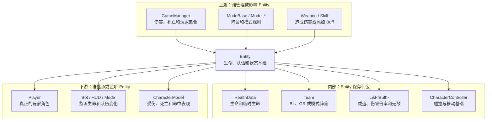
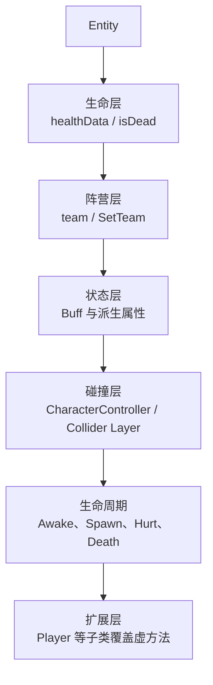
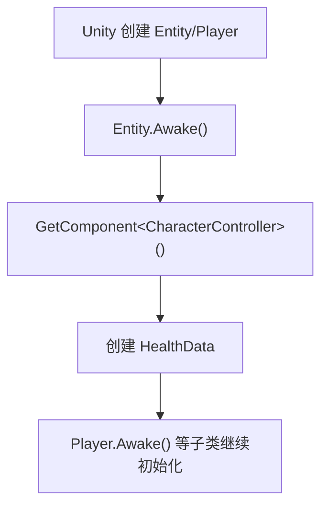
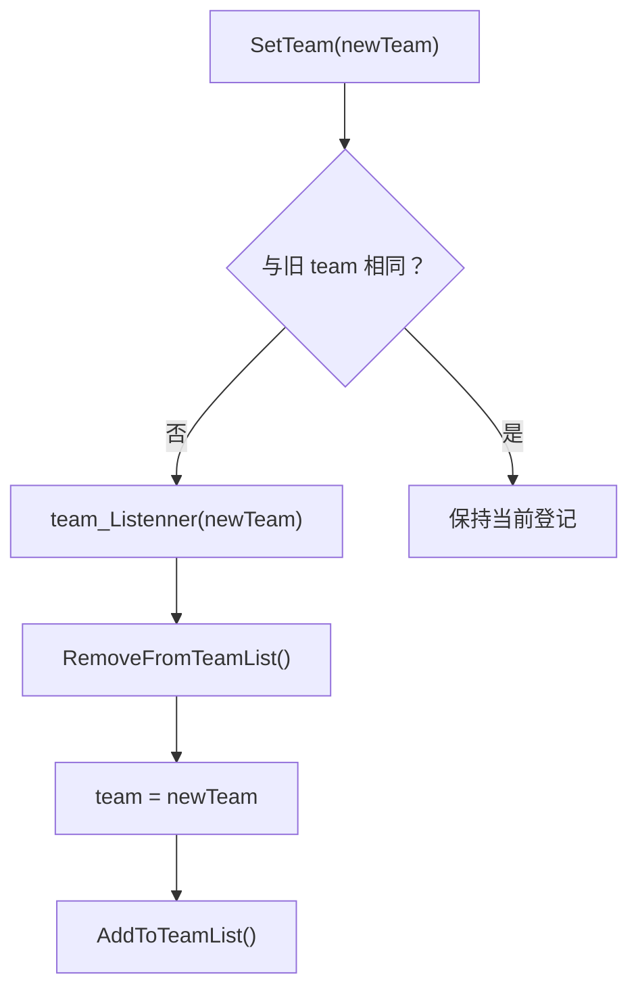
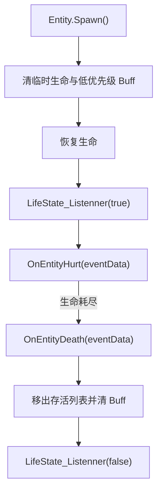
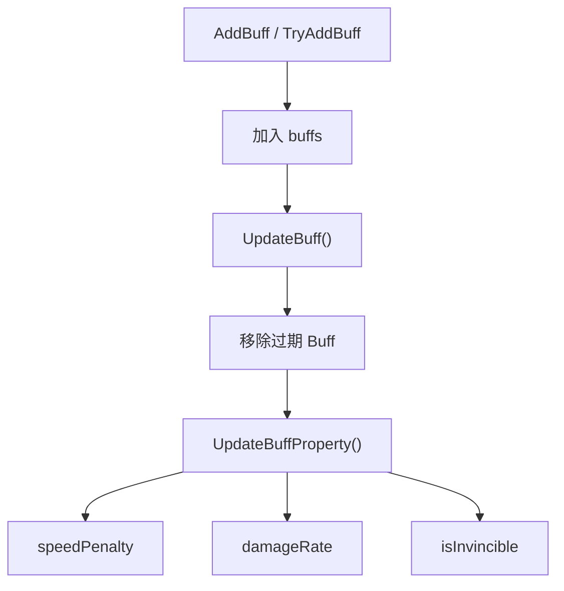

# Entity 类关系与流程

> 目标：理解穿越火线战场对象共享的生命、队伍、Buff、出生、受伤和死亡基础。

## 一、先用一句话理解

`Entity` 是战斗实体的公共基类。`Player`、部分炮台和其他可受伤对象在它之上增加自己的功能。

## 二、A：以 Entity 为中心的分层预览



## 三、C：分层学习地图



## 四、核心字段

| 字段 | 偏移 | 穿越火线含义 |
| --- | ---: | --- |
| `baseMoveSpeed` | `+0x0C` | 基础移动速度 |
| `speedPenalty` | `+0x10` | Buff 汇总后的速度惩罚 |
| `damageRate` | `+0x14` | 伤害倍率修正 |
| `isInvincible` | `+0x18` | 当前是否无敌 |
| `healthData` | `+0x1C` | 生命值和临时生命对象 |
| `team` | `+0x20` | 当前所属队伍/阵营 |
| `team_Listenner` | `+0x24` | 阵营变化监听 |
| `characterAnimator` | `+0x28` | 基础角色 Animator |
| `characterController` | `+0x2C` | Unity 角色碰撞控制器 |
| `isGhostEntity` | `+0x30` | 是否按幽灵实体处理 |
| `buffs` | `+0x34` | 当前 Buff 列表 |
| `LifeState_Listenner` | `+0x38` | 出生和死亡状态监听 |

## 五、初始化流程



汇编确认 `Player.Awake()` 首先调用 `Entity.Awake()`；后者取得 `CharacterController` 并建立 `HealthData`。

## 六、队伍变化



`SetTeam()` 不只是写 `team +0x20`，还会调整 GameManager 的队伍列表和存活列表。直接改字段可能造成“字段变了，但列表和 HUD 没变”。

## 七、出生、受伤和死亡



汇编确认：

- `Spawn()` 调用 `HealthData.ClearTempHealth()`、恢复生命、`CleanAllBuff()`，再通知存活状态。
- `OnEntityDeath()` 调用队伍列表更新、清理 Buff，并通知 `LifeState_Listenner(false)`。
- `Player.Spawn()` 先调用 `Entity.Spawn()`，再执行 Player 自己的背包、模型和复活逻辑。

## 八、Buff 工作方式



常用入口：

| 方法 | 功能 |
| --- | --- |
| `AddSpeedPenalty()` | 添加限时减速 |
| `SetDamageRate()` | 添加伤害倍率修正 |
| `TryAddBuff()` | 按名称避免重复或更新 Buff |
| `RemoveBuff()` | 删除指定名称 Buff |
| `CleanAllBuff()` | 按优先级批量清理 |
| `FindBuff()` | 查询指定 Buff |

## 九、敌我判断与 Team

`isBlackList`、`isGlobalRisk` 是 Entity 的派生属性，但不能把它们理解成所有模式下永远固定的“敌人”。

```text
团队竞技：通常根据 BL / GR 队伍关系
个人竞技：其他有效 Player 通常都可能是敌人
生化模式：人类、幽灵和特殊角色规则由 Mode_* 扩展
```

因此，开发敌人筛选功能时应复用游戏当前的敌我属性/模式逻辑，不要只比较 `team != myTeam`。

## 十、完整游戏语言流程

```text
Player 被创建
-> Entity.Awake 建立生命和碰撞基础
-> GameManager/Player 设置队伍并登记
-> Spawn 恢复生命和清理旧状态
-> Weapon 造成伤害
-> GameManager 计算并派发 DamageEventData
-> Entity/Player OnEntityHurt 响应
-> 生命耗尽后 OnEntityDeath
-> 移出存活列表并通知 Bot、HUD、Mode
-> 允许复活的模式再次调用 Spawn
```

## 十一、修改功能时应该改哪一层

| 目标 | 推荐入口 | 不建议只改 |
| --- | --- | --- |
| 生命/无敌 | `HealthData`、伤害流程、`isInvincible` 更新器 | 单独冻结显示值 |
| 队伍 | `SetTeam()` | `team +0x20` |
| 移速 | `baseMoveSpeed` 或 Buff 汇总流程 | `speedPenalty` 临时结果 |
| 伤害倍率 | `SetDamageRate()` 或对应更新器 | 一次性改 `damageRate` |
| 复活 | `Player.Respawn/Spawn` 和 Mode 规则 | 只把生命改满 |
| 幽灵碰撞 | `SetGhostEntityState()` | 只改布尔字段 |

## 十二、关键方法与证据

| 方法 | RVA | 作用 |
| --- | ---: | --- |
| `Awake()` | `0xB3F060` | 初始化生命和碰撞 |
| `SetTeam()` | `0xB3F940` | 切换阵营并维护列表 |
| `Spawn()` | `0xB3F9F0` | 恢复生命和出生状态 |
| `OnEntityHurt()` | `0xB3F470` | 基础受伤响应 |
| `OnEntityDeath()` | `0xB3F400` | 基础死亡与事件通知 |
| `UpdateBuff()` | `0xB3FC00` | 更新和清理 Buff |
| `UpdateBuffProperty()` | `0xB3FB40` | 汇总 Buff 属性 |
| `SetGhostEntityState()` | `0xB3F920` | 切换幽灵实体状态 |
| `GetVisibleHitBox()` | `0x22D360` | 虚命中盒入口 |

