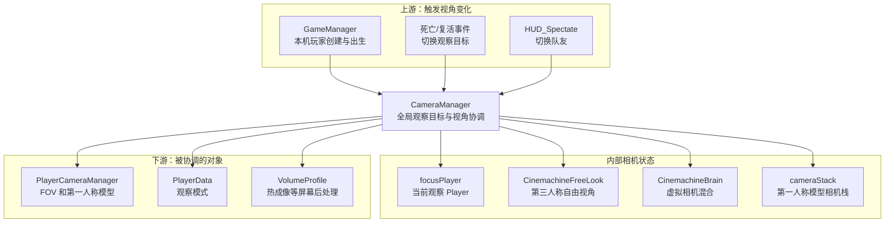
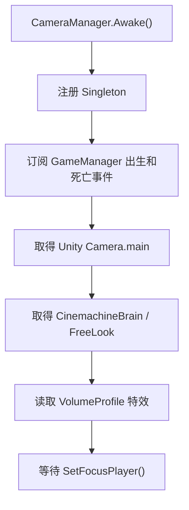
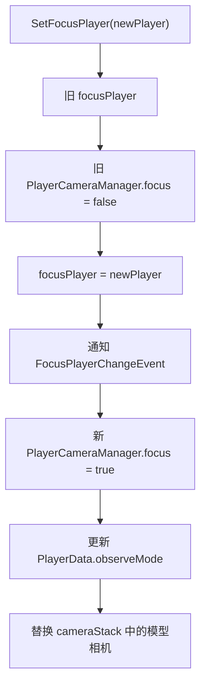
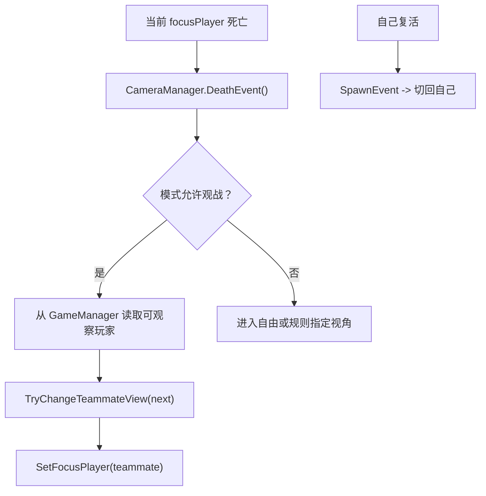

# CameraManager 类关系与流程

> 目标：理解本机正在观察谁、第一/第三人称如何切换，以及全局相机与 Player 自身相机组件的区别。

## 一、先用一句话理解

`CameraManager` 决定 **本机当前观察哪个 Player**；`PlayerCameraManager` 负责 **某个 Player 的第一人称模型、FOV 和镜头表现**。

## 二、A：以 CameraManager 为中心的分层预览



## 三、两个 CameraManager 不要混淆

| 类 | 数量 | 核心职责 |
| --- | --- | --- |
| `CameraManager : Singleton<CameraManager>` | 场景通常一个 | 当前观察谁、PV/CV 切换、死亡观战、队友切换 |
| `PlayerCameraManager : MonoBehaviour` | 每个 Player 一个 | 该 Player 的第一人称手模相机、FOV、狙击镜、震屏 |

`Player.cameraManager +0x48` 指向的是 `PlayerCameraManager`，不是全局 `CameraManager` 单例。

## 四、核心字段

### CameraManager

| 字段 | 偏移 | 功能 |
| --- | ---: | --- |
| `focusPlayer` | `+0x0C` | 本机当前观察的 Player |
| `freeLookCamera` | `+0x10` | 第三人称/观察自由镜头 |
| `brain` | `+0x14` | Cinemachine 镜头混合 |
| `playerView` | 静态 `+0x00` | 当前是否使用玩家第一人称视角 |
| `FocusPlayerChangeEvent_Observers` | 静态 `+0x0C` | 观察目标变化事件 |
| `cameraStack` | `+0x18` | 相机叠加列表 |
| `changeViewUnlockTime` | `+0x1C` | 防止连续切视角的解锁时间 |

### PlayerCameraManager

| 字段 | 偏移 | 功能 |
| --- | ---: | --- |
| `mapCamera` | `+0x0C` | Player 对应的虚拟相机 |
| `modelCamera` | `+0x10` | 第一人称手模/武器模型相机 |
| `modelContainer` | `+0x18` | 第一人称模型容器 |
| `zoomFovScale` | `+0x28` | 开镜 FOV 缩放 |
| `modelDefaultFOV` | `+0x3C` | 模型相机默认 FOV |
| `extraMapFov` | `+0x40` | 世界相机额外 FOV |
| `extraPvFov` | `+0x44` | 第一人称模型额外 FOV |

## 五、CameraManager 初始化



汇编确认 `Awake()` 调用单例基类，并从 `GameManager` 注册 `SpawnEvent`、`DeathEvent`。

## 六、设置观察目标



汇编直接确认：

- `SetFocusPlayer()` RVA `0xB364D0`。
- 会读取 Player `+0x48` 的 `PlayerCameraManager`。
- 对旧/新组件调用 `PlayerCameraManager.set_focus()`。
- 会更新 `PlayerData.SetObserveMode()`。
- 会广播旧 Player 和新 Player。

所以 `focusPlayer` 不是“自己的 Player”字段，而是“此刻本机相机看着谁”。活着时通常是自己，死亡观战时可能是队友。

## 七、死亡观战与队友切换



`TryChangeTeammateView()` 会取得 `Singleton<GameManager>` 并按当前模式、队伍、存活状态筛选目标。

## 八、PV、CV 与 FOV

```text
PV：Player View，第一人称玩家视角
CV：Character/Camera View，角色或观察视角
```

`ChangePVandCV()` 负责两种观察方式切换；具体 Player 的镜头表现由 `PlayerCameraManager` 执行：

- `PlaySniperZoom()`：狙击开镜。
- `CameraFovSetting()`：持续计算世界与模型 FOV。
- `LookAt()` / `SetRotation()`：调整观察方向。
- `PlayKnifeHitStunShake()`：近战受击震屏。
- `SetFovBuffInfo()`：Buff 或技能 FOV。

## 九、完整游戏语言流程

```text
进入战斗后 GameManager 创建 myPlayer
-> CameraManager.SetFocusPlayer(myPlayer)
-> myPlayer.cameraManager.focus = true
-> 第一人称模型相机加入 cameraStack
-> 开枪、开镜和受击由 PlayerCameraManager 表现
-> myPlayer 死亡
-> CameraManager 根据模式选择队友或自由观察
-> focusPlayer 改成被观察者
-> myPlayer 复活后 SpawnEvent 切回自己
```

## 十、修改功能时的选择

| 目标 | 应操作 |
| --- | --- |
| 当前观察谁 | `CameraManager.SetFocusPlayer()` |
| 第一/第三人称切换 | `ChangePVandCV()` |
| 观战切换队友 | `TryChangeTeammateView()` |
| 狙击镜 FOV | `PlayerCameraManager.PlaySniperZoom()` |
| 固定第一人称模型 FOV | `PlayerCameraManager` FOV 计算链 |
| 镜头震动 | `PlayKnifeHitStunShake()` 等表现方法 |
| 热成像 | `CameraManager.SetThermalVision()` |

不要只写 `focusPlayer +0x0C`，否则旧相机、观察模式、事件和相机栈不会同步。

## 十一、关键方法

| 方法 | RVA | 功能 |
| --- | ---: | --- |
| `CameraManager.Awake()` | `0xB35550` | 单例、事件和相机初始化 |
| `SetFocusPlayer()` | `0xB364D0` | 完整切换观察目标 |
| `ChangePVandCV()` | `0xB35920` | 第一/第三人称切换 |
| `DeathEvent()` | `0xB35B70` | 处理观察目标死亡 |
| `SpawnEvent()` | `0xB36A30` | 处理出生后焦点恢复 |
| `TryChangeTeammateView()` | `0xB36BF0` | 选择可观察队友 |
| `PlayerCameraManager.Awake()` | `0xB11650` | 初始化 Player 镜头 |
| `PlaySniperZoom()` | `0xB11AF0` | 狙击开镜 FOV |
| `LookAt()` | `0xB119F0` | 设置镜头方向 |

