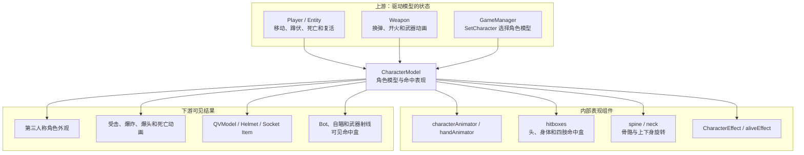
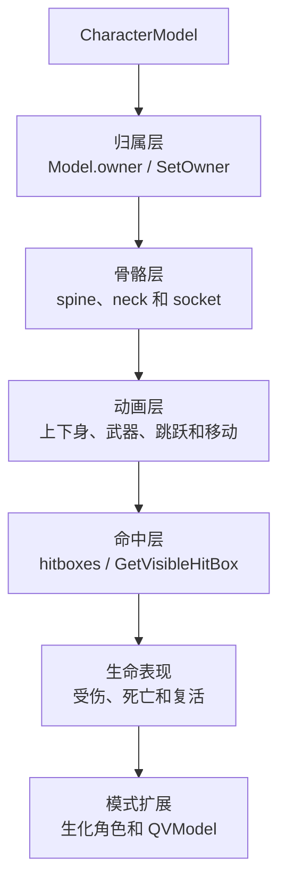
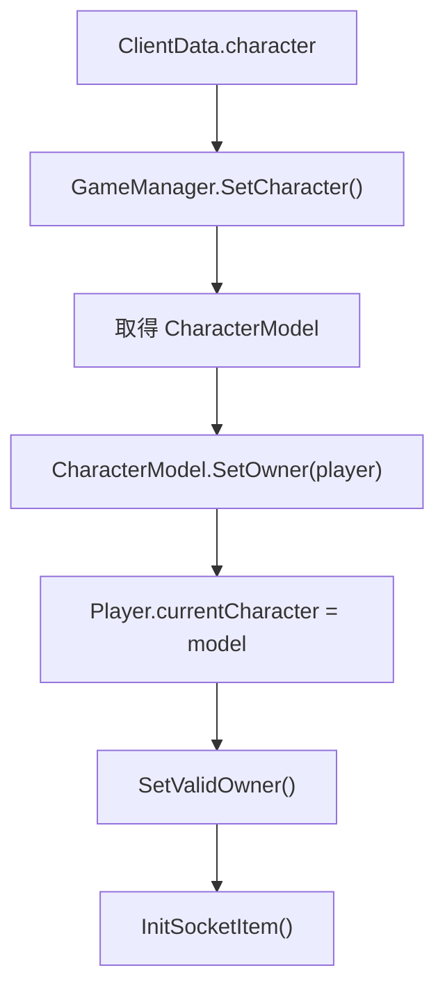
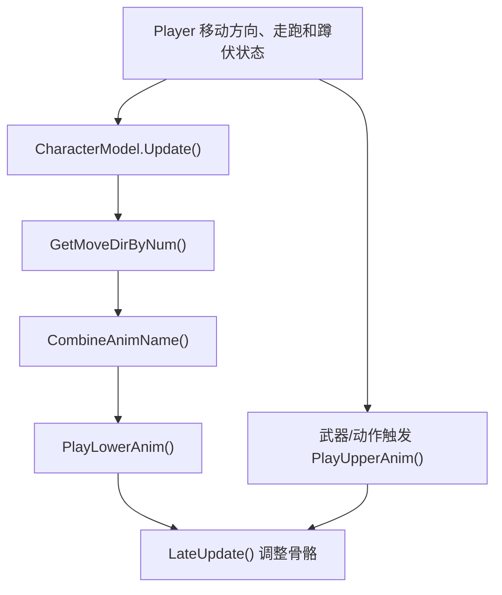
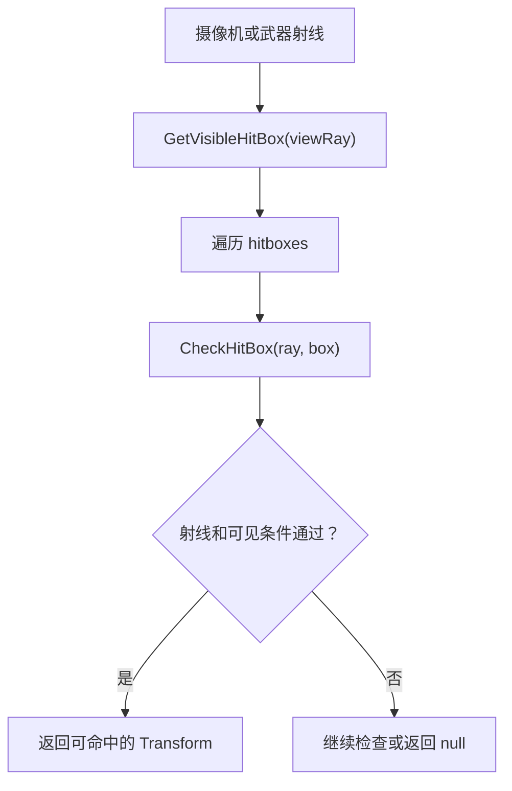
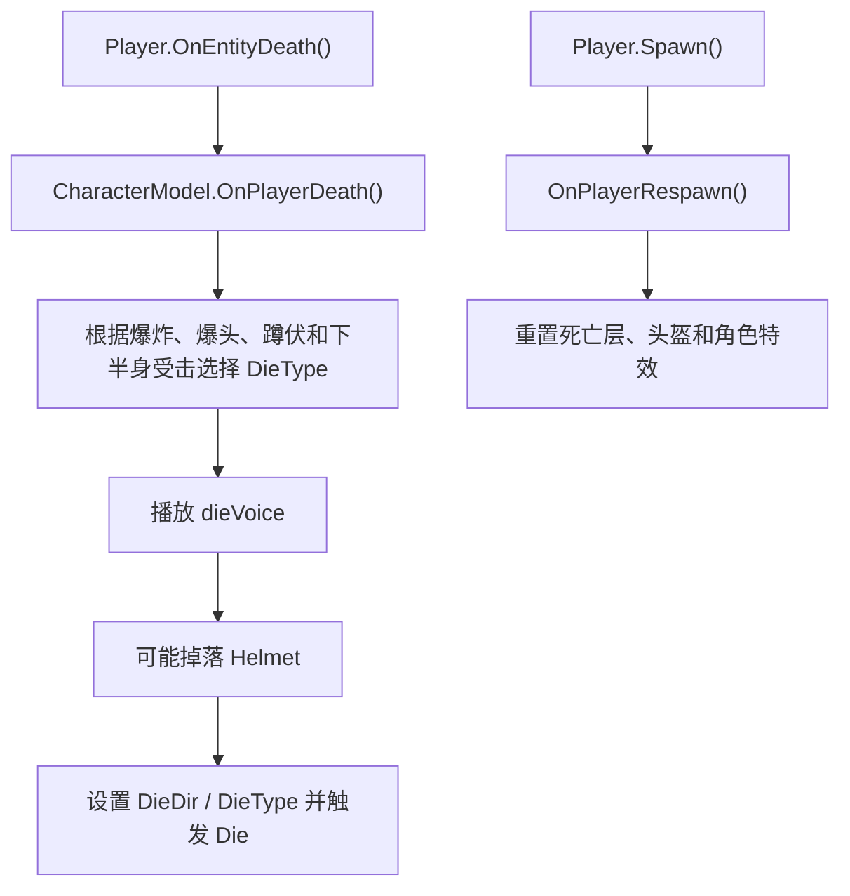

# CharacterModel 类关系与流程

> 目标：理解第三人称角色模型、命中盒、移动动画、武器动画和死亡表现如何绑定到 Player。

## 一、先用一句话理解

`CharacterModel` 是 Player 的 **第三人称身体与战斗表现层**。生命和队伍不属于它，但角色看起来怎样移动、受击、死亡，以及子弹命中哪个身体部位，都与它有关。

## 二、A：以 CharacterModel 为中心的分层预览



## 三、C：分层学习地图



## 四、核心字段

| 字段 | 偏移 | 功能 |
| --- | ---: | --- |
| `sex` | `+0x40` | 角色性别类型 |
| `recycle` | `+0x44` | 模型是否走回收流程 |
| `characterAnimator` | `+0x48` | 身体 Animator |
| `handAnimator` | `+0x4C` | 手部/武器关联 Animator |
| `characterEffect` | `+0x50` | 角色特效 |
| `cvRenderers` | `+0x54` | 第三人称模型渲染器 |
| `dieVoice` | `+0x58` | 死亡语音 |
| `spine/spine1/neck` | `+0x5C/+0x60/+0x64` | 上身和头部骨骼 |
| `helmet` | `+0x6C` | 当前头盔模型 |
| `hitboxes` | `+0x74` | 可被射线命中的身体部位 |
| `targetLowerAngle` | `+0x78` | 目标下半身旋转角 |
| `lowerAngle` | `+0x7C` | 当前下半身旋转角 |
| `animSetting` | `+0xA0` | 当前武器动画配置 |
| `bindQvMdl` | `+0xB4` | 绑定的特殊 QVModel |

## 五、模型如何绑定 Player



`SetOwner()` 先调用父类 `Model.SetOwner()`，再把角色特效等子组件指向新 Player。更换角色时还会通过 `RemoveFromOldOwner()` 和回收逻辑解除旧绑定。

## 六、移动和上下半身动画



上下身分层使角色可以一边移动一边开枪或换弹。直接播放整个 Animator 状态可能覆盖游戏自己的分层逻辑。

## 七、武器动画

```text
PlayerWeapons 切换 inUse
-> Weapon 提供 CharWpnAnimData
-> CharacterModel.SetWeaponAnim(animData)
-> 开火/近战调用 PlayWpnAnim()
-> 换弹调用 PlayGunReloadAnim()
-> 收枪或结束动作调用 StopWeaponAnim()
```

这说明修改“枪的动作速度”可能同时涉及 Weapon 时序和 CharacterModel Animator，不能只改一个动画名称。

## 八、命中盒与可见部位



`Entity.GetVisibleHitBox()` 是虚入口，Player 可通过当前 `CharacterModel.GetVisibleHitBox()` 返回实际身体命中点。Bot 选目标和自瞄选骨骼时应注意：

- `Player` 地址不是 hitbox 地址。
- `CharacterModel.hitboxes` 中可能有多个部位。
- 模型未初始化、已回收或不可见时可能返回 `null`。

## 九、死亡和复活表现



汇编确认 `OnPlayerDeath()` 使用 `Die`、`DieDir`、`DieType` Animator 参数，并调用声音和头盔流程；`OnPlayerRespawn()` 重置死亡动画层并恢复特效。

## 十、完整游戏语言流程

```text
进入战斗后 GameManager 按 ClientData 选择角色
-> CharacterModel.SetOwner(player)
-> Player.currentCharacter 保存模型
-> 移动时模型根据方向、走跑和蹲伏播放动画
-> 武器切换后更新武器动画配置
-> 射线通过 hitboxes 判断头部或身体命中
-> 受击播放 Hit 动画
-> 死亡按爆头、爆炸和姿势选择死亡表现
-> 复活时重置模型、特效和动画
```

## 十一、修改功能时应该改哪一层

| 目标 | 推荐入口 |
| --- | --- |
| 更换角色外观 | `GameManager.SetCharacter()` |
| 第三人称显隐 | `CharacterModel.SetActive()` |
| 命中部位 | `hitboxes` 与 `GetVisibleHitBox()` |
| 武器动画 | `SetWeaponAnim()`、具体播放方法 |
| 死亡动作 | `OnPlayerDeath()` 参数与 Animator |
| 复活模型恢复 | `OnPlayerRespawn()` |
| 特殊角色模型 | `BindQvModel()` / `BindMapGunQvModel()` |

## 十二、关键方法

| 方法 | RVA | 功能 |
| --- | ---: | --- |
| `SetOwner()` | `0xB39910` | 绑定 Player |
| `SetValidOwner()` | `0xB399D0` | 完成有效绑定 |
| `GetVisibleHitBox()` | `0xB38190` | 返回射线可见命中盒 |
| `PlayHitAnim()` | `0xB38FB0` | 播放受击动画 |
| `OnPlayerDeath()` | `0xB38B80` | 死亡表现 |
| `OnPlayerRespawn()` | `0xB38E70` | 复活重置 |
| `SetWeaponAnim()` | `0xB39EB0` | 设置武器动画配置 |
| `PlayWpnAnim()` | `0xB39470` | 播放武器动作 |
| `BindQvModel()` | `0xB37D70` | 绑定特殊模型 |

