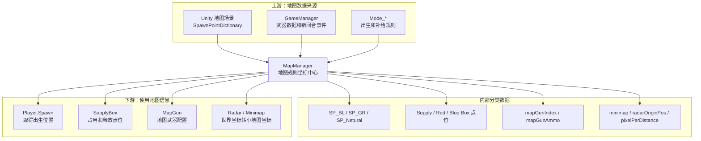
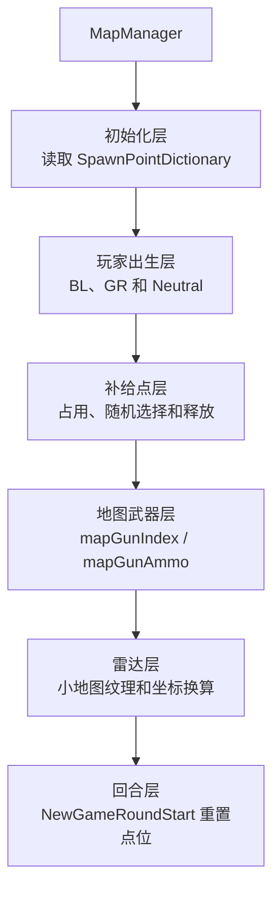
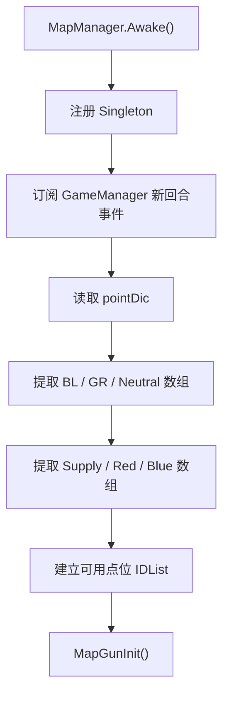
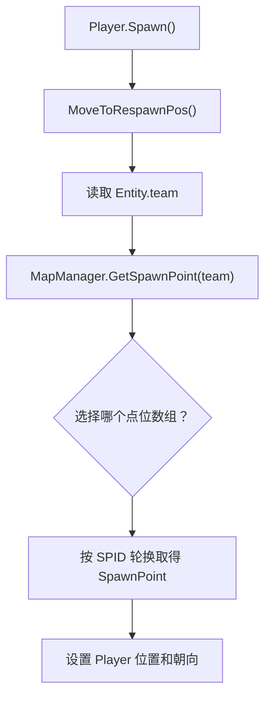
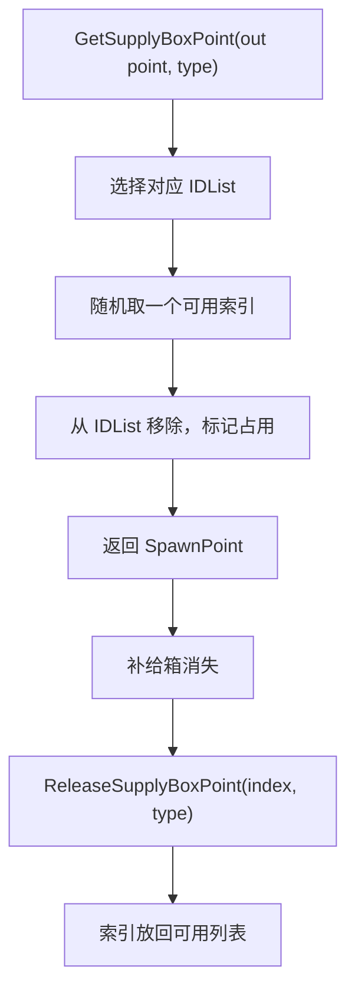

# MapManager 类关系与流程

> 目标：理解地图出生点、补给箱位置、地图武器、雷达原点和小地图数据如何被战斗系统使用。

## 一、先用一句话理解

`MapManager` 是当前地图的 **规则坐标与地图资源索引中心**。它不管理所有场景物体，而是重点管理出生点、补给点、地图枪和雷达参数。

## 二、A：以 MapManager 为中心的分层预览



## 三、C：分层学习地图



## 四、核心字段

### 出生点

| 字段 | 偏移 | 功能 |
| --- | ---: | --- |
| `pointDic` | `+0x0C` | 场景配置的出生点字典 |
| `SP_BL` | `+0x10` | BL 阵营出生点 |
| `SP_GR` | `+0x14` | GR 阵营出生点 |
| `SP_Netural` | `+0x18` | 中立/非团队出生点 |
| `SPID_BL` | 静态 `+0x00` | BL 下次轮换索引 |
| `SPID_GR` | 静态 `+0x04` | GR 下次轮换索引 |
| `SPID_Netural` | 静态 `+0x08` | 中立下次轮换索引 |

### 补给和模式点

| 字段 | 偏移 | 功能 |
| --- | ---: | --- |
| `SP_SupplyBox` | `+0x1C` | 普通补给箱点 |
| `SP_RedBox` | `+0x20` | 红色补给点 |
| `SP_BlueBox` | `+0x24` | 蓝色补给点 |
| `IDList_SupplyBox` | `+0x28` | 当前可用普通点位索引 |
| `IDList_RedBox` | `+0x2C` | 当前可用红点索引 |
| `IDList_BlueBox` | `+0x30` | 当前可用蓝点索引 |

### 地图武器与雷达

| 字段 | 偏移 | 功能 |
| --- | ---: | --- |
| `mapGunIndex` | `+0x34` | 地图指定武器数据编号 |
| `mapGunAmmo` | 静态 `+0x0C` | 地图武器弹药 |
| `knifeHitStun` | `+0x38` | 地图是否启用刀击硬直 |
| `minimap` | `+0x3C` | 小地图纹理 |
| `radarOriginPos` | `+0x40` | 雷达世界坐标原点 |
| `pixelPerDistance` | `+0x4C` | 世界距离到像素距离比例 |

## 五、初始化流程



汇编确认 `Awake()` 按字典键读取 `BL`、`GR`、`Neutral`、补给箱类别，建立 ID 列表，并调用 `MapGunInit()`。

## 六、Player 出生点流程



IDA 直接确认 `MapManager.GetSpawnPoint()` 的调用者包含 `Player.<Spawn>...MoveToRespawnPos`。

`GetSpawnPoint()` 使用静态 SPID 轮换点位，不是每次都固定返回数组第一个。

## 七、团队与个人竞技

```text
团队竞技：
team = BL -> SP_BL
team = GR -> SP_GR

个人竞技或中立规则：
通常使用 SP_Netural
具体选择仍取决于传入的 Team 和 Mode 逻辑
```

若只修改 Player 坐标而不影响 Spawn 流程，下次出生仍会被 `GetSpawnPoint()` 结果覆盖。

## 八、补给箱点位占用



这种设计避免多个补给箱同时生成在同一位置。直接从数组随机而不维护 IDList，会破坏占用规则。

## 九、新回合与地图枪

`MapManager` 在 `Awake()` 订阅 GameManager 的新回合事件，`NewGameRoundStart()` 用于恢复地图级临时状态。

`MapGunInit()`：

- `mapGunIndex < 0` 时把 `mapGunAmmo` 设为零。
- 否则从 `GameManager` 的武器数据字典读取对应 `WeaponData`。
- 根据具体武器数据初始化地图枪弹药。

所以修改 `mapGunIndex` 后若不重新执行初始化，`mapGunAmmo` 可能仍是旧值。

## 十、雷达与小地图

```text
世界位置
-> 减去 radarOriginPos
-> 按 pixelPerDistance 缩放
-> 映射到 minimap 纹理/UI
```

`minimap` 是显示资源；`radarOriginPos` 和 `pixelPerDistance` 才决定位置映射。修改纹理不会自动修正雷达坐标。

## 十一、完整游戏语言流程

```text
地图场景加载
-> MapManager 从 pointDic 分类出生点和补给点
-> GameManager 开始新回合
-> Player.Spawn 按队伍请求出生点
-> MapManager 轮换返回位置和朝向
-> 生化/补给玩法请求未占用补给点
-> 地图枪按 mapGunIndex 加载弹药参数
-> HUD 使用雷达参数显示玩家和目标
-> 新回合恢复临时点位状态
```

## 十二、修改功能时应该改哪一层

| 目标 | 推荐入口 |
| --- | --- |
| 改玩家出生点 | `SpawnPointDictionary` / 对应 `SP_*` |
| 改出生轮换 | `GetSpawnPoint()` 与 `SPID_*` |
| 改补给生成位置 | `SP_*Box` 和 IDList 占用流程 |
| 改地图枪 | `mapGunIndex` 后重新走 `MapGunInit()` |
| 改地图枪弹药 | `mapGunAmmo` 与实际 Weapon 初始化 |
| 改雷达比例 | `radarOriginPos` / `pixelPerDistance` |
| 改刀击硬直规则 | `knifeHitStun` 及读取它的伤害/镜头流程 |

## 十三、关键方法

| 方法 | RVA | 功能 |
| --- | ---: | --- |
| `Awake()` | `0xAEB2B0` | 单例、点位分类和事件初始化 |
| `GetSpawnPoint()` | `0xAEB6E0` | 按队伍取得出生点 |
| `GetSupplyBoxPoint()` | `0xAEB8A0` | 占用并返回补给点 |
| `ReleaseSupplyBoxPoint()` | `0xAEC7C0` | 释放补给点 |
| `MapGunInit()` | `0xAEBB70` | 初始化地图枪数据 |
| `NewGameRoundStart()` | `0xAEBCB0` | 新回合地图状态重置 |
| `OnDestroy()` | `0xAEBD40` | 注销事件和单例 |

