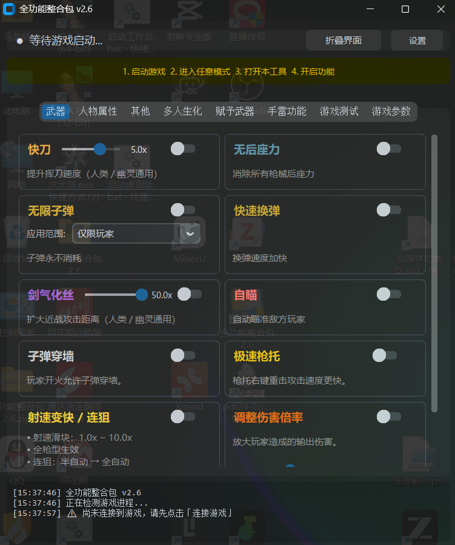
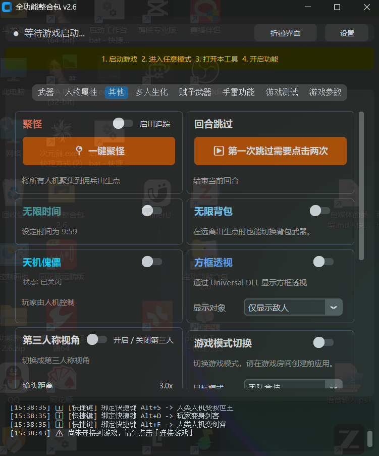
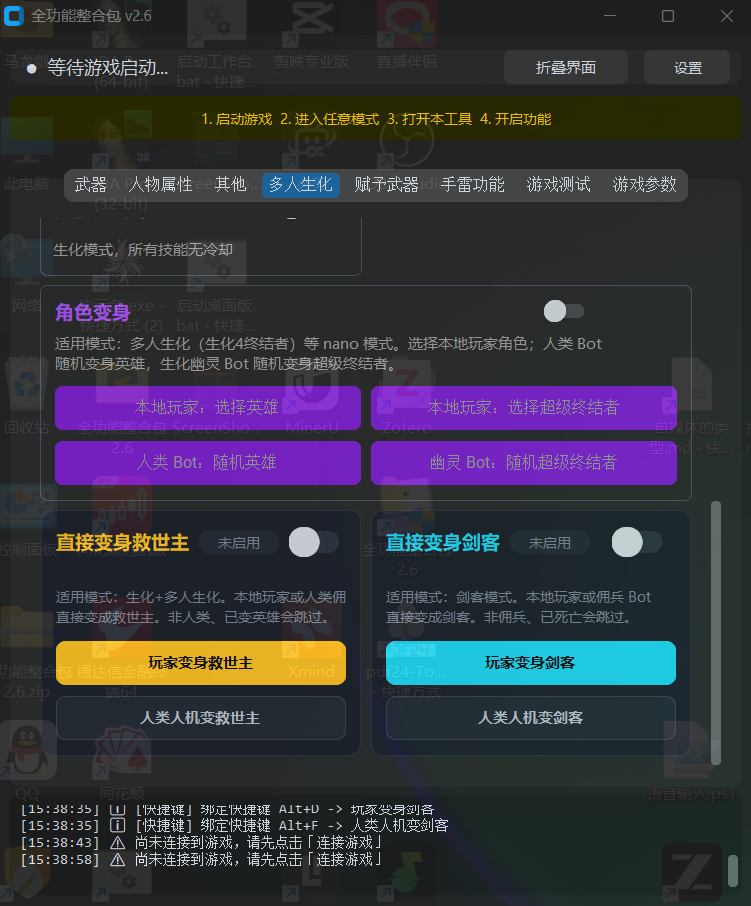
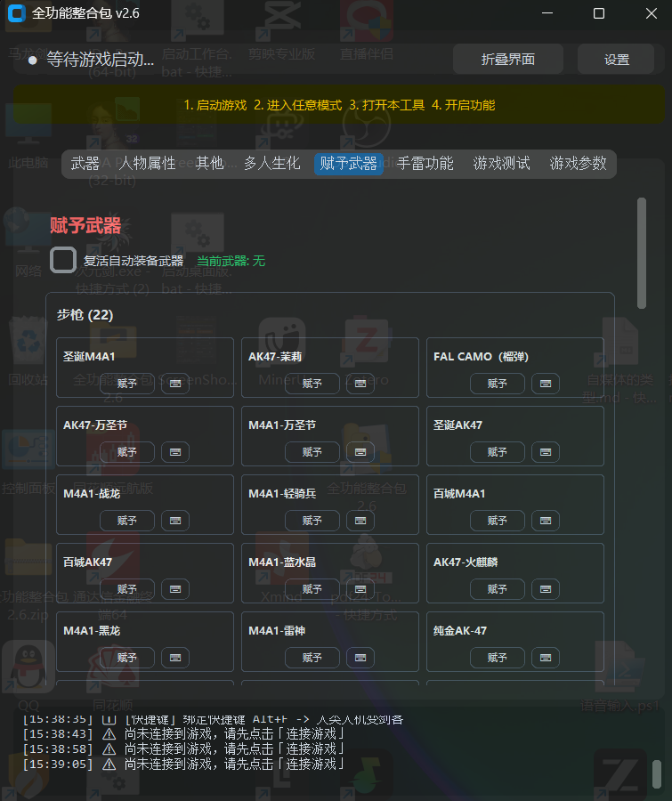
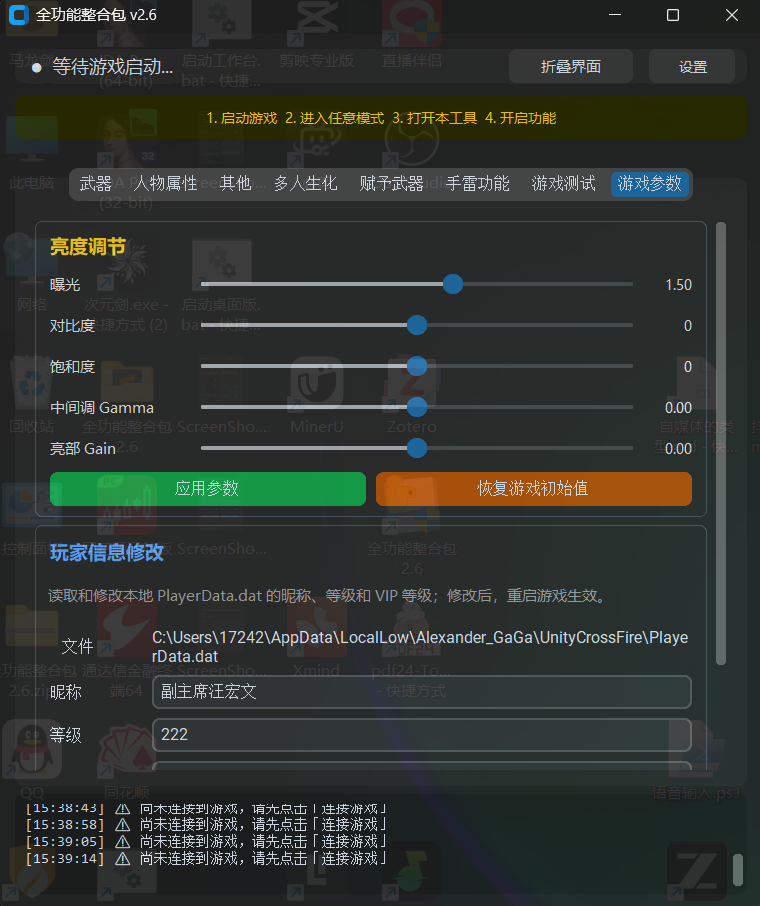
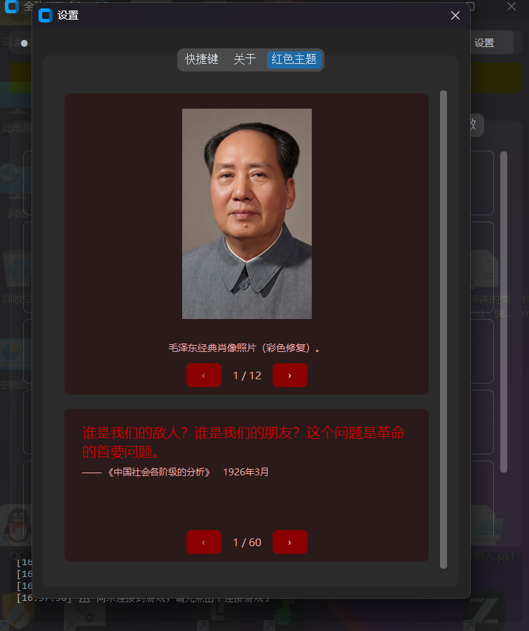
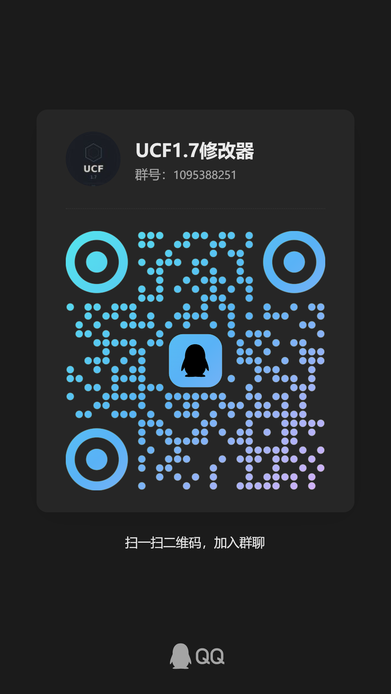

# UCF 1.7 修改器 — 全功能整合包

> **文档更新日期：2026年09月21日**

## 这是什么

这是 **UnityCrossFire 1.7**（穿越火线单机版）的游戏修改器项目。

修改器通过 **Frida** 注入 `GameAssembly.dll`，用 JavaScript 脚本 Hook IL2CPP 方法、读写内存字段，实现 39 项游戏功能修改。界面层用 **Python + CustomTkinter** 构建，通过 RPC 与 Frida 脚本通信。

## 程序展示

<p align="center">
  
  &nbsp;
  
</p>

<p align="center">
  
  &nbsp;
  
</p>

<p align="center">
  
</p>

<p align="center">
  
</p>


## 技术栈

| 层 | 技术 | 说明 |
|---|---|---|
| 注入与 Hook | Frida | Windows x86 IL2CPP，调用约定 `mscdecl` |
| 脚本逻辑 | JavaScript | Hook 方法、读写内存、定时器调度 |
| 界面 | Python + CustomTkinter | 功能面板、设置页、红色主题 Tab |
| 通信 | RPC（Frida export） | Python ↔ JS 双向调用 |
| 逆向资料 | Il2CppDumper + IDA | dump.cs 查类/字段，IDA 查汇编逻辑 |
| 打包 | PyInstaller + InnoSetup | onedir 产出 + 安装器 |

## 如何入手了解

按以下顺序阅读，能快速理解整个项目：

```
1. 本 README                    → 项目全貌
2. 02-开发规范/01-项目背景与游戏信息.md  → 游戏信息、逆向资料位置、技术红线
3. 02-开发规范/00-总览与导航.md         → 开发规范文档索引
4. 02-开发规范/各个功能/              → 每个功能的设计文档
5. 04-正式发行版/全功能整合包2.6/      → 最新正式代码
```

## 项目结构

```
ucf1.7-modifier/
├── 00-游戏逆向分析-相关信息/     # 逆向资料（dump.cs、IDA 汇编、AssetStudio）
├── 01-游戏系统分析/            # 游戏系统架构分析文档
├── 02-开发规范/               # 开发规范、功能设计文档
│   ├── 00-总览与导航.md
│   ├── 01-项目背景与游戏信息.md
│   ├── 10-单功能开发/          # 单功能开发流程、目录标准、生命周期规范
│   ├── 20-整合包接入/          # 整合包接入规范、持久化、快捷键
│   ├── 30-整合包程序与发布/     # 程序 UI 设计、打包发布
│   ├── 90-通用规范/            # 编码与文件规范
│   └── 各个功能/               # 39 个功能的设计文档
├── 03-经验手册/               # IL2CPP 逆向、Frida、git 等经验手册
├── 04-正式发行版/              # 各版本整合包源代码
│   ├── 全功能整合包1.0/ ~ 2.5/  # 历史版本
│   └── 全功能整合包2.6/        # ★ 最新稳定版
│       ├── game_modifier/      # 修改器主程序
│       │   ├── core/          # 配置、事件总线、热键管理
│       │   ├── features/       # 39 个功能插件（script.js + feature.py + panel.py）
│       │   ├── ui/            # 界面（主窗口、设置页、红色主题 Tab）
│       │   └── main.py        # 入口
│       └── 资源/              # 图片、音效、文案
├── 05-正式功能/               # 各功能的开发过程记录与经验总结
└── 疑问.md                    # 技术问答
```

## 功能列表（39 项）

| # | 功能 | 说明 |
|---|---|---|
| 1 | 无限子弹 | 子弹永不消耗 |
| 2 | 无后座力 | 消除所有枪械后座力 |
| 3 | 无限时间 | 设定时间为 9:59 |
| 4 | 快刀 | 提升挥刀速度 |
| 5 | 快速换弹 | 换弹速度加快 |
| 6 | 滑板鞋 | 提升移动速度 |
| 7 | 剑气化丝 | 扩大近战攻击距离 |
| 8 | 聚怪 | 将所有人机聚集到出生点 |
| 9 | 轻重力 / 高跳 | 调整重力与跳跃倍率 |
| 10 | 回合跳过 | 结束当前回合 |
| 11 | 自瞄 | 自动瞄准敌方玩家 |
| 12 | 金刚不坏 | 角色受伤时不掉血 |
| 13 | 射速变快 / 连狙 | 射速可调，半自动转全自动 |
| 14 | 天机傀儡 | 玩家由人机控制 |
| 15 | 多人生化 Buff 选择 | 选择生化 Buff |
| 16 | 赋予武器 | 给予指定武器 |
| 17 | 技能无冷却 | 生化模式技能无 CD |
| 18 | 方框透视 | 通过 Universal DLL 显示方框透视 |
| 19 | 强制决战回合 | 强制进入决战回合 |
| 20 | 时间加速 | 调整游戏时间倍率 |
| 21 | 第三人称视角 | 切换为第三人称 |
| 22 | 无限背包 | 远离出生点也能切换武器 |
| 23 | 极速枪托 | 枪托重击速度更快 |
| 24 | 人机暂停 | 所有人机停止行动 |
| 25 | 自由视角 | 脱离玩家跟随，自由拖动镜头 |
| 26 | 手雷模式 | 无限手雷投掷 |
| 27 | 游戏模式切换 | 切换游戏模式（建房前应用） |
| 28 | 人体穿墙 | 按住 Alt 穿过墙体 |
| 29 | 子弹穿墙 | 子弹可穿墙 |
| 30 | 调整伤害倍率 | 放大输出伤害 |
| 31 | 定点瞬移 | 保存点位后瞬移回点位 |
| 32 | 亮度调节 | 调整画面亮度 |
| 33 | 玩家信息修改 | 修改昵称、等级、VIP 等级 |
| 34 | 角色变身 | 选择角色 / Bot 随机变身 |
| 35 | 全模式房间人数 | 自定义房间人数 |
| 36 | 增加血量 | 快捷键或按钮加血 |
| 37 | 增加防化服 | 无限累计防化服 |
| 38 | 直接近身救世主 | 直接变身救世主 |
| 39 | 直接近身剑客 | 直接变身剑客 |

## 快速开始

1. 安装依赖：`pip install -r requirements.txt`（见 `全功能整合包2.6/` 下）
2. 运行修改器：`python main.py`
3. 启动游戏 `UnityCrossFire.exe`
4. 在修改器界面勾选功能即可生效

## 开发者信息

- **修改器作者**：挂呱呱呱
- **代码贡献者**：少年与狗子
- **游戏原作者**：內個_shei_鸭
- **B 站主页**：[挂呱呱呱的 B 站](https://space.bilibili.com)

## 交流与支持

<p align="center">
  
  &nbsp;&nbsp;
</p>


| 群 | 群号 |
|---|---|
| UCF1.7 游戏群 | 1095388251 |

## 赞赏

如果这个项目对你有帮助，可以请作者喝杯咖啡。

<p align="center">
  
</p>

## 许可

本项目仅供学习和个人娱乐使用，请勿用于商业用途或在线对战。
